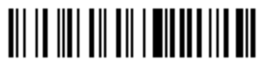

> Navigation: [Technologies](../../technologies.md) · [Core Image](../../coreimage.md) · [CIFilter](../cifilter-swift.class.md)

# code128BarcodeGenerator()

<sub>Type Method</sub>

Generates a high-density, linear barcode.

<sub>iOS, iPadOS, Mac Catalyst, macOS, tvOS, visionOS</sub>

```swift
class func code128BarcodeGenerator() -> any CIFilter & CICode128BarcodeGenerator
```

## Return Value

The generated image.

## Discussion

This method generates a Code 128 barcode as an image. Code 128 is a high-density linear barcode defined in the ISO/IEC 15417:2007 standard. Use this filter to generate alphanumeric or numeric-only barcodes. The barcode can contain any of the 128 ASCII characters.

The Code 128 barcode filter uses the following properties:

- **`message`** — [NSData](../../foundation/nsdata.md) containing the message to encode in the Code 128 barcode.
- **`quietSpace`** — [NSNumber](../../foundation/nsnumber.md) containing the number of empty white pixels that should surround the barcode.
- **`barcodeHeight`** — [NSNumber](../../foundation/nsnumber.md) containing the height of the generated barcode in pixels.

The following code creates a filter that generates a Code 128 barcode:

```swift
func code128Barcode(barcode: String) -> CIImage {
    let code128Barcode = CIFilter.code128BarcodeGenerator()
    code128Barcode.message = barcode.data(using: .ascii)!
    code128Barcode.quietSpace = 5
    code128Barcode.barcodeHeight = 20
    return code128Barcode.outputImage!
}
```



## See Also

### Filters

- [+ attributedTextImageGeneratorFilter](<attributedtextimagegenerator().md>) — Generates an attributed-text image.
- [+ aztecCodeGeneratorFilter](<azteccodegenerator().md>) — Generates a low-density barcode.
- [+ barcodeGeneratorFilter](<barcodegenerator().md>) — Generates a barcode as an image from the descriptor.
- [+ blurredRectangleGeneratorFilter](<blurredrectanglegenerator().md>) — Generates a blurred rectangle.
- [+ checkerboardGeneratorFilter](<checkerboardgenerator().md>) — Generates a checkerboard image.
- [+ lenticularHaloGeneratorFilter](<lenticularhalogenerator().md>) — Generates a lenticular halo image.
- [+ meshGeneratorFilter](<meshgenerator().md>) — Generates a pattern made from an array of line segments.
- [+ PDF417BarcodeGenerator](<pdf417barcodegenerator().md>) — Generates a high-density linear barcode.
- [+ QRCodeGenerator](<qrcodegenerator().md>) — Generates a quick response (QR) code image.
- [+ randomGeneratorFilter](<randomgenerator().md>) — Generates a random filter image.
- [+ roundedRectangleGeneratorFilter](<roundedrectanglegenerator().md>) — Generates a rounded rectangle image.
- [+ roundedRectangleStrokeGeneratorFilter](<roundedrectanglestrokegenerator().md>) — Creates an image containing the outline of a rounded rectangle.
- [+ starShineGeneratorFilter](<starshinegenerator().md>) — Generates a star-shine image.
- [+ stripesGeneratorFilter](<stripesgenerator().md>) — Generates a line of stripes as an image
- [+ sunbeamsGeneratorFilter](<sunbeamsgenerator().md>) — Generates an image resembling the sun.
