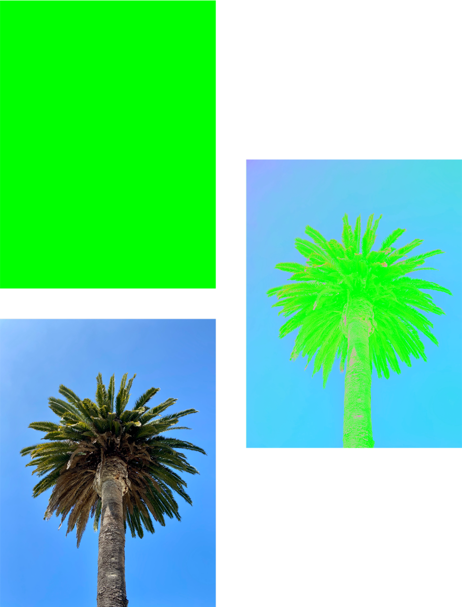

> Navigation: [Technologies](../../technologies.md) · [Core Image](../../coreimage.md) · [CIFilter](../cifilter-swift.class.md)

# colorAbsoluteDifference()

<sub>Type Method</sub>

Calculates the absolute difference between each color component in the input images.

<sub>iOS, iPadOS, Mac Catalyst, macOS, tvOS, visionOS</sub>

```swift
class func colorAbsoluteDifference() -> any CIFilter & CIColorAbsoluteDifference
```

## Return Value

An image containing the absolute color difference between the two input images.

## Discussion

This method applies the color absolute difference filter to an image. This filter calculates the absolute color difference of the red, green, and blue values between the two input images. The alpha channel is the product of the alpha channels from the two input images.

The absolute difference filter uses the following properties:

- **`inputImage`** — The first [CIImage](../ciimage.md) for differencing.
- **`inputImage2`** — The second [CIImage](../ciimage.md) for differencing.

The following code creates a filter that results in the color difference between two images:

```swift
func colorAbsolute(inputImage: CIImage, inputImage2: CIImage) -> CIImage {
    let filter = CIFilter.colorAbsoluteDifference()
    filter.inputImage = inputImage
    filter.inputImage2 = inputImage2
    return filter.outputImage!
}
```



<sub>Three images arranged with two images on the left and an image on the right. The top left image is a solid green color, and the bottom left image is a single palm tree with a clear sky. The right image shows the result of applying the color absolute difference filter to the two images on the left. The palm tree is now highlighted against the background.</sub>

## See Also

### Filters

- [+ colorClampFilter](<colorclamp().md>) — Alters the colors in an image based on color components.
- [+ colorControlsFilter](<colorcontrols().md>) — Alters the brightness, contrast, and saturation of an image’s colors.
- [+ colorMatrixFilter](<colormatrix().md>) — Alters the colors in an image based on vectors provided.
- [+ colorPolynomialFilter](<colorpolynomial().md>) — Alters an image’s colors.
- [+ colorThresholdFilter](<colorthreshold().md>) — Compares the red, green, and blue components of the input image to a threshold and sets them to 1 or 0.
- [+ colorThresholdOtsuFilter](<colorthresholdotsu().md>) — Compares the red, green, and blue components of the input image against a threshold calculated using Otsu’s algorithm.
- [+ depthToDisparityFilter](<depthtodisparity().md>) — Converts from an image containing depth data to an image containing disparity data.
- [+ disparityToDepthFilter](<disparitytodepth().md>) — Creates depth data from an image containing disparity data.
- [+ exposureAdjustFilter](<exposureadjust().md>) — Adjusts an image’s exposure.
- [+ gammaAdjustFilter](<gammaadjust().md>) — Alters an image’s transition between black and white.
- [+ hueAdjustFilter](<hueadjust().md>) — Modifies an image’s hue.
- [+ linearToSRGBToneCurveFilter](<lineartosrgbtonecurve().md>) — Alters an image’s color intensity.
- [+ sRGBToneCurveToLinearFilter](<srgbtonecurvetolinear().md>) — Converts the colors in an image from sRGB to linear.
- [+ temperatureAndTintFilter](<temperatureandtint().md>) — Alters an image’s temperature and tint.
- [+ toneCurveFilter](<tonecurve().md>) — Alters an image’s tone curve according to a series of data points.
