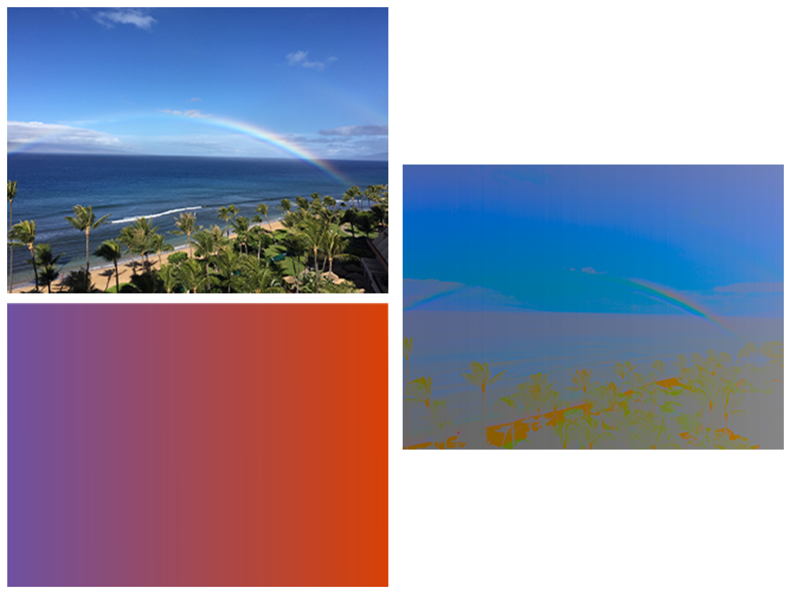

> Navigation: [Technologies](../../technologies.md) · [Core Image](../../coreimage.md) · [CIFilter](../cifilter-swift.class.md)

# colorBlendMode()

<sub>Type Method</sub>

Blends color from two images using the luminance values from the background image and the hue and saturation values from the input image.

<sub>iOS, iPadOS, Mac Catalyst, macOS, tvOS, visionOS</sub>

```swift
class func colorBlendMode() -> any CIFilter & CICompositeOperation
```

## Return Value

The modified image.

## Discussion

This method applies the color-blend mode filter to an image. The effect creates the output image by using the luminance values of the background image, while using the hue and saturation values of the input image. The effect preserves gray levels from the background image.

The color-blend mode filter uses the following properties:

- **`inputImage`** — An image with the type [CIImage](../ciimage.md).
- **`backgroundImage`** — An image with the type [CIImage](../ciimage.md).

The following code creates a filter that replaces the colors the image:

```swift
func colorBlendMode(inputImage: CIImage, backgroundImage: CIImage) -> CIImage {
    let colorBlendModeFilter = CIFilter.colorBlendMode()
    colorBlendModeFilter.inputImage = inputImage
    colorBlendModeFilter.backgroundImage = backgroundImage
    return colorBlendModeFilter.outputImage!
}
```



<sub>The image on the top left shows a beach with multiple palm trees and a rainbow arching across the blue sky.  The image below this is a gradient image displaying a gradual color shift from purple to a dark orange. The image on the right shows the output from applying the color blend mode filter. This results in an image that is darker with color changes to the trees and the sand, and less of the rainbow visible.</sub>

## See Also

### Filters

- [+ additionCompositingFilter](<additioncompositing().md>) — Blends colors from two images by addition.
- [+ colorBurnBlendModeFilter](<colorburnblendmode().md>) — Blends color from two images while darkening the image.
- [+ colorDodgeBlendModeFilter](<colordodgeblendmode().md>) — Blends color from two images using dodging.
- [+ darkenBlendModeFilter](<darkenblendmode().md>) — Blends colors from two images while darkening lighter pixels.
- [+ differenceBlendModeFilter](<differenceblendmode().md>) — Subtracts color values to blend colors.
- [+ divideBlendModeFilter](<divideblendmode().md>) — Divides color values to blend colors.
- [+ exclusionBlendModeFilter](<exclusionblendmode().md>) — Subtracts color values to blend colors with less contrast.
- [+ hardLightBlendModeFilter](<hardlightblendmode().md>) — Blends colors of two images by screening and multiplying.
- [+ hueBlendModeFilter](<hueblendmode().md>) — Blends colors of two images by computing the sum of image color values.
- [+ lightenBlendModeFilter](<lightenblendmode().md>) — Blends colors from two images by brightening colors.
- [+ linearBurnBlendModeFilter](<linearburnblendmode().md>) — Blends color from two images while increasing contrast.
- [+ linearDodgeBlendModeFilter](<lineardodgeblendmode().md>) — Blends colors of two images with dodging.
- [+ linearLightBlendModeFilter](<linearlightblendmode().md>) — A combination of linear burn and linear dodge blend modes.
- [+ luminosityBlendModeFilter](<luminosityblendmode().md>) — Blends color from two images by calculating the color, hue, and saturation.
- [+ minimumCompositingFilter](<minimumcompositing().md>) — Blends colors from two images by computing minimum values.
