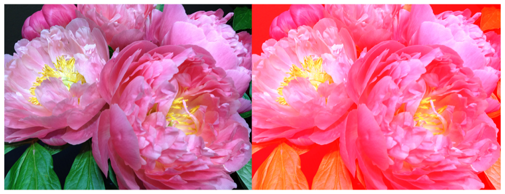

> Navigation: [Technologies](../../technologies.md) · [Core Image](../../coreimage.md) · [CIFilter](../cifilter-swift.class.md)

# colorClamp()

<sub>Type Method</sub>

Alters the colors in an image based on color components.

<sub>iOS, iPadOS, Mac Catalyst, macOS, tvOS, visionOS</sub>

```swift
class func colorClamp() -> any CIFilter & CIColorClamp
```

## Return Value

The modified image.

## Discussion

This method applies the color clamp filter to an image. The effect calculates each pixel’s color component value. Using this calculation, the effect adjusts the values that are outside the range of the `minComponents` or `maxComponents` properties and clamps them within the range.

The color clamp filter uses the following properties:

- **`minComponents`** — `RGBA` values for the lower end of the range as a [CIVector](../civector.md).
- **`maxComponents`** — `RGBA` values for the upper end of the range as a [CIVector](../civector.md).
- **`inputImage`** — An image with the type [CIImage](../ciimage.md).

The following code creates a filter that adds a red hue to the input image:

```swift
func colorClamp(inputImage: CIImage) -> CIImage {
    let colorClampFilter = CIFilter.colorClamp()
    colorClampFilter.inputImage = inputImage
    colorClampFilter.minComponents = CIVector(x: 1, y: 0, z: 0, w: 0)
    colorClampFilter.maxComponents = CIVector (x: 1, y: 0.9, z: 1, w: 1)
    return colorClampFilter.outputImage!
}
```



<sub>Two versions of a photograph side by side. The photo on the left shows a small bunch of flowers photographed close up, in focus, with good light and no effects. In the photo on the right, a color clamp filter is applied, resulting in a red hue added to the entire image.</sub>

## See Also

### Filters

- [+ colorAbsoluteDifferenceFilter](<colorabsolutedifference().md>) — Calculates the absolute difference between each color component in the input images.
- [+ colorControlsFilter](<colorcontrols().md>) — Alters the brightness, contrast, and saturation of an image’s colors.
- [+ colorMatrixFilter](<colormatrix().md>) — Alters the colors in an image based on vectors provided.
- [+ colorPolynomialFilter](<colorpolynomial().md>) — Alters an image’s colors.
- [+ colorThresholdFilter](<colorthreshold().md>) — Compares the red, green, and blue components of the input image to a threshold and sets them to 1 or 0.
- [+ colorThresholdOtsuFilter](<colorthresholdotsu().md>) — Compares the red, green, and blue components of the input image against a threshold calculated using Otsu’s algorithm.
- [+ depthToDisparityFilter](<depthtodisparity().md>) — Converts from an image containing depth data to an image containing disparity data.
- [+ disparityToDepthFilter](<disparitytodepth().md>) — Creates depth data from an image containing disparity data.
- [+ exposureAdjustFilter](<exposureadjust().md>) — Adjusts an image’s exposure.
- [+ gammaAdjustFilter](<gammaadjust().md>) — Alters an image’s transition between black and white.
- [+ hueAdjustFilter](<hueadjust().md>) — Modifies an image’s hue.
- [+ linearToSRGBToneCurveFilter](<lineartosrgbtonecurve().md>) — Alters an image’s color intensity.
- [+ sRGBToneCurveToLinearFilter](<srgbtonecurvetolinear().md>) — Converts the colors in an image from sRGB to linear.
- [+ temperatureAndTintFilter](<temperatureandtint().md>) — Alters an image’s temperature and tint.
- [+ toneCurveFilter](<tonecurve().md>) — Alters an image’s tone curve according to a series of data points.
