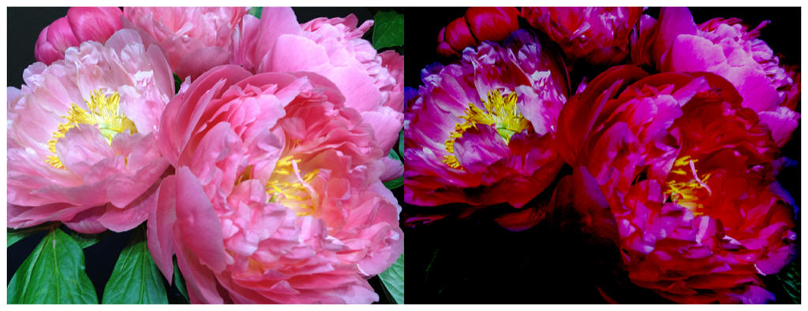

> Navigation: [Technologies](../../technologies.md) · [Core Image](../../coreimage.md) · [CIFilter](../cifilter-swift.class.md)

# colorControls()

<sub>Type Method</sub>

Alters the brightness, contrast, and saturation of an image’s colors.

<sub>iOS, iPadOS, Mac Catalyst, macOS, tvOS, visionOS</sub>

```swift
class func colorControls() -> any CIFilter & CIColorControls
```

## Return Value

The modified image.

## Discussion

This method applies the color controls filter to an image. The effect calculates saturation by linearly interpolating between a grayscale image with a saturation of `0.0` and the original image saturation of `1.0.`

The color controls filter uses the following properties:

- **`brightness`** — A `float` representing the amount of brightness applied as a [NSNumber](../../foundation/nsnumber.md).
- **`contrast`** — A `float` `r`epresenting the amount of contrast applied as a [NSNumber](../../foundation/nsnumber.md).
- **`saturation`** — A float representing the amount of saturation applied as a [NSNumber](../../foundation/nsnumber.md).
- **`inputImage`** — An image with the type [CIImage](../ciimage.md).

The following code creates a filter that results in a darker image:

```swift
func colorControls(inputImage: CIImage) -> CIImage {
    let colorControlsFilter = CIFilter.colorControls()
    colorControlsFilter.inputImage = inputImage
    colorControlsFilter.brightness = -0.4
    colorControlsFilter.contrast = 1
    colorControlsFilter.saturation = 1
    return colorControlsFilter.outputImage!
}
```



<sub>Two versions of a photograph side by side. The photo on the left shows a small bunch of flowers photographed close up, in focus, with good light and no effects. In the photo on the right, a color controls filter is applied, resulting in the image having darker colors and decreased brightness.</sub>

## See Also

### Filters

- [+ colorAbsoluteDifferenceFilter](<colorabsolutedifference().md>) — Calculates the absolute difference between each color component in the input images.
- [+ colorClampFilter](<colorclamp().md>) — Alters the colors in an image based on color components.
- [+ colorMatrixFilter](<colormatrix().md>) — Alters the colors in an image based on vectors provided.
- [+ colorPolynomialFilter](<colorpolynomial().md>) — Alters an image’s colors.
- [+ colorThresholdFilter](<colorthreshold().md>) — Compares the red, green, and blue components of the input image to a threshold and sets them to 1 or 0.
- [+ colorThresholdOtsuFilter](<colorthresholdotsu().md>) — Compares the red, green, and blue components of the input image against a threshold calculated using Otsu’s algorithm.
- [+ depthToDisparityFilter](<depthtodisparity().md>) — Converts from an image containing depth data to an image containing disparity data.
- [+ disparityToDepthFilter](<disparitytodepth().md>) — Creates depth data from an image containing disparity data.
- [+ exposureAdjustFilter](<exposureadjust().md>) — Adjusts an image’s exposure.
- [+ gammaAdjustFilter](<gammaadjust().md>) — Alters an image’s transition between black and white.
- [+ hueAdjustFilter](<hueadjust().md>) — Modifies an image’s hue.
- [+ linearToSRGBToneCurveFilter](<lineartosrgbtonecurve().md>) — Alters an image’s color intensity.
- [+ sRGBToneCurveToLinearFilter](<srgbtonecurvetolinear().md>) — Converts the colors in an image from sRGB to linear.
- [+ temperatureAndTintFilter](<temperatureandtint().md>) — Alters an image’s temperature and tint.
- [+ toneCurveFilter](<tonecurve().md>) — Alters an image’s tone curve according to a series of data points.
