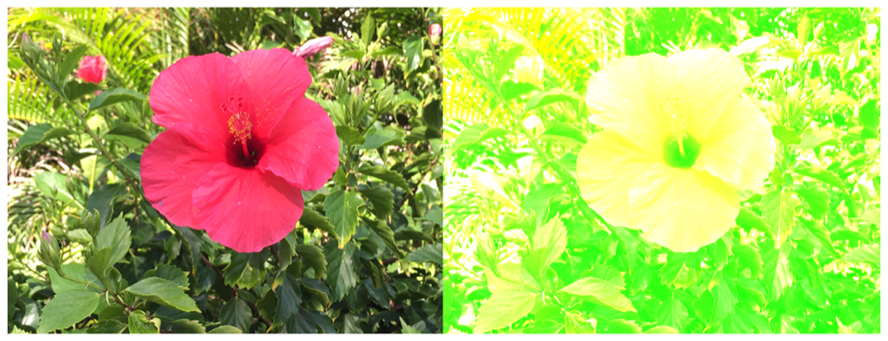

> Navigation: [Technologies](../../technologies.md) · [Core Image](../../coreimage.md) · [CIFilter](../cifilter-swift.class.md)

# colorCrossPolynomial()

<sub>Type Method</sub>

Adjusts an image’s color by applying polynomial cross-products.

<sub>iOS, iPadOS, Mac Catalyst, macOS, tvOS, visionOS</sub>

```swift
class func colorCrossPolynomial() -> any CIFilter & CIColorCrossPolynomial
```

## Return Value

The modified image.

## Discussion

This method applies the color cross polynomial filter to an image. The effect targets each pixel individually and calculates the coefficients for the r`ed`, `green`, and `blue` channels according to the polynomial cross product.

The color cross-polynomial filter uses the following properties:

- **`redCoefficients`** — A [CIVector](../civector.md) representing the polynomial coefficients for the red channel.
- **`blueCoefficients`** — A [CIVector](../civector.md) representing the polynomial coefficients for the blue channel.
- **`greenCoefficients`** — A [CIVector](../civector.md) representing polynomial coefficients for the green channel.
- **`inputImage`** — An image with the type [CIImage](../ciimage.md).

The following code creates a filter that adds a green hue to the input image:

```swift
    func colorCrossPolynomial(inputImage: CIImage) -> CIImage? {

        let colorCrossPolynomial = CIFilter.colorCrossPolynomial()
        let redfloatArr: [CGFloat] = [1, 1, 1, 1, 0, 0, 0, 0, 0, 0]
        let greenfloatArr: [CGFloat] = [0, 1, 1, 0, 0, 0, 0, 0, 0, 1]
        let bluefloatArr: [CGFloat] = [0, 0, 1, 0, 0, 0, 0, 1, 1, 0]

        colorCrossPolynomial.inputImage = inputImage
        colorCrossPolynomial.blueCoefficients = CIVector(values: bluefloatArr, count: bluefloatArr.count)
        colorCrossPolynomial.redCoefficients = CIVector(values: redfloatArr, count: redfloatArr.count)
        colorCrossPolynomial.greenCoefficients = CIVector(values: greenfloatArr, count: greenfloatArr.count)
        return colorCrossPolynomial.outputImage
    }
```



<sub>Two pictures of a pink flower surrounded by foliage. The photo on the left shows a single flower photographed closeup, in focus, with good light and no effects. In the photo on the right, a color cross polynomial filter is applied, and the colors in the image have a green hue.</sub>

## See Also

### Color Effect Filters

- [+ colorCubeFilter](<colorcube().md>) — Adjusts an image’s pixels using a three-dimensional color table.
- [+ colorCubeWithColorSpaceFilter](<colorcubewithcolorspace().md>) — Adjusts an image’s pixels using a three-dimensional color table in specified color space.
- [+ colorCubesMixedWithMaskFilter](<colorcubesmixedwithmask().md>) — Alters an image’s pixels using a three-dimensional color tables and a mask image.
- [+ colorCurvesFilter](<colorcurves().md>) — Adjusts an image’s color curves.
- [+ colorInvertFilter](<colorinvert().md>) — Inverts an image’s colors.
- [+ colorMapFilter](<colormap().md>) — Performs a transformation of the input image colors to colors from a gradient image.
- [+ colorMonochromeFilter](<colormonochrome().md>) — Adjusts an image’s colors to shades of a single color.
- [+ colorPosterizeFilter](<colorposterize().md>) — Flattens an image’s colors.
- [+ convertLabToRGBFilter](<convertlabtorgb().md>) — Converts an image from CIELAB to RGB color space.
- [+ convertRGBtoLabFilter](<convertrgbtolab().md>) — Converts an image from RGB to CIELAB color space.
- [+ ditherFilter](<dither().md>) — Applies randomized noise to produce a processed look.
- [+ documentEnhancerFilter](<documentenhancer().md>) — Adjusts an image’s shadows and contrast.
- [+ falseColorFilter](<falsecolor().md>) — Replaces an image’s colors with specified colors.
- [+ LabDeltaE](<labdeltae().md>) — Compares an image’s color values.
- [+ maskToAlphaFilter](<masktoalpha().md>) — Converts an image to a white image with an alpha component.
