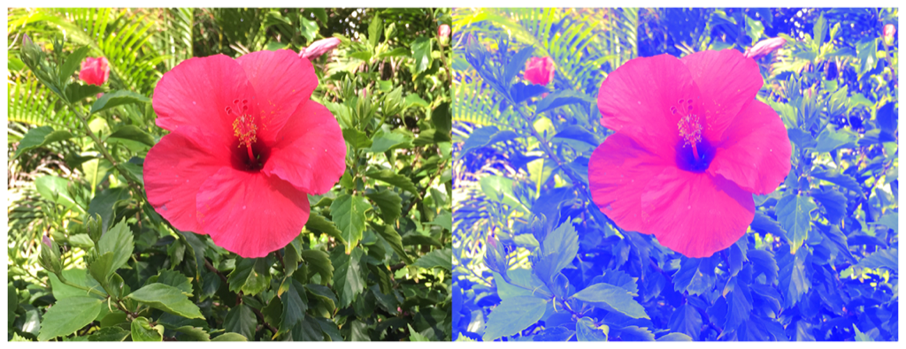

> Navigation: [Technologies](../../technologies.md) · [Core Image](../../coreimage.md) · [CIFilter](../cifilter-swift.class.md)

# colorCube()

<sub>Type Method</sub>

Adjusts an image’s pixels using a three-dimensional color table.

<sub>iOS, iPadOS, Mac Catalyst, macOS, tvOS, visionOS</sub>

```swift
class func colorCube() -> any CIFilter & CIColorCube
```

## Return Value

The modified image.

## Discussion

This method applies the color cube filter to an image. The effect maps color values in the input image to new color values using a three-dimensional color look-up table, also called a color cube. For each `RGBA` pixel in the input image, the filter uses the pixel’s `red`, `green`, and `blue` component values to identify a location in the table. The `RGBA` value at that location becomes the `RGBA` value of the output pixel.

The color cube filter uses the following properties:

- **`inputImage`** — An image with the type [CIImage](../ciimage.md).
- **`cubeData`** — Data containing a 3-dimensional color table of floating-point premultiplied RGBA values. The cells are organized in a standard ordering. The columns and rows of the data are indexed by red and green, respectively. Each data plane is followed by the next higher plane in the data, with planes indexed by blue.
- **`extrapolate`** — If `true`, then the filter extrapolates the color cube for any RGB component values outside the range 0.0 to 1.0.
- **`cubeDimension`** — The dimension of the color cube.

The following code creates a filter that adds a blue hue to the input image:

```swift
func colorCube(inputImage: CIImage, cubeData: Data) -> CIImage {
    let colorCubeEffect = CIFilter.colorCube()
    colorCubeEffect.inputImage = inputImage
    colorCubeEffect.cubeData = cubeData
    colorCubeEffect.cubeDimension = 4
    return colorCubeEffect.outputImage!
}
// Create a color cube with size 4.
var colorCubeData: [Float32] = []
let size = 4
let step = 1.0 / Float(size - 1)
for b in 0..<size {
    for g in 0..<size {
        for r in 0..<size {
            // Calculate the normalized color component values.
            let red = Float32(r) * step
            let green = Float32(g) * step
            // Shift the blue component to add a blue tint.
            let blue = min(1.0, Float32(b) * step + 0.5)
            let alpha: Float = 1.0
            colorCubeData.append(contentsOf: [red, green, blue, alpha])
        }
    }
}
let cubeData = Data(bytes: colorCubeData, count: colorCubeData.count * 4)
let result = colorCube(inputImage: ciImage, cubeData: cubeData)
imageView.image = UIImage(ciImage: result)
```



<sub>Two pictures of a pink flower surrounded by foliage. The photo on the left shows a single flower photographed close-up, in focus, with good light and no effects. In the photo on the right, a color cube filter is applied, and the image has a blue hue.</sub>

## See Also

### Color Effect Filters

- [+ colorCrossPolynomialFilter](<colorcrosspolynomial().md>) — Adjusts an image’s color by applying polynomial cross-products.
- [+ colorCubeWithColorSpaceFilter](<colorcubewithcolorspace().md>) — Adjusts an image’s pixels using a three-dimensional color table in specified color space.
- [+ colorCubesMixedWithMaskFilter](<colorcubesmixedwithmask().md>) — Alters an image’s pixels using a three-dimensional color tables and a mask image.
- [+ colorCurvesFilter](<colorcurves().md>) — Adjusts an image’s color curves.
- [+ colorInvertFilter](<colorinvert().md>) — Inverts an image’s colors.
- [+ colorMapFilter](<colormap().md>) — Performs a transformation of the input image colors to colors from a gradient image.
- [+ colorMonochromeFilter](<colormonochrome().md>) — Adjusts an image’s colors to shades of a single color.
- [+ colorPosterizeFilter](<colorposterize().md>) — Flattens an image’s colors.
- [+ convertLabToRGBFilter](<convertlabtorgb().md>) — Converts an image from CIELAB to RGB color space.
- [+ convertRGBtoLabFilter](<convertrgbtolab().md>) — Converts an image from RGB to CIELAB color space.
- [+ ditherFilter](<dither().md>) — Applies randomized noise to produce a processed look.
- [+ documentEnhancerFilter](<documentenhancer().md>) — Adjusts an image’s shadows and contrast.
- [+ falseColorFilter](<falsecolor().md>) — Replaces an image’s colors with specified colors.
- [+ LabDeltaE](<labdeltae().md>) — Compares an image’s color values.
- [+ maskToAlphaFilter](<masktoalpha().md>) — Converts an image to a white image with an alpha component.
