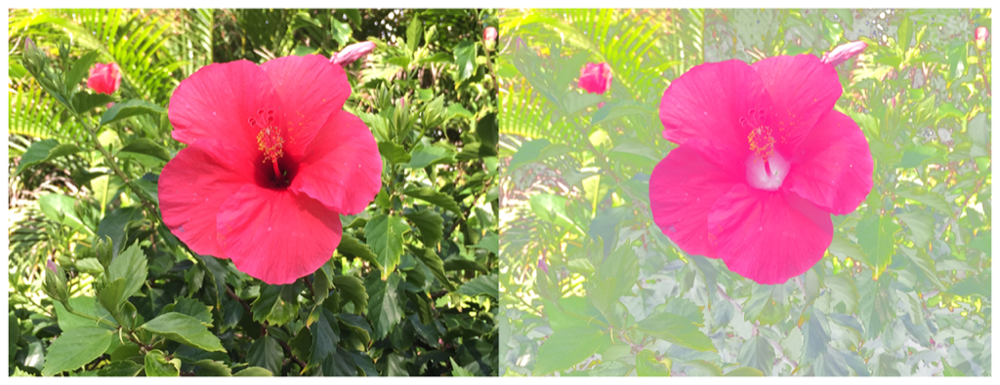

> Navigation: [Technologies](../../technologies.md) · [Core Image](../../coreimage.md) · [CIFilter](../cifilter-swift.class.md)

# colorCubeWithColorSpace()

<sub>Type Method</sub>

Adjusts an image’s pixels using a three-dimensional color table in specified color space.

<sub>iOS, iPadOS, Mac Catalyst, macOS, tvOS, visionOS</sub>

```swift
class func colorCubeWithColorSpace() -> any CIFilter & CIColorCubeWithColorSpace
```

## Return Value

The modified image.

## Discussion

This method applies the color cube with color space filter to an image. The effect applies a mapping from `rgb` space within the color space defined to color values the cubeData defines. For each pixel, it matches the data and adjusts the color on the output image.

The color cube with color space filter uses the following properties:

- **`cubeData`** — Data containing a 3-dimensional color table of floating-point premultiplied RGBA values. The cells are organized in a standard ordering. The columns and rows of the data are indexed by red and green, respectively. Each data plane is followed by the next higher plane in the data, with planes indexed by blue.
- **`colorSpace`** — A [CGColorSpace](../../coregraphics/cgcolorspace.md) representing the color space for the color cube.
- **`cubeDimension`** — The dimension of the color cube.
- **`inputImage`** — An image with the type [CIImage](../ciimage.md).

The following code creates a filter that adds brightness to the input image:

```swift
func colorCube(inputImage: CIImage, cubeData: Data) -> CIImage {
    let colorCubeEffect = CIFilter.colorCubeWithColorSpace()
    colorCubeEffect.inputImage = inputImage
    colorCubeEffect.colorSpace = CGColorSpaceCreateDeviceRGB()
    colorCubeEffect.cubeData = cubeData
    colorCubeEffect.cubeDimension = 4
    return colorCubeEffect.outputImage!
}
// Create a color cube with size 4.
var colorCubeData: [Float32] = []
let size = 4
let step = 1.0 / Float32(size - 1)
for b in 0..<size {
    for g in 0..<size {
        for r in 0..<size {
            // Calculate the normalized color component values.
            let redNormalised = Float32(r) * step
            let greenNormalised = Float32(g) * step
            let blueNormalised = Float32(b) * step
            let red = pow(redNormalised, 0.5)
            let green = pow(greenNormalised, 0.5)
            let blue = pow(blueNormalised, 0.5)
            let alpha: Float = 1.0
            colorCubeData.append(contentsOf: [red, green, blue, alpha])
        }
    }
}
let cubeData = Data(bytes:colorCubeData, count: colorCubeData.count*4)
let result = colorCube(inputImage: ciImage, cubeData: cubeData)
```



<sub>Two pictures of a pink flower surrounded by foliage. The photo on the left shows a single flower photographed close-up, in focus, with good light and no effects. In the photo on the right, a color cube with color space filter is applied, resulting in the photo becoming lighter and the flower becoming darker.</sub>

## See Also

### Color Effect Filters

- [+ colorCrossPolynomialFilter](<colorcrosspolynomial().md>) — Adjusts an image’s color by applying polynomial cross-products.
- [+ colorCubeFilter](<colorcube().md>) — Adjusts an image’s pixels using a three-dimensional color table.
- [+ colorCubesMixedWithMaskFilter](<colorcubesmixedwithmask().md>) — Alters an image’s pixels using a three-dimensional color tables and a mask image.
- [+ colorCurvesFilter](<colorcurves().md>) — Adjusts an image’s color curves.
- [+ colorInvertFilter](<colorinvert().md>) — Inverts an image’s colors.
- [+ colorMapFilter](<colormap().md>) — Performs a transformation of the input image colors to colors from a gradient image.
- [+ colorMonochromeFilter](<colormonochrome().md>) — Adjusts an image’s colors to shades of a single color.
- [+ colorPosterizeFilter](<colorposterize().md>) — Flattens an image’s colors.
- [+ convertLabToRGBFilter](<convertlabtorgb().md>) — Converts an image from CIELAB to RGB color space.
- [+ convertRGBtoLabFilter](<convertrgbtolab().md>) — Converts an image from RGB to CIELAB color space.
- [+ ditherFilter](<dither().md>) — Applies randomized noise to produce a processed look.
- [+ documentEnhancerFilter](<documentenhancer().md>) — Adjusts an image’s shadows and contrast.
- [+ falseColorFilter](<falsecolor().md>) — Replaces an image’s colors with specified colors.
- [+ LabDeltaE](<labdeltae().md>) — Compares an image’s color values.
- [+ maskToAlphaFilter](<masktoalpha().md>) — Converts an image to a white image with an alpha component.
