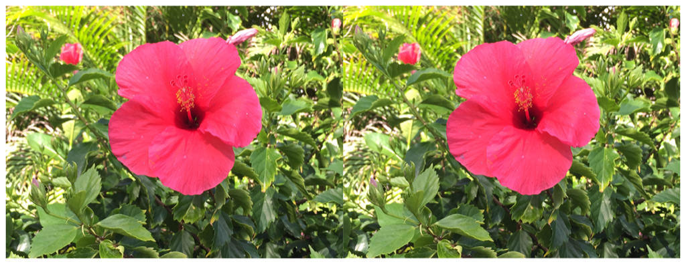

> Navigation: [Technologies](../../technologies.md) · [Core Image](../../coreimage.md) · [CIFilter](../cifilter-swift.class.md)

# colorCurves()

<sub>Type Method</sub>

Adjusts an image’s color curves.

<sub>iOS, iPadOS, Mac Catalyst, macOS, tvOS, visionOS</sub>

```swift
class func colorCurves() -> any CIFilter & CIColorCurves
```

## Return Value

The modified image.

## Discussion

This method applies the color curves filter to an image. The effect uses a three-channel one-dimensional color table to transform the source image pixels. The color table must be comprised of floating-point RGB value.

The color curves filter uses the following properties:

- **`colorSpace`** — A [CGColorSpace](../../coregraphics/cgcolorspace.md) representing the color space for the color curve.
- **`curvesData`** — Data containing a color table of floating-point RGB values as [NSData](../../foundation/nsdata.md).
- **`curvesDomain`** — A two-element vector that defines the minimum and maximum values of the curve data as a [CIVector](../civector.md).
- **`inputImage`** — An image with the type [CIImage](../ciimage.md).

The following code creates a filter that adds brightness to the input image:

```swift
func colorCurves(inputImage: CIImage) -> CIImage {
    let colorCurvesEffect = CIFilter.colorCurves()
    colorCurvesEffect.inputImage = inputImage
    colorCurvesEffect.curvesDomain = CIVector(x: 0, y: 1)
    colorCurvesEffect.curvesData = Data(
        bytes: [Float32]([
            0.0,0.0,0.0,
            0.8,0.8,0.8,
            1.0,1.0,1.0
        ]), count: 36)
    colorCurvesEffect.colorSpace = CGColorSpaceCreateDeviceRGB()
    return colorCurvesEffect.outputImage!
}
```



<sub>Two pictures of a pink flower surrounded by foliage. The photo on the left shows a single flower photographed close-up, in focus, with good light and no effects. In the photo on the right, a color curves filter is applied, resulting in the photo becoming brighter.</sub>

## See Also

### Color Effect Filters

- [+ colorCrossPolynomialFilter](<colorcrosspolynomial().md>) — Adjusts an image’s color by applying polynomial cross-products.
- [+ colorCubeFilter](<colorcube().md>) — Adjusts an image’s pixels using a three-dimensional color table.
- [+ colorCubeWithColorSpaceFilter](<colorcubewithcolorspace().md>) — Adjusts an image’s pixels using a three-dimensional color table in specified color space.
- [+ colorCubesMixedWithMaskFilter](<colorcubesmixedwithmask().md>) — Alters an image’s pixels using a three-dimensional color tables and a mask image.
- [+ colorInvertFilter](<colorinvert().md>) — Inverts an image’s colors.
- [+ colorMapFilter](<colormap().md>) — Performs a transformation of the input image colors to colors from a gradient image.
- [+ colorMonochromeFilter](<colormonochrome().md>) — Adjusts an image’s colors to shades of a single color.
- [+ colorPosterizeFilter](<colorposterize().md>) — Flattens an image’s colors.
- [+ convertLabToRGBFilter](<convertlabtorgb().md>) — Converts an image from CIELAB to RGB color space.
- [+ convertRGBtoLabFilter](<convertrgbtolab().md>) — Converts an image from RGB to CIELAB color space.
- [+ ditherFilter](<dither().md>) — Applies randomized noise to produce a processed look.
- [+ documentEnhancerFilter](<documentenhancer().md>) — Adjusts an image’s shadows and contrast.
- [+ falseColorFilter](<falsecolor().md>) — Replaces an image’s colors with specified colors.
- [+ LabDeltaE](<labdeltae().md>) — Compares an image’s color values.
- [+ maskToAlphaFilter](<masktoalpha().md>) — Converts an image to a white image with an alpha component.
