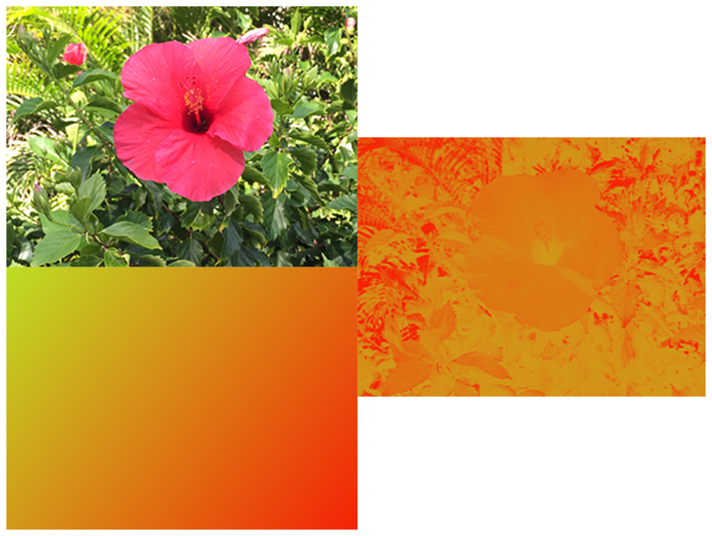

> Navigation: [Technologies](../../technologies.md) · [Core Image](../../coreimage.md) · [CIFilter](../cifilter-swift.class.md)

# colorMap()

<sub>Type Method</sub>

Performs a transformation of the input image colors to colors from a gradient image.

<sub>iOS, iPadOS, Mac Catalyst, macOS, tvOS, visionOS</sub>

```swift
class func colorMap() -> any CIFilter & CIColorMap
```

## Return Value

The modified image.

## Discussion

This method applies a color map filter to an image. The effect transforms source color values by converting the unpremultiplied RGB values to luma using the weighting `(0.2125, 0.7154, 0.0721)`. The luma value is then used to look up the new color from the gradient image.

The color map filter uses the following properties:

- **`inputImage`** — An image with the type [CIImage](../ciimage.md).
- **`gradientImage`** — An image representing the gradient of colors to be mapped to the input image colors with the type [CIImage](../ciimage.md).

The following code creates a filter that adds the gradient image colors to the input image:

```swift
func colorMap(inputImage: CIImage, gradientImage: CIImage) -> CIImage {
    let colorMap = CIFilter.colorMap()
    colorMap.inputImage = inputImage
    colorMap.gradientImage = gradientImage
    return colorMap.outputImage!
}
```



<sub>One photograph on the left above a gradient image, and a second photograph on the right. The photograph on the top left shows a single flower photographed closeup, in focus, with good light and no effects. The image below is a gradient image displaying a gradual color shift from lime green to orange. The photo on the right shows the same pink flower picture with a color map filter applied. The photograph displays the colors of the gradient photo, with the brightness and contrast of the flower photo.</sub>

## See Also

### Color Effect Filters

- [+ colorCrossPolynomialFilter](<colorcrosspolynomial().md>) — Adjusts an image’s color by applying polynomial cross-products.
- [+ colorCubeFilter](<colorcube().md>) — Adjusts an image’s pixels using a three-dimensional color table.
- [+ colorCubeWithColorSpaceFilter](<colorcubewithcolorspace().md>) — Adjusts an image’s pixels using a three-dimensional color table in specified color space.
- [+ colorCubesMixedWithMaskFilter](<colorcubesmixedwithmask().md>) — Alters an image’s pixels using a three-dimensional color tables and a mask image.
- [+ colorCurvesFilter](<colorcurves().md>) — Adjusts an image’s color curves.
- [+ colorInvertFilter](<colorinvert().md>) — Inverts an image’s colors.
- [+ colorMonochromeFilter](<colormonochrome().md>) — Adjusts an image’s colors to shades of a single color.
- [+ colorPosterizeFilter](<colorposterize().md>) — Flattens an image’s colors.
- [+ convertLabToRGBFilter](<convertlabtorgb().md>) — Converts an image from CIELAB to RGB color space.
- [+ convertRGBtoLabFilter](<convertrgbtolab().md>) — Converts an image from RGB to CIELAB color space.
- [+ ditherFilter](<dither().md>) — Applies randomized noise to produce a processed look.
- [+ documentEnhancerFilter](<documentenhancer().md>) — Adjusts an image’s shadows and contrast.
- [+ falseColorFilter](<falsecolor().md>) — Replaces an image’s colors with specified colors.
- [+ LabDeltaE](<labdeltae().md>) — Compares an image’s color values.
- [+ maskToAlphaFilter](<masktoalpha().md>) — Converts an image to a white image with an alpha component.
