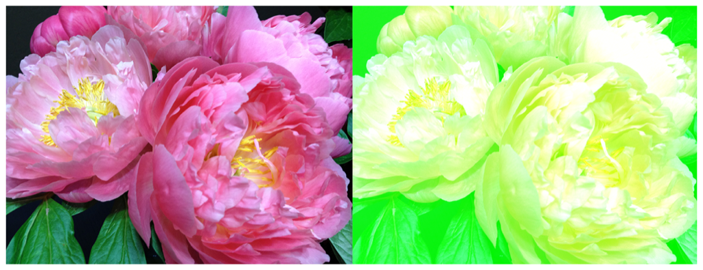

> Navigation: [Technologies](../../technologies.md) · [Core Image](../../coreimage.md) · [CIFilter](../cifilter-swift.class.md)

# colorMatrix()

<sub>Type Method</sub>

Alters the colors in an image based on vectors provided.

<sub>iOS, iPadOS, Mac Catalyst, macOS, tvOS, visionOS</sub>

```swift
class func colorMatrix() -> any CIFilter & CIColorMatrix
```

## Return Value

The modified image.

## Discussion

This method applies the color matrix filter to an image. The effect calculates the color matrix by multiplying the vector properties with the color values from the input image.

The color matrix filter uses the following properties:

- **`rVector`** — A [CIVector](../civector.md) representing the amount of red to multiply the source color values by.
- **`gVector`** — A [CIVector](../civector.md) representing the amount of green to multiply the source color values by.
- **`bVector`** — A [CIVector](../civector.md) representing the amount of blue to multiply the source color values by.
- **`aVector`** — A [CIVector](../civector.md) representing the amount of alpha to multiply the source color values by.
- **`biasVector`** — A [CIVector](../civector.md) representing the amount of each vector that’s added to each color component.
- **`inputImage`** — An image with the type [CIImage](../ciimage.md).

The following code creates a filter that adds a green hue to the input image:

```swift
func colorMatrix(inputImage: CIImage) -> CIImage {
    let colorMatrixFilter = CIFilter.colorMatrix()
    colorMatrixFilter.inputImage = inputImage
    colorMatrixFilter.rVector = CIVector (x: 1, y: 0, z: 0.2, w: 0)
    colorMatrixFilter.gVector = CIVector (x: 0, y: 1, z: 0, w: 0.9)
    colorMatrixFilter.bVector = CIVector (x: 0, y: 0, z: 1, w: 0)
    colorMatrixFilter.aVector = CIVector (x: 0, y: 0, z: 0, w: 1)
    colorMatrixFilter.biasVector = CIVector (x: 0, y: 0, z: 0, w: 0)
    return colorMatrixFilter.outputImage!
}
```



<sub>Two versions of a photograph side by side. The photo on the left shows a small bunch of flowers photographed close up, in focus, with good light and no effects. In the photo on the right, a color matrix filter is applied, transforming the colors in the image to have a green hue.</sub>

## See Also

### Filters

- [+ colorAbsoluteDifferenceFilter](<colorabsolutedifference().md>) — Calculates the absolute difference between each color component in the input images.
- [+ colorClampFilter](<colorclamp().md>) — Alters the colors in an image based on color components.
- [+ colorControlsFilter](<colorcontrols().md>) — Alters the brightness, contrast, and saturation of an image’s colors.
- [+ colorPolynomialFilter](<colorpolynomial().md>) — Alters an image’s colors.
- [+ colorThresholdFilter](<colorthreshold().md>) — Compares the red, green, and blue components of the input image to a threshold and sets them to 1 or 0.
- [+ colorThresholdOtsuFilter](<colorthresholdotsu().md>) — Compares the red, green, and blue components of the input image against a threshold calculated using Otsu’s algorithm.
- [+ depthToDisparityFilter](<depthtodisparity().md>) — Converts from an image containing depth data to an image containing disparity data.
- [+ disparityToDepthFilter](<disparitytodepth().md>) — Creates depth data from an image containing disparity data.
- [+ exposureAdjustFilter](<exposureadjust().md>) — Adjusts an image’s exposure.
- [+ gammaAdjustFilter](<gammaadjust().md>) — Alters an image’s transition between black and white.
- [+ hueAdjustFilter](<hueadjust().md>) — Modifies an image’s hue.
- [+ linearToSRGBToneCurveFilter](<lineartosrgbtonecurve().md>) — Alters an image’s color intensity.
- [+ sRGBToneCurveToLinearFilter](<srgbtonecurvetolinear().md>) — Converts the colors in an image from sRGB to linear.
- [+ temperatureAndTintFilter](<temperatureandtint().md>) — Alters an image’s temperature and tint.
- [+ toneCurveFilter](<tonecurve().md>) — Alters an image’s tone curve according to a series of data points.
