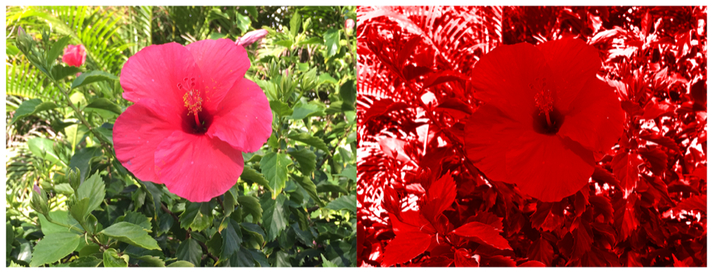

> Navigation: [Technologies](../../technologies.md) · [Core Image](../../coreimage.md) · [CIFilter](../cifilter-swift.class.md)

# colorMonochrome()

<sub>Type Method</sub>

Adjusts an image’s colors to shades of a single color.

<sub>iOS, iPadOS, Mac Catalyst, macOS, tvOS, visionOS</sub>

```swift
class func colorMonochrome() -> any CIFilter & CIColorMonochrome
```

## Return Value

The modified image.

## Discussion

This method applies the color monochrome filter to an image. The effect remaps the colors of the image to shades of the specified color.

The color monochrome filter uses the following properties:

- **`inputImage`** — An image with the type [CIImage](../ciimage.md).
- **`color`** — The color to map the input image colors to, as a [CIColor](../cicolor.md).
- **`intensity`** — A `float` representing the desired strength of the effect as an [NSNumber](../../foundation/nsnumber.md).

The following code creates a filter that results in the colors of the image becoming shades of red:

```swift
func colorMonochrome(inputImage: CIImage) -> CIImage {
    let colorMonochromeFilter = CIFilter.colorMonochrome()
    colorMonochromeFilter.inputImage = inputImage
    colorMonochromeFilter.color = CIColor(red: 1, green: 0, blue: 0)
    colorMonochromeFilter.intensity = 1
    return colorMonochromeFilter.outputImage!
}
```



<sub>Two pictures of a pink flower surrounded by foliage. The photo on the left shows a single flower photographed close-up, in focus, with good light and no effects. In the photo on the right, a color monochrome filter is applied, transforming the colors in the image to a red hue.</sub>

## See Also

### Color Effect Filters

- [+ colorCrossPolynomialFilter](<colorcrosspolynomial().md>) — Adjusts an image’s color by applying polynomial cross-products.
- [+ colorCubeFilter](<colorcube().md>) — Adjusts an image’s pixels using a three-dimensional color table.
- [+ colorCubeWithColorSpaceFilter](<colorcubewithcolorspace().md>) — Adjusts an image’s pixels using a three-dimensional color table in specified color space.
- [+ colorCubesMixedWithMaskFilter](<colorcubesmixedwithmask().md>) — Alters an image’s pixels using a three-dimensional color tables and a mask image.
- [+ colorCurvesFilter](<colorcurves().md>) — Adjusts an image’s color curves.
- [+ colorInvertFilter](<colorinvert().md>) — Inverts an image’s colors.
- [+ colorMapFilter](<colormap().md>) — Performs a transformation of the input image colors to colors from a gradient image.
- [+ colorPosterizeFilter](<colorposterize().md>) — Flattens an image’s colors.
- [+ convertLabToRGBFilter](<convertlabtorgb().md>) — Converts an image from CIELAB to RGB color space.
- [+ convertRGBtoLabFilter](<convertrgbtolab().md>) — Converts an image from RGB to CIELAB color space.
- [+ ditherFilter](<dither().md>) — Applies randomized noise to produce a processed look.
- [+ documentEnhancerFilter](<documentenhancer().md>) — Adjusts an image’s shadows and contrast.
- [+ falseColorFilter](<falsecolor().md>) — Replaces an image’s colors with specified colors.
- [+ LabDeltaE](<labdeltae().md>) — Compares an image’s color values.
- [+ maskToAlphaFilter](<masktoalpha().md>) — Converts an image to a white image with an alpha component.
