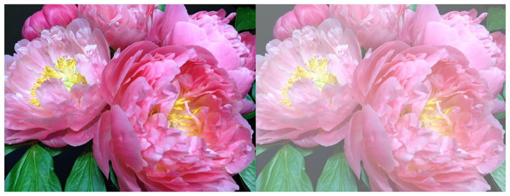

> Navigation: [Technologies](../../technologies.md) · [Core Image](../../coreimage.md) · [CIFilter](../cifilter-swift.class.md)

# colorPolynomial()

<sub>Type Method</sub>

Alters an image’s colors.

<sub>iOS, iPadOS, Mac Catalyst, macOS, tvOS, visionOS</sub>

```swift
class func colorPolynomial() -> any CIFilter & CIColorPolynomial
```

## Return Value

The modified image.

## Discussion

This method applies the color polynomial filter to an image. The effect calculates the sum of each pixel’s color component value and the coefficient properties together to produce the output image.

The color polynomial filter uses the following properties:

- **`redCoefficients`** — A vector representing the polynomial coefficients for the red channel as a [CIVector](../civector.md).
- **`greenCoefficients`** — A vector representing the polynomial coefficients for the green channel as a [CIVector](../civector.md).
- **`blueCoefficients`** — A vector representing the polynomial coefficients for the blue channel as a [CIVector](../civector.md).
- **`alphaCoefficients`** — A vector representing the polynomial coefficients for the alpha channel as a [CIVector](../civector.md).
- **`inputImage`** — An image with the type [CIImage](../ciimage.md).

The following code creates a filter that adds a lighter contrast to the input image:

```swift
func colorPolynomial(inputImage: CIImage) -> CIImage {
    let colorPolynomialFilter = CIFilter.colorPolynomial()
    colorPolynomialFilter.alphaCoefficients = CIVector (x: 0, y: 0.6, z: 0, w: 0)
    colorPolynomialFilter.redCoefficients = CIVector (x: 0, y: 1, z: 0.1, w: 0)
    colorPolynomialFilter.greenCoefficients = CIVector(x: 0, y: 1, z: 0, w: 0)
    colorPolynomialFilter.blueCoefficients = CIVector(x: 0, y: 1, z: 0, w: 0)
    colorPolynomialFilter.inputImage = inputImage
    return colorPolynomialFilter.outputImage!
}
```



<sub>Two versions of a photograph side by side. The photo on the left shows a small bunch of flowers photographed close up, in focus, with good light and no effects. In the photo on the right, a color polynomial filter is applied, resulting in less contrast.</sub>

## See Also

### Filters

- [+ colorAbsoluteDifferenceFilter](<colorabsolutedifference().md>) — Calculates the absolute difference between each color component in the input images.
- [+ colorClampFilter](<colorclamp().md>) — Alters the colors in an image based on color components.
- [+ colorControlsFilter](<colorcontrols().md>) — Alters the brightness, contrast, and saturation of an image’s colors.
- [+ colorMatrixFilter](<colormatrix().md>) — Alters the colors in an image based on vectors provided.
- [+ colorThresholdFilter](<colorthreshold().md>) — Compares the red, green, and blue components of the input image to a threshold and sets them to 1 or 0.
- [+ colorThresholdOtsuFilter](<colorthresholdotsu().md>) — Compares the red, green, and blue components of the input image against a threshold calculated using Otsu’s algorithm.
- [+ depthToDisparityFilter](<depthtodisparity().md>) — Converts from an image containing depth data to an image containing disparity data.
- [+ disparityToDepthFilter](<disparitytodepth().md>) — Creates depth data from an image containing disparity data.
- [+ exposureAdjustFilter](<exposureadjust().md>) — Adjusts an image’s exposure.
- [+ gammaAdjustFilter](<gammaadjust().md>) — Alters an image’s transition between black and white.
- [+ hueAdjustFilter](<hueadjust().md>) — Modifies an image’s hue.
- [+ linearToSRGBToneCurveFilter](<lineartosrgbtonecurve().md>) — Alters an image’s color intensity.
- [+ sRGBToneCurveToLinearFilter](<srgbtonecurvetolinear().md>) — Converts the colors in an image from sRGB to linear.
- [+ temperatureAndTintFilter](<temperatureandtint().md>) — Alters an image’s temperature and tint.
- [+ toneCurveFilter](<tonecurve().md>) — Alters an image’s tone curve according to a series of data points.
