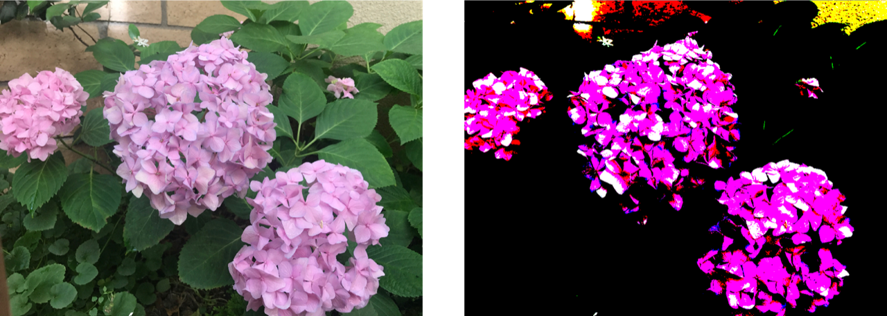

> Navigation: [Technologies](../../technologies.md) · [Core Image](../../coreimage.md) · [CIFilter](../cifilter-swift.class.md)

# colorThreshold()

<sub>Type Method</sub>

Compares the red, green, and blue components of the input image to a threshold and sets them to 1 or 0.

<sub>iOS, iPadOS, Mac Catalyst, macOS, tvOS, visionOS</sub>

```swift
class func colorThreshold() -> any CIFilter & CIColorThreshold
```

## Return Value

An image containing pixels with color components that are either 1 or 0.

## Discussion

This method applies the color threshold filter to an image. The filter compares the value of each color component (red, green, and blue) in the image against the threshold value. Any component higher than the threshold becomes 1 and any component lower becomes 0. The alpha component remains unchanged.

The color threshold filter uses the following properties:

- **`inputImage`** — An image with the type [CIImage](../ciimage.md).
- **`threshold`** — A `float` representing the threshold of color values as an [NSNumber](../../foundation/nsnumber.md).

The following code creates a filter that results in an image where each color component is either 1 or 0.

```swift
func colorThreshold(inputImage: CIImage) -> CIImage {
    let filter = CIFilter.colorThreshold()
    filter.inputImage = inputImage
    filter.threshold = 0.5
    return filter.outputImage!
}
```



<sub>Two images arranged horizontally. The left image contains a photograph of three hydrangea flowers with dark leaves in the background. The image on the right shows the result of applying the color threshold filter. The dark leaves have been replaced by black and the colors in the flowers are now fully saturated or white.</sub>

## See Also

### Filters

- [+ colorAbsoluteDifferenceFilter](<colorabsolutedifference().md>) — Calculates the absolute difference between each color component in the input images.
- [+ colorClampFilter](<colorclamp().md>) — Alters the colors in an image based on color components.
- [+ colorControlsFilter](<colorcontrols().md>) — Alters the brightness, contrast, and saturation of an image’s colors.
- [+ colorMatrixFilter](<colormatrix().md>) — Alters the colors in an image based on vectors provided.
- [+ colorPolynomialFilter](<colorpolynomial().md>) — Alters an image’s colors.
- [+ colorThresholdOtsuFilter](<colorthresholdotsu().md>) — Compares the red, green, and blue components of the input image against a threshold calculated using Otsu’s algorithm.
- [+ depthToDisparityFilter](<depthtodisparity().md>) — Converts from an image containing depth data to an image containing disparity data.
- [+ disparityToDepthFilter](<disparitytodepth().md>) — Creates depth data from an image containing disparity data.
- [+ exposureAdjustFilter](<exposureadjust().md>) — Adjusts an image’s exposure.
- [+ gammaAdjustFilter](<gammaadjust().md>) — Alters an image’s transition between black and white.
- [+ hueAdjustFilter](<hueadjust().md>) — Modifies an image’s hue.
- [+ linearToSRGBToneCurveFilter](<lineartosrgbtonecurve().md>) — Alters an image’s color intensity.
- [+ sRGBToneCurveToLinearFilter](<srgbtonecurvetolinear().md>) — Converts the colors in an image from sRGB to linear.
- [+ temperatureAndTintFilter](<temperatureandtint().md>) — Alters an image’s temperature and tint.
- [+ toneCurveFilter](<tonecurve().md>) — Alters an image’s tone curve according to a series of data points.
