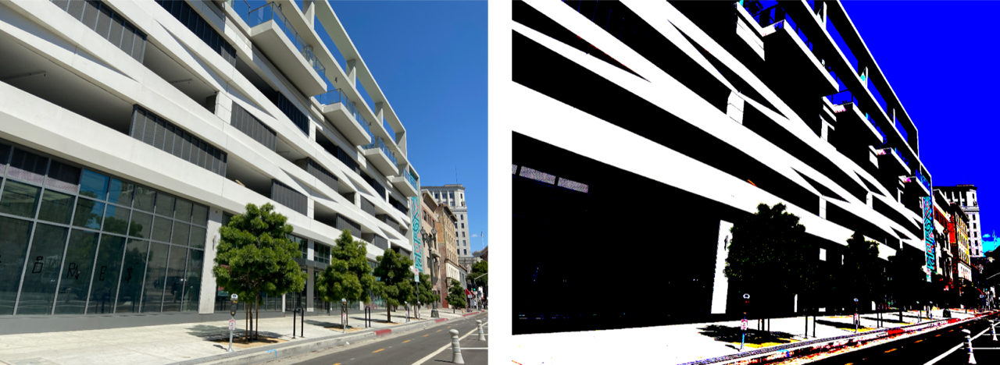

> Navigation: [Technologies](../../technologies.md) · [Core Image](../../coreimage.md) · [CIFilter](../cifilter-swift.class.md)

# colorThresholdOtsu()

<sub>Type Method</sub>

Compares the red, green, and blue components of the input image against a threshold calculated using Otsu’s algorithm.

<sub>iOS, iPadOS, Mac Catalyst, macOS, tvOS, visionOS</sub>

```swift
class func colorThresholdOtsu() -> any CIFilter & CIColorThresholdOtsu
```

## Return Value

An image containing pixels with color components that are either 1 or 0.

## Discussion

The filter applies Otsu’s algorithm to the reg, green, and blue color components. The filter uses these thresholds to set the color to components to 1 or 0. The alpha component remains unchanged.

The color threshold Otsu filter uses the following property:

- **`inputImage`** — An image with the type [CIImage](../ciimage.md).

The following code creates a filter that results in an image where each color component is either 1 or 0:

```swift
func colorThresholdOTSU(inputImage: CIImage) -> CIImage {
    let filter = CIFilter.colorThresholdOtsu()
    filter.inputImage = inputImage
    return filter.outputImage!
}
```



<sub>Two images arranged horizontally. The left image contains a photograph of a modern building with light colored concrete set against a clear sky. The image on the right shows the result of applying the color threshold Otsu filter. The light colored concrete is now set to bright white and the sky is set to fully saturated blue. </sub>

## See Also

### Filters

- [+ colorAbsoluteDifferenceFilter](<colorabsolutedifference().md>) — Calculates the absolute difference between each color component in the input images.
- [+ colorClampFilter](<colorclamp().md>) — Alters the colors in an image based on color components.
- [+ colorControlsFilter](<colorcontrols().md>) — Alters the brightness, contrast, and saturation of an image’s colors.
- [+ colorMatrixFilter](<colormatrix().md>) — Alters the colors in an image based on vectors provided.
- [+ colorPolynomialFilter](<colorpolynomial().md>) — Alters an image’s colors.
- [+ colorThresholdFilter](<colorthreshold().md>) — Compares the red, green, and blue components of the input image to a threshold and sets them to 1 or 0.
- [+ depthToDisparityFilter](<depthtodisparity().md>) — Converts from an image containing depth data to an image containing disparity data.
- [+ disparityToDepthFilter](<disparitytodepth().md>) — Creates depth data from an image containing disparity data.
- [+ exposureAdjustFilter](<exposureadjust().md>) — Adjusts an image’s exposure.
- [+ gammaAdjustFilter](<gammaadjust().md>) — Alters an image’s transition between black and white.
- [+ hueAdjustFilter](<hueadjust().md>) — Modifies an image’s hue.
- [+ linearToSRGBToneCurveFilter](<lineartosrgbtonecurve().md>) — Alters an image’s color intensity.
- [+ sRGBToneCurveToLinearFilter](<srgbtonecurvetolinear().md>) — Converts the colors in an image from sRGB to linear.
- [+ temperatureAndTintFilter](<temperatureandtint().md>) — Alters an image’s temperature and tint.
- [+ toneCurveFilter](<tonecurve().md>) — Alters an image’s tone curve according to a series of data points.
