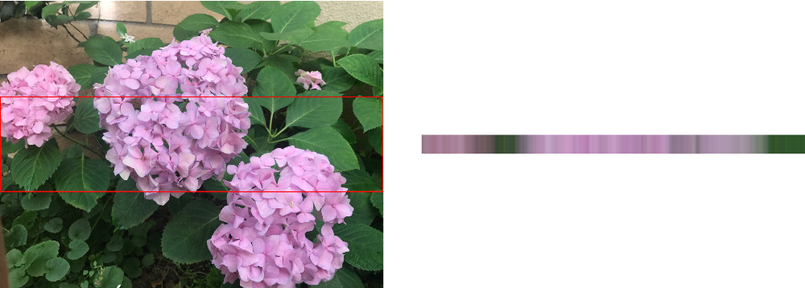

> Navigation: [Technologies](../../technologies.md) · [Core Image](../../coreimage.md) · [CIFilter](../cifilter-swift.class.md)

# columnAverage()

<sub>Type Method</sub>

Calculates the average color for a specified column of an image.

<sub>iOS, iPadOS, Mac Catalyst, macOS, tvOS, visionOS</sub>

```swift
class func columnAverage() -> any CIFilter & CIColumnAverage
```

## Return Value

The generated image.

## Discussion

This method applies the column average filter to an image. This effect calculates the average color for a vertical column over a region defined by `extent`. The width of the resulting image is set by the width of the `extent`. The height of the resulting image is always 1 pixel.

The column average filter uses the following properties:

- **`inputImage`** — An image with the type [CIImage](../ciimage.md).
- **`extent`** — A [CGRect](../../corefoundation/cgrect.md) that specifies the subregion of the image that you want to process.

The following code creates an image containing the average values in the columns from the middle of the image:

```swift
func columnAverage(inputImage: CIImage) -> CIImage {
    let filter = CIFilter.columnAverage()
    filter.inputImage = inputImage
    filter.extent = CGRect(x: 0, y: inputImage.extent.height/3, width: inputImage.extent.width, height: inputImage.extent.height/3)
    return filter.outputImage!
}
```



<sub>Two images arranged horizontally side by side. The left image contains a photograph of three hydrangeas with a background of leaves. The middle of the image is highlighted by an outlined rectangle. The right image contains the result of the column average filter applied to the highlighted region of the image. The right image has been stretched vertically to make it easier to see. It contains colors from the flowers and the leaves.</sub>

## See Also

### Filters

- [+ areaAverageFilter](<areaaverage().md>) — Returns a 1 x 1 pixel image that contains the average color for the region of interest.
- [+ areaHistogramFilter](<areahistogram().md>) — Returns a histogram of a specified area of the image.
- [+ areaLogarithmicHistogramFilter](<arealogarithmichistogram().md>) — Returns a logarithmic histogram of a specified area of the image.
- [+ areaMaximumFilter](<areamaximum().md>) — Calculates the maximum color components of a specified area of the image.
- [+ areaMaximumAlphaFilter](<areamaximumalpha().md>) — Finds the pixel with the highest alpha value.
- [+ areaMinimumFilter](<areaminimum().md>) — Calculates the minimum color component values for a specified area of the image.
- [+ areaMinimumAlphaFilter](<areaminimumalpha().md>) — Calculates the pixel within a specified area that has the smallest alpha value.
- [+ areaMinMaxFilter](<areaminmax().md>) — Calculates minimum and maximum color components for a specified area of the image.
- [+ areaMinMaxRedFilter](<areaminmaxred().md>) — Calculates the minimum and maximum red component value.
- [+ histogramDisplayFilter](<histogramdisplay().md>) — Generates a histogram map from the image.
- [+ KMeansFilter](<kmeans().md>) — Applies the k-means algorithm to find the most common colors in an image.
- [+ rowAverageFilter](<rowaverage().md>) — Calculates the average color for the specified row of pixels in an image.
