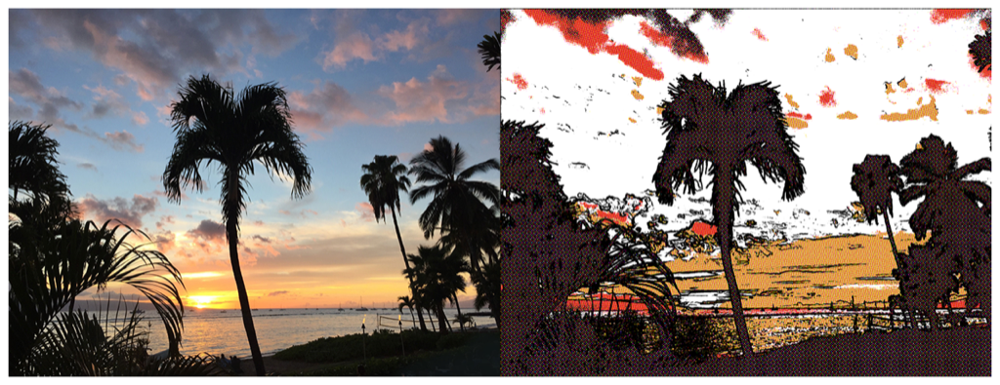

> Navigation: [Technologies](../../technologies.md) · [Core Image](../../coreimage.md) · [CIFilter](../cifilter-swift.class.md)

# comicEffect()

<sub>Type Method</sub>

Creates an image with a comic book effect.

<sub>iOS, iPadOS, Mac Catalyst, macOS, tvOS, visionOS</sub>

```swift
class func comicEffect() -> any CIFilter & CIComicEffect
```

## Return Value

The modified image.

## Discussion

This method applies the comic effect filter to an image. The effect simulates a comic book drawing by outlining edges and applying a color halftone effect.

The comic effect filter uses the following property:

- **`inputImage`** — An image with the type [CIImage](../ciimage.md).

The following code creates a filter that results in the image appearing image in comic book style.

```swift
func comicEffect(inputImage: CIImage) -> CIImage {
    let comicEffectFilter = CIFilter.comicEffect()
    comicEffectFilter.inputImage = inputImage
    return comicEffectFilter.outputImage!
}
```



<sub>Two photographs of a beach at sunset with multiple palm trees. The photo on the left is clear and crisp. In the photo on the right, a comic effect filter is applied, and the image is brighter with a series of colorful dots creating the detail of the image.</sub>

## See Also

### Filters

- [+ blendWithAlphaMaskFilter](<blendwithalphamask().md>) — Blends two images by using an alpha mask image.
- [+ blendWithBlueMaskFilter](<blendwithbluemask().md>) — Blends two images by using a blue mask image.
- [+ blendWithMaskFilter](<blendwithmask().md>) — Blends two images by using a mask image.
- [+ blendWithRedMaskFilter](<blendwithredmask().md>) — Blends two images by using a red mask image.
- [+ bloomFilter](<bloom().md>) — Adjusts an image’s colors by applying a blur effect.
- [+ cannyEdgeDetectorFilter](<cannyedgedetector().md>) — Applies the Canny edge-detection algorithm to an image.
- [+ coreMLModelFilter](<coremlmodel().md>) — Filters an image with a Core ML model.
- [+ crystallizeFilter](<crystallize().md>) — Creates an image made with a series of colorful polygons.
- [+ depthOfFieldFilter](<depthoffield().md>) — Simulates a depth of field effect.
- [+ edgesFilter](<edges().md>) — Hilghlights edges of objects found within an image.
- [+ edgeWorkFilter](<edgework().md>) — Produces a black-and-white image that looks similar to a woodblock print.
- [+ gaborGradientsFilter](<gaborgradients().md>) — Highlights textures in an image.
- [+ gloomFilter](<gloom().md>) — Adjusts an image’s color by applying a gloom filter.
- [+ heightFieldFromMaskFilter](<heightfieldfrommask().md>) — Creates a realistic shaded height-field image.
- [+ hexagonalPixellateFilter](<hexagonalpixellate().md>) — Creates an image made of a series of colorful hexagons.
