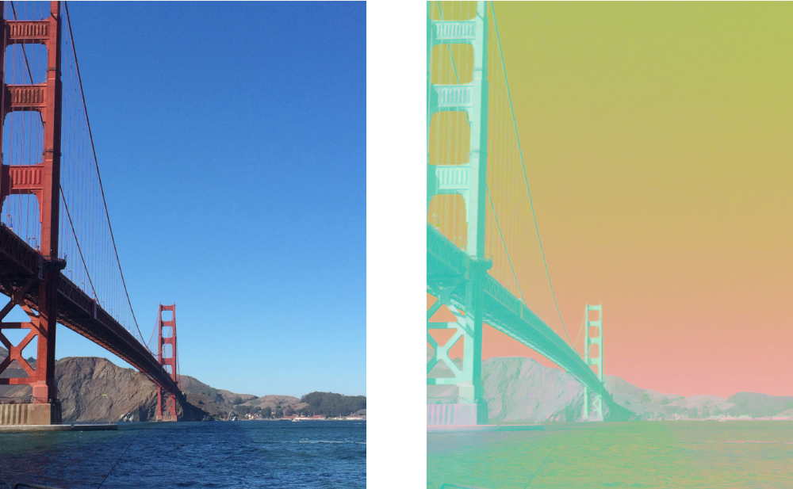

> Navigation: [Technologies](../../technologies.md) · [Core Image](../../coreimage.md) · [CIFilter](../cifilter-swift.class.md)

# convertRGBtoLab()

<sub>Type Method</sub>

Converts an image from RGB to CIELAB color space.

<sub>iOS, iPadOS, Mac Catalyst, macOS, tvOS, visionOS</sub>

```swift
class func convertRGBtoLab() -> any CIFilter & CIConvertLab
```

## Return Value

The converted [CIImage](../ciimage.md).

## Discussion

This filter converts an image from RGB to CIELAB color space. The CIELAB color space expresses color as three values: L* for the perceptual lightness, and a*b* for the colors red, green, blue, and yellow. The RGB color space expresses colors using the intensities of the three primary colors: red, green, and blue.

- **`inputImage`** — A [CIImage](../ciimage.md) containing the `RGB` image.
- **`normalize`** — If true, the three output channels are in the range 0 to 1. If false, the L* channel is in the range 0 to 100 and the a*b* channels are in the range -128 to 128.

The following code applies the `convertRGBToLabFilter` to an image with the `normalize` flag set to the `true`:

```swift
func convertRGBToLab(inputImage: CIImage) -> CIImage {
    let convertRGBToLabFilter = CIFilter.convertRGBtoLab()
    convertRGBToLabFilter.inputImage = inputImage
    convertRGBToLabFilter.normalize = true
    return convertRGBToLabFilter.outputImage!
}
```



<sub>Two images arranged horizontally. The left image contains a photo of the Golden Gate Bridge with a clear sky as the background. The right image shows the result of applying the convert-RGB-to-Lab filter with the normalize flag set to true. The bridge is a light cyan color and the sky is a gradient from yellow-green through to red-pink.</sub>

## See Also

### Color Effect Filters

- [+ colorCrossPolynomialFilter](<colorcrosspolynomial().md>) — Adjusts an image’s color by applying polynomial cross-products.
- [+ colorCubeFilter](<colorcube().md>) — Adjusts an image’s pixels using a three-dimensional color table.
- [+ colorCubeWithColorSpaceFilter](<colorcubewithcolorspace().md>) — Adjusts an image’s pixels using a three-dimensional color table in specified color space.
- [+ colorCubesMixedWithMaskFilter](<colorcubesmixedwithmask().md>) — Alters an image’s pixels using a three-dimensional color tables and a mask image.
- [+ colorCurvesFilter](<colorcurves().md>) — Adjusts an image’s color curves.
- [+ colorInvertFilter](<colorinvert().md>) — Inverts an image’s colors.
- [+ colorMapFilter](<colormap().md>) — Performs a transformation of the input image colors to colors from a gradient image.
- [+ colorMonochromeFilter](<colormonochrome().md>) — Adjusts an image’s colors to shades of a single color.
- [+ colorPosterizeFilter](<colorposterize().md>) — Flattens an image’s colors.
- [+ convertLabToRGBFilter](<convertlabtorgb().md>) — Converts an image from CIELAB to RGB color space.
- [+ ditherFilter](<dither().md>) — Applies randomized noise to produce a processed look.
- [+ documentEnhancerFilter](<documentenhancer().md>) — Adjusts an image’s shadows and contrast.
- [+ falseColorFilter](<falsecolor().md>) — Replaces an image’s colors with specified colors.
- [+ LabDeltaE](<labdeltae().md>) — Compares an image’s color values.
- [+ maskToAlphaFilter](<masktoalpha().md>) — Converts an image to a white image with an alpha component.
