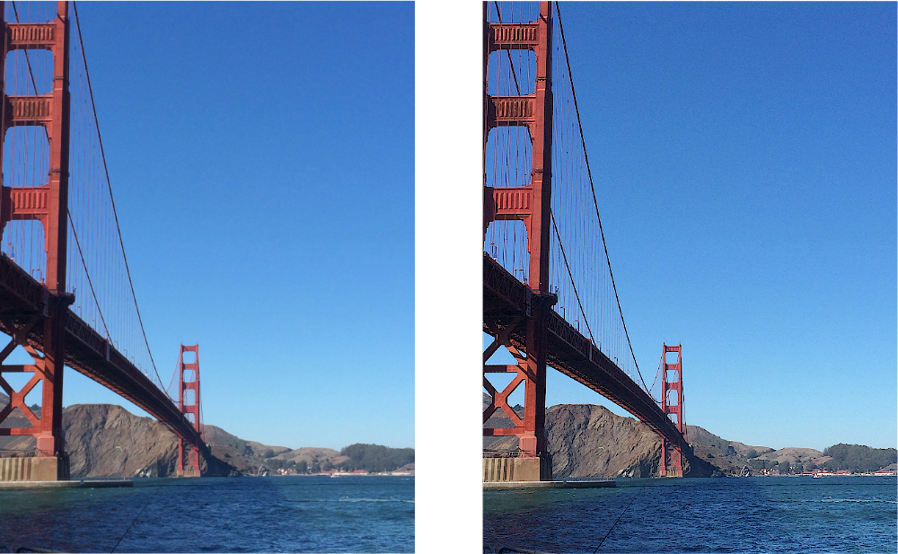

> Navigation: [Technologies](../../technologies.md) · [Core Image](../../coreimage.md) · [CIFilter](../cifilter-swift.class.md)

# convolution3X3()

<sub>Type Method</sub>

Applies a convolution 3 x 3 filter to the `RGBA` components of an image.

<sub>iOS, iPadOS, Mac Catalyst, macOS, tvOS, visionOS</sub>

```swift
class func convolution3X3() -> any CIFilter & CIConvolution
```

## Return Value

The modified image.

## Discussion

This method applies a 3 x 3 convolution to the `RGBA` components of an image. The effect uses a 3 x 3 area surrounding an input pixel, the pixel itself, and those within a distance of 1 pixel horizontally and vertically. The effect repeats this for every pixel within the image. The work area is then combined with the weight property vector to produce the processed image. This filter differs from the [+ convolutionRGB3X3Filter](<convolutionrgb3x3().md>), which only processes the `RGB` color components.

The convolution 3 x 3 filter uses the following properties:

- **`bias`** — A `float` representing the value that’s added to each output pixel as a [NSNumber](../../foundation/nsnumber.md).
- **`weights`** — A [CIVector](../civector.md) representing the convolution kernel.
- **`inputImage`** — An image with the type [CIImage](../ciimage.md).

> [!note] Note
> When using a nonzero `bias` value, the output image has an infinite extent. You should crop the output image before attempting to render it.

The following code creates a filter that sharpens the input image:

```swift
func convolution3X3(inputImage: CIImage) -> CIImage? {
    let convolutionFilter = CIFilter.convolution3X3()
    convolutionFilter.inputImage = inputImage
    let kernel = CIVector(values: [
        0, -2, 0,
        -2, 9, -2,
        0, -2, 0
    ], count: 9)
    convolutionFilter.weights = kernel
    convolutionFilter.bias = 0.0
    return convolutionFilter.outputImage!
}
```



<sub>Two images arranged horizontally. The left image is of a modern building with horizontal concrete beams and large tinted windows. The right image shows the result of applying the convolution RGB 3 x 3 filter with a kernel that sharpens the image. Edges and fine detail in the image are emphasized.</sub>

## See Also

### Filters

- [+ convolution5X5Filter](<convolution5x5().md>) — Applies a convolution 5 x 5 filter to the `RGBA` components image.
- [+ convolution7X7Filter](<convolution7x7().md>) — Applies a convolution 7 x 7 filter to the `RGBA` color components of an image.
- [+ convolution9HorizontalFilter](<convolution9horizontal().md>) — Applies a convolution-9 horizontal filter to the `RGBA` components of an image.
- [+ convolution9VerticalFilter](<convolution9vertical().md>) — Applies a convolution-9 vertical filter to the `RGBA` components of an image.
- [+ convolutionRGB3X3Filter](<convolutionrgb3x3().md>) — Applies a convolution 3 x 3 filter to the `RGB` components of an image.
- [+ convolutionRGB5X5Filter](<convolutionrgb5x5().md>) — Applies a convolution 5 x 5 filter to the `RGB` components of an image.
- [+ convolutionRGB7X7Filter](<convolutionrgb7x7().md>) — Applies a convolution 7 x 7 filter to the RGB components of an image.
- [+ convolutionRGB9HorizontalFilter](<convolutionrgb9horizontal().md>) — Applies a convolution 9 x 1 filter to the RGB components of an image.
- [+ convolutionRGB9VerticalFilter](<convolutionrgb9vertical().md>) — Applies a convolution 1 x 9 filter to the RGB components of an image.
