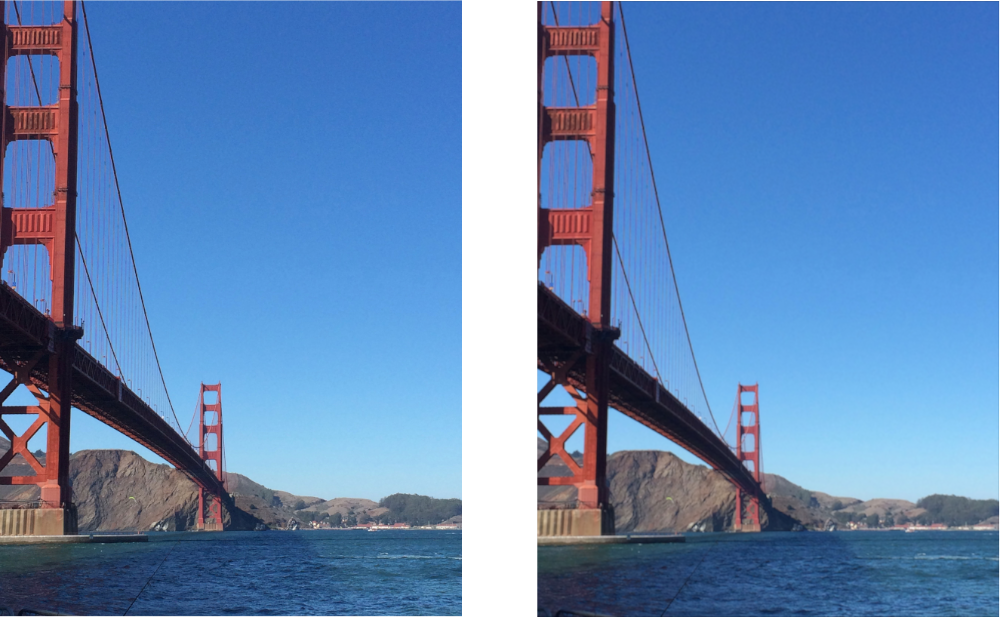

> Navigation: [Technologies](../../technologies.md) · [Core Image](../../coreimage.md) · [CIFilter](../cifilter-swift.class.md)

# convolution5X5()

<sub>Type Method</sub>

Applies a convolution 5 x 5 filter to the `RGBA` components image.

<sub>iOS, iPadOS, Mac Catalyst, macOS, tvOS, visionOS</sub>

```swift
class func convolution5X5() -> any CIFilter & CIConvolution
```

## Return Value

The modified image.

## Discussion

This method applies a 5 x 5 convolution to the `RGBA` components of an image. The effect uses a 5 x 5 area surrounding an input pixel, the pixel itself, and those within a distance of 2 pixels horizontally and vertically. The effect repeats this for every pixel within the image. The work area is then combined with the weight property vector to produce the processed image. This filter differs from the [+ convolutionRGB5X5Filter](<convolutionrgb5x5().md>) filter, which only processes the RGB components.

The convolution 5 x 5 filter uses the following properties:

- **`bias`** — A `float` representing the value that’s added to each output pixel as a [NSNumber](../../foundation/nsnumber.md).
- **`weights`** — A [CIVector](../civector.md) representing the convolution kernel.
- **`inputImage`** — An image with the type [CIImage](../ciimage.md).

> [!note] Note
> When using a nonzero `bias` value, the output image has an infinite extent. You should crop the output image before attempting to render it.

The following code creates a filter that blurs the input image:

```swift
func convolution5X5(inputImage: CIImage) -> CIImage? {
    let convolutionFilter = CIFilter.convolution5X5()
    convolutionFilter.inputImage = inputImage
    let blur: [CGFloat] = [
         1, 1, 1, 1, 1,
         1, 1, 1, 1, 1,
         1, 1, 1, 1, 1,
         1, 1, 1, 1, 1,
         1, 1, 1, 1, 1,
    ].map { $0/25.0 }
    let kernel = CIVector(values: blur, count: 25)
    convolutionFilter.weights = kernel
    convolutionFilter.bias = 0
    return convolutionFilter.outputImage!
}
```



<sub>Two images arranged horizontally. The left image contains a photo of the Golden Gate Bridge with a clear sky as the background. The right image shows the result of applying a 5 x 5 box blur convolution kernel. Fine detail in the image is now blurred.</sub>

## See Also

### Filters

- [+ convolution3X3Filter](<convolution3x3().md>) — Applies a convolution 3 x 3 filter to the `RGBA` components of an image.
- [+ convolution7X7Filter](<convolution7x7().md>) — Applies a convolution 7 x 7 filter to the `RGBA` color components of an image.
- [+ convolution9HorizontalFilter](<convolution9horizontal().md>) — Applies a convolution-9 horizontal filter to the `RGBA` components of an image.
- [+ convolution9VerticalFilter](<convolution9vertical().md>) — Applies a convolution-9 vertical filter to the `RGBA` components of an image.
- [+ convolutionRGB3X3Filter](<convolutionrgb3x3().md>) — Applies a convolution 3 x 3 filter to the `RGB` components of an image.
- [+ convolutionRGB5X5Filter](<convolutionrgb5x5().md>) — Applies a convolution 5 x 5 filter to the `RGB` components of an image.
- [+ convolutionRGB7X7Filter](<convolutionrgb7x7().md>) — Applies a convolution 7 x 7 filter to the RGB components of an image.
- [+ convolutionRGB9HorizontalFilter](<convolutionrgb9horizontal().md>) — Applies a convolution 9 x 1 filter to the RGB components of an image.
- [+ convolutionRGB9VerticalFilter](<convolutionrgb9vertical().md>) — Applies a convolution 1 x 9 filter to the RGB components of an image.
