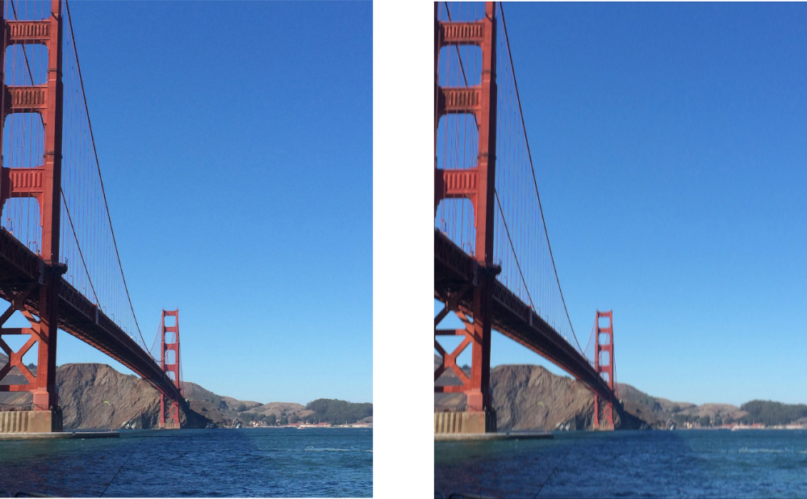

> Navigation: [Technologies](../../technologies.md) · [Core Image](../../coreimage.md) · [CIFilter](../cifilter-swift.class.md)

# convolutionRGB9Vertical()

<sub>Type Method</sub>

Applies a convolution 1 x 9 filter to the RGB components of an image.

<sub>iOS, iPadOS, Mac Catalyst, macOS, tvOS, visionOS</sub>

```swift
class func convolutionRGB9Vertical() -> any CIFilter & CIConvolution
```

## Return Value

This method applies a 1 x 9 convolution to the `RGB` components of an image. The effect uses a 1 x 9 area surrounding an input pixel, the pixel itself, and those within a distance of 4 pixels vertically. The effect repeats this for every pixel within the image. Unlike the convolution filters, which use square matrices, this filter can only produce effects along a vertical axis. You can combine this filter with the [+ convolutionRGB9HorizontalFilter](<convolutionrgb9horizontal().md>) to apply separable 9 x 9 convolutions. This filter differs from the [+ convolution9VerticalFilter](<convolution9vertical().md>) filter, which processes all of the color components including the alpha component.

## Discussion

The convolution-RGB-9-vertical filter uses the following properties:

- **`inputImage`** — A  [CIImage](../ciimage.md) containing the image to process.
- **`weights`** — A [CIVector](../civector.md) representing the convolution kernel.
- **`bias`** — A `float` representing the value that’s added to each output pixel.

> [!note] Note
> When using a nonzero `bias` value, the output image has an infinite extent. You should crop the image before attempting to render it.

The following code creates a filter that blurs the image in the vertical direction:

```swift
func convolutionRGB9Vertical(inputImage: CIImage) -> CIImage {
    let convolutionFilter = CIFilter.convolutionRGB9Vertical()
    convolutionFilter.inputImage = inputImage
    let weights: [CGFloat] = [1, 1, 1, 1, 1, 1, 1, 1, 1].map { $0/9.0 }
    let kernel = CIVector(values: weights, count: 9)
    convolutionFilter.weights = kernel
    convolutionFilter.bias = 0.0
    return convolutionFilter.outputImage!
}
```



<sub>Two images arranged horizontally. The left image contains a photo of the Golden Gate Bridge with a clear sky as the background. The right image shows the result of applying a vertical convolution kernel that blurs the image. Fine detail in the vertical direction is blurred.</sub>

## See Also

### Filters

- [+ convolution3X3Filter](<convolution3x3().md>) — Applies a convolution 3 x 3 filter to the `RGBA` components of an image.
- [+ convolution5X5Filter](<convolution5x5().md>) — Applies a convolution 5 x 5 filter to the `RGBA` components image.
- [+ convolution7X7Filter](<convolution7x7().md>) — Applies a convolution 7 x 7 filter to the `RGBA` color components of an image.
- [+ convolution9HorizontalFilter](<convolution9horizontal().md>) — Applies a convolution-9 horizontal filter to the `RGBA` components of an image.
- [+ convolution9VerticalFilter](<convolution9vertical().md>) — Applies a convolution-9 vertical filter to the `RGBA` components of an image.
- [+ convolutionRGB3X3Filter](<convolutionrgb3x3().md>) — Applies a convolution 3 x 3 filter to the `RGB` components of an image.
- [+ convolutionRGB5X5Filter](<convolutionrgb5x5().md>) — Applies a convolution 5 x 5 filter to the `RGB` components of an image.
- [+ convolutionRGB7X7Filter](<convolutionrgb7x7().md>) — Applies a convolution 7 x 7 filter to the RGB components of an image.
- [+ convolutionRGB9HorizontalFilter](<convolutionrgb9horizontal().md>) — Applies a convolution 9 x 1 filter to the RGB components of an image.
