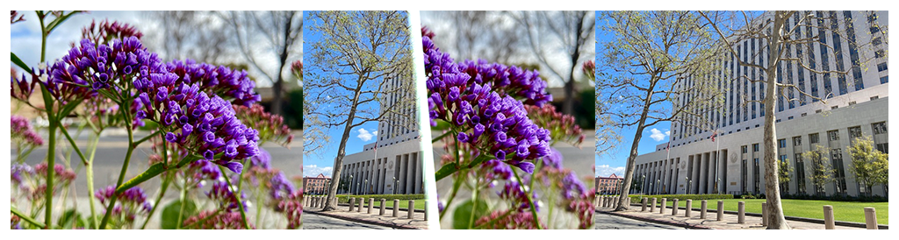

> Navigation: [Technologies](../../technologies.md) · [Core Image](../../coreimage.md) · [CIFilter](../cifilter-swift.class.md)

# copyMachineTransition()

<sub>Type Method</sub>

Simulates the effect of a copy machine scanner light to transiton between two images.

<sub>iOS, iPadOS, Mac Catalyst, macOS, tvOS, visionOS</sub>

```swift
class func copyMachineTransition() -> any CIFilter & CICopyMachineTransition
```

## Return Value

The transition image.

## Discussion

This method applies the copy machine transition filter to an image. The effect transitions from one image to another by simulating the scanning light effect of a copy machine.

The copy machine transition filter uses the following properties:

- **`inputImage`** — The starting image with the type [CIImage](../ciimage.md).
- **`targetImage`** — The ending image with the type [CIImage](../ciimage.md).
- **`time`** — A `float` representing the parametric time of the transition from start (at time 0) to end (at time 1) as an [NSNumber](../../foundation/nsnumber.md).
- **`angle`** — A `float` representing the angle of the copier light, in radians as an [NSNumber](../../foundation/nsnumber.md).
- **`width`** — A `float` representing the width of the effect as a [NSNumber](../../foundation/nsnumber.md).
- **`extent`** — A [CGRect](../../corefoundation/cgrect.md) representing the area of the copy machine effect.
- **`color`** — A [CIColor](../cicolor.md) representing the color of the light.
- **`opacity`** — A `float` representing the transparency of the copier light as an [NSNumber](../../foundation/nsnumber.md).

The following code creates a filter that produces a light bar that glides across the input image revealing the target image:

```swift
func copyMachine(inputImage: CIImage, targetImage: CIImage) -> CIImage {
    let copyMachineTransition = CIFilter.copyMachineTransition()
    copyMachineTransition.inputImage = inputImage
    copyMachineTransition.targetImage = targetImage
    copyMachineTransition.time = 0.5
    copyMachineTransition.angle = 0.9
    copyMachineTransition.extent = CGRect(x: 54.1, y: 90.2, width: 300, height: 300)
    copyMachineTransition.color = .white
    copyMachineTransition.width = 200
    copyMachineTransition.opacity = 1.30   
    return copyMachineTransition.outputImage!
}
```



<sub>Three photographs. In the photo on the left, multiple sets of small purple flowers are photographed close up with good lighting, and the background has a slight blur. In the photograph on the right is a tall building with two trees directly in front of the building. In the center photo, a copy machine transition filter is applied, resulting in a still photograph of the moving transition. The left photograph is overlaid on the right photo while slowly transitioning to the city image with a light bar that stretches the height of the image slowly showing the city building image.</sub>

## See Also

### Filters

- [+ accordionFoldTransitionFilter](<accordionfoldtransition().md>) — Transitions by folding and crossfading an image to reveal the target image.
- [+ barsSwipeTransitionFilter](<barsswipetransition().md>) — Transitions between two images by removing rectangular portions of an image.
- [+ disintegrateWithMaskTransitionFilter](<disintegratewithmasktransition().md>) — Transitions between two images using a mask image.
- [+ dissolveTransitionFilter](<dissolvetransition().md>) — Transitions between two images with a fade effect.
- [+ flashTransitionFilter](<flashtransition().md>) — Creates a flash of light to transition between two images.
- [+ modTransitionFilter](<modtransition().md>) — Transitions between two images by applying irregularly shaped holes.
- [+ pageCurlTransitionFilter](<pagecurltransition().md>) — Simulates the curl of a page, revealing the target image.
- [+ pageCurlWithShadowTransitionFilter](<pagecurlwithshadowtransition().md>) — Simulates the curl of a page, revealing the target image with added shadow.
- [+ rippleTransitionFilter](<rippletransition().md>) — Simulates a ripple in a pond to transiton from one image to another.
- [+ swipeTransitionFilter](<swipetransition().md>) — Gradually transitions from one image to another with a swiping motion.
