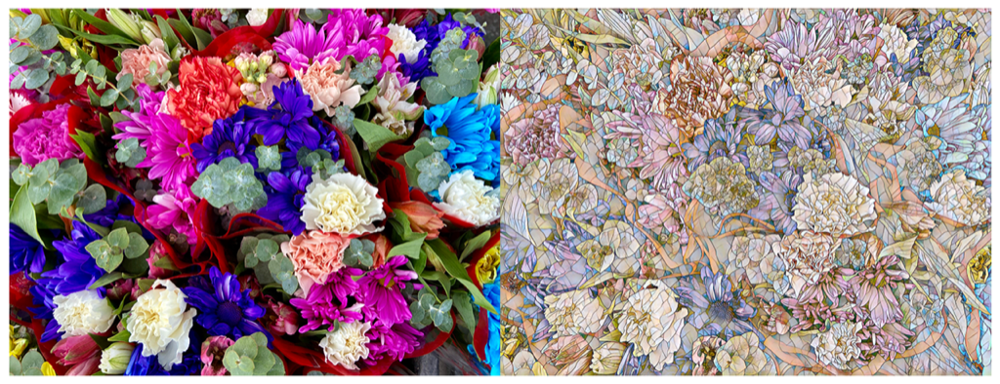

> Navigation: [Technologies](../../technologies.md) · [Core Image](../../coreimage.md) · [CIFilter](../cifilter-swift.class.md)

# coreMLModel()

<sub>Type Method</sub>

Filters an image with a Core ML model.

<sub>iOS, iPadOS, Mac Catalyst, macOS, tvOS, visionOS</sub>

```swift
class func coreMLModel() -> any CIFilter & CICoreMLModel
```

## Return Value

The modified image.

## Discussion

This method applies the Core ML model filter to an image. The effect filters the image using a trained Core ML model to produce the result. Specifying the head index allows you to produce a result from various components of a multiheaded coreML model.

The Core ML model filter uses the following properties:

- **`inputImage`** — An image with the type [CIImage](../ciimage.md).
- **`headIndex`** — A `float` representing which output of a multihead Core ML model should be used for applying the effect to an image.
- **`softmaxNormalization`** — A `Boolean` value representing the softmax normalization to be applied to the output image created by the model.
- **`inputModel`** — The Core ML model to be used for applying effect on the image.

The following code creates a filter that results in the flowers appearing to be glass panes:

```swift
func coreML(inputImage: CIImage) -> CIImage {
    let coreMLFilter = CIFilter.coreMLModel()
    let model = GlassModel().model
    coreMLFilter.inputImage = inputImage
    coreMLFilter.headIndex = 0
    coreMLFilter.softmaxNormalization = false
    return coreMLFilter.outputImage!
}
```



<sub>Two photographs of colorful flowers. The photo on the left is clear and crisp with good lighting. In the photo on the right, a Core ML model filter is applied, and the image flowers appear to be made of colorful glass panes.</sub>

## See Also

### Filters

- [+ blendWithAlphaMaskFilter](<blendwithalphamask().md>) — Blends two images by using an alpha mask image.
- [+ blendWithBlueMaskFilter](<blendwithbluemask().md>) — Blends two images by using a blue mask image.
- [+ blendWithMaskFilter](<blendwithmask().md>) — Blends two images by using a mask image.
- [+ blendWithRedMaskFilter](<blendwithredmask().md>) — Blends two images by using a red mask image.
- [+ bloomFilter](<bloom().md>) — Adjusts an image’s colors by applying a blur effect.
- [+ cannyEdgeDetectorFilter](<cannyedgedetector().md>) — Applies the Canny edge-detection algorithm to an image.
- [+ comicEffectFilter](<comiceffect().md>) — Creates an image with a comic book effect.
- [+ crystallizeFilter](<crystallize().md>) — Creates an image made with a series of colorful polygons.
- [+ depthOfFieldFilter](<depthoffield().md>) — Simulates a depth of field effect.
- [+ edgesFilter](<edges().md>) — Hilghlights edges of objects found within an image.
- [+ edgeWorkFilter](<edgework().md>) — Produces a black-and-white image that looks similar to a woodblock print.
- [+ gaborGradientsFilter](<gaborgradients().md>) — Highlights textures in an image.
- [+ gloomFilter](<gloom().md>) — Adjusts an image’s color by applying a gloom filter.
- [+ heightFieldFromMaskFilter](<heightfieldfrommask().md>) — Creates a realistic shaded height-field image.
- [+ hexagonalPixellateFilter](<hexagonalpixellate().md>) — Creates an image made of a series of colorful hexagons.
