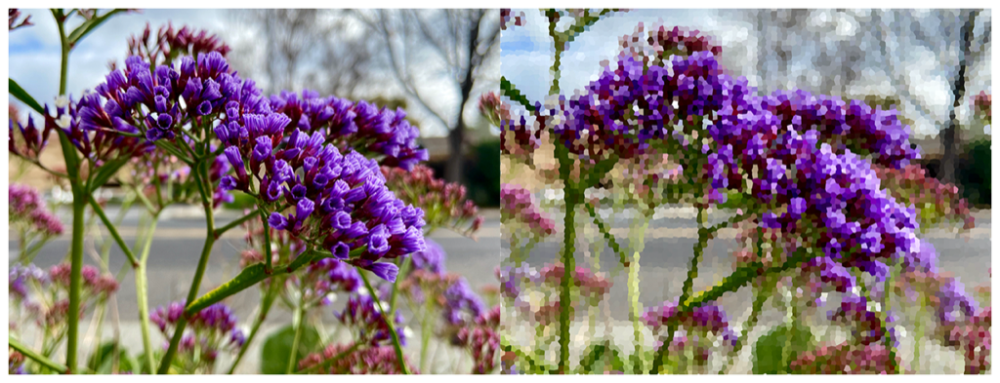

> Navigation: [Technologies](../../technologies.md) · [Core Image](../../coreimage.md) · [CIFilter](../cifilter-swift.class.md)

# crystallize()

<sub>Type Method</sub>

Creates an image made with a series of colorful polygons.

<sub>iOS, iPadOS, Mac Catalyst, macOS, tvOS, visionOS</sub>

```swift
class func crystallize() -> any CIFilter & CICrystallize
```

## Return Value

The modified image.

## Discussion

This method applies the crystallize filter to an image. The effect creates polygon-shaped color blocks by aggregating pixel-color values.

The crystallize filter uses the following properties:

- **`inputImage`** — An image with the type [CIImage](../ciimage.md).
- **`radius`** — A `float` representing the area of effect as an [NSNumber](../../foundation/nsnumber.md).
- **`center`** — A set of coordinates marking the center of the image as a [CGPoint](../../corefoundation/cgpoint.md).

The following code creates a filter that results in an image made of small polygons:

```swift
func crystalize(inputImage: CIImage) -> CIImage {
    let crystalizefilter = CIFilter.crystallize()
    crystalizefilter.inputImage = inputImage
    crystalizefilter.radius = 50
    crystalizefilter.center = CGPoint(x: 2016, y: 1512)
    return crystalizefilter.outputImage!
}
```



<sub>Two photographs of multiple sets of small purple flowers surrounded by other flowers and a blue sky. The photo on the left is clear and crisp. In the photo on the right, a crystalize filter is applied, and the image is made of small polygons with the color of the area they’re replacing.</sub>

## See Also

### Filters

- [+ blendWithAlphaMaskFilter](<blendwithalphamask().md>) — Blends two images by using an alpha mask image.
- [+ blendWithBlueMaskFilter](<blendwithbluemask().md>) — Blends two images by using a blue mask image.
- [+ blendWithMaskFilter](<blendwithmask().md>) — Blends two images by using a mask image.
- [+ blendWithRedMaskFilter](<blendwithredmask().md>) — Blends two images by using a red mask image.
- [+ bloomFilter](<bloom().md>) — Adjusts an image’s colors by applying a blur effect.
- [+ cannyEdgeDetectorFilter](<cannyedgedetector().md>) — Applies the Canny edge-detection algorithm to an image.
- [+ comicEffectFilter](<comiceffect().md>) — Creates an image with a comic book effect.
- [+ coreMLModelFilter](<coremlmodel().md>) — Filters an image with a Core ML model.
- [+ depthOfFieldFilter](<depthoffield().md>) — Simulates a depth of field effect.
- [+ edgesFilter](<edges().md>) — Hilghlights edges of objects found within an image.
- [+ edgeWorkFilter](<edgework().md>) — Produces a black-and-white image that looks similar to a woodblock print.
- [+ gaborGradientsFilter](<gaborgradients().md>) — Highlights textures in an image.
- [+ gloomFilter](<gloom().md>) — Adjusts an image’s color by applying a gloom filter.
- [+ heightFieldFromMaskFilter](<heightfieldfrommask().md>) — Creates a realistic shaded height-field image.
- [+ hexagonalPixellateFilter](<hexagonalpixellate().md>) — Creates an image made of a series of colorful hexagons.
