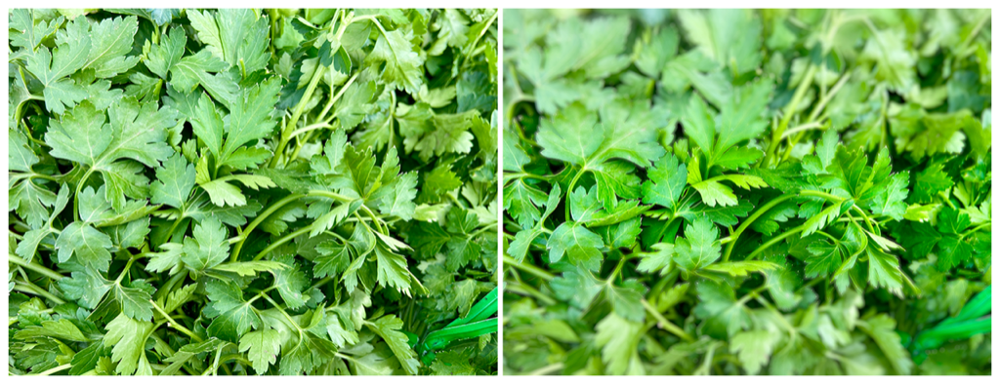

> Navigation: [Technologies](../../technologies.md) · [Core Image](../../coreimage.md) · [CIFilter](../cifilter-swift.class.md)

# depthOfField()

<sub>Type Method</sub>

Simulates a depth of field effect.

<sub>iOS, iPadOS, Mac Catalyst, macOS, tvOS, visionOS</sub>

```swift
class func depthOfField() -> any CIFilter & CIDepthOfField
```

## Return Value

The modified image.

## Discussion

This method applies the depth of field filter to an image. The effect simulates changing the focus of the camera before taking a photograph.

The depth of field filter uses the following properties:

- **`inputImage`** — An image with the type [CIImage](../ciimage.md).
- **`radius`** — A `float` representing the area of effect as an [NSNumber](../../foundation/nsnumber.md).
- **`point0`** — A set of coordinates marking the first point to be focused on as a [CGPoint](../../corefoundation/cgpoint.md).
- **`point1`** — A set of coordinates marking the second point to be focused on as a [CGPoint](../../corefoundation/cgpoint.md).
- **`unsharpMaskRadius`** — A `float` representing the radius of the unsharpened mask effect applied to the in-focus area of effect as an [NSNumber](../../foundation/nsnumber.md).
- **`unsharpMaskIntensity`** — A `float` representing the intensity of the unsharp mask effect as an [NSNumber](../../foundation/nsnumber.md).

The following code creates a filter that results in the center cilantro being in focus while gradually blurring to the top and bottom of the image:

```swift
func depthOfField(inputImage: CIImage) -> CIImage {
    let depthOfFieldFilter = CIFilter.depthOfField()
    depthOfFieldFilter.inputImage = inputImage
    depthOfFieldFilter.radius = 5
    depthOfFieldFilter.point0 = CGPoint(x: 2349, y: 846)
    depthOfFieldFilter.point1 = CGPoint(x: 571, y: 3121)
    depthOfFieldFilter.unsharpMaskRadius = 7
    depthOfFieldFilter.unsharpMaskIntensity = 10
    return depthOfFieldFilter.outputImage!
}
```



<sub>Two photographs of a pile of cilantro. The photo on the left is clear and crisp with good lighting. In the photo on the right, a depth of field filter is applied, resulting in the cilantro in the image’s periphery becoming blurred while the center remains in focus.</sub>

## See Also

### Filters

- [+ blendWithAlphaMaskFilter](<blendwithalphamask().md>) — Blends two images by using an alpha mask image.
- [+ blendWithBlueMaskFilter](<blendwithbluemask().md>) — Blends two images by using a blue mask image.
- [+ blendWithMaskFilter](<blendwithmask().md>) — Blends two images by using a mask image.
- [+ blendWithRedMaskFilter](<blendwithredmask().md>) — Blends two images by using a red mask image.
- [+ bloomFilter](<bloom().md>) — Adjusts an image’s colors by applying a blur effect.
- [+ cannyEdgeDetectorFilter](<cannyedgedetector().md>) — Applies the Canny edge-detection algorithm to an image.
- [+ comicEffectFilter](<comiceffect().md>) — Creates an image with a comic book effect.
- [+ coreMLModelFilter](<coremlmodel().md>) — Filters an image with a Core ML model.
- [+ crystallizeFilter](<crystallize().md>) — Creates an image made with a series of colorful polygons.
- [+ edgesFilter](<edges().md>) — Hilghlights edges of objects found within an image.
- [+ edgeWorkFilter](<edgework().md>) — Produces a black-and-white image that looks similar to a woodblock print.
- [+ gaborGradientsFilter](<gaborgradients().md>) — Highlights textures in an image.
- [+ gloomFilter](<gloom().md>) — Adjusts an image’s color by applying a gloom filter.
- [+ heightFieldFromMaskFilter](<heightfieldfrommask().md>) — Creates a realistic shaded height-field image.
- [+ hexagonalPixellateFilter](<hexagonalpixellate().md>) — Creates an image made of a series of colorful hexagons.
