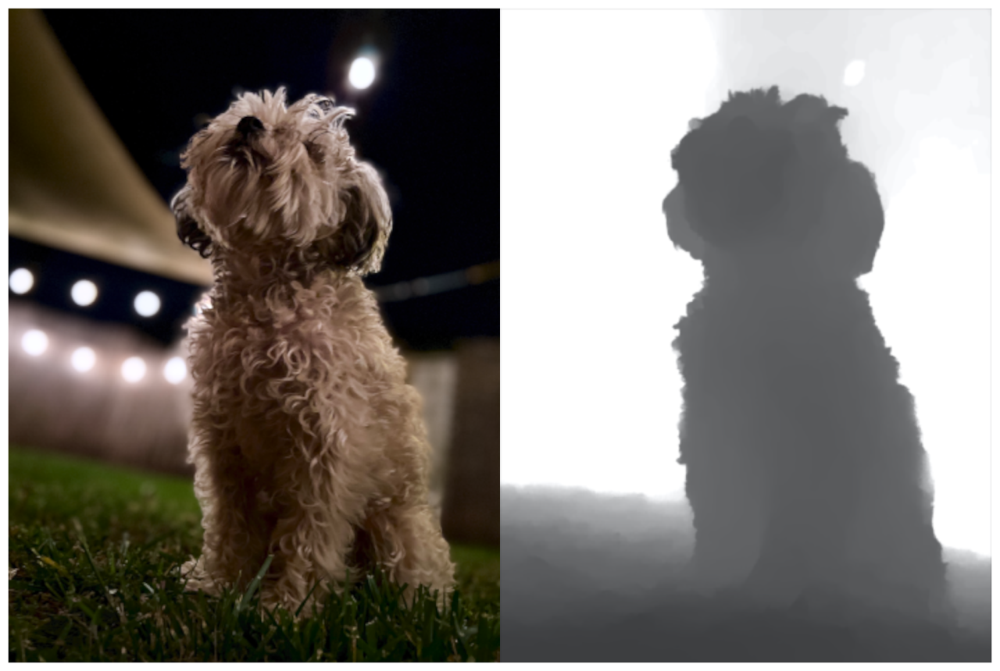

> Navigation: [Technologies](../../technologies.md) · [Core Image](../../coreimage.md) · [CIFilter](../cifilter-swift.class.md)

# depthToDisparity()

<sub>Type Method</sub>

Converts from an image containing depth data to an image containing disparity data.

<sub>iOS, iPadOS, Mac Catalyst, macOS, tvOS, visionOS</sub>

```swift
class func depthToDisparity() -> any CIFilter & CIDepthToDisparity
```

## Return Value

An image containing the disparity data.

## Discussion

This method applies the depth-to-disparity filter. The filter takes depth data as an input and produces disparity data in the output image. You can use the output of this filter to create a stereo image.

The depth-to-disparity filter uses the following property:

- **`inputImage`** — An image with the type [CIImage](../ciimage.md).

The following code creates a filter that generates a depth map image:

```swift
func depthToDisparity(inputImage: CIImage) -> CIImage {
    let depthToDisparityFilter = CIFilter.depthToDisparity()
    depthToDisparityFilter.inputImage = inputImage
    return depthToDisparityFilter.outputImage!
}
```



<sub>Two photographs of a small dog sitting on grass. The photo on the left shows the dog in the foreground with good light and a soft blur of the background. In the photo on the right, a depth-to-disparity filter is applied, resulting in a depth map created from the photo on the left. The dog in the photo and the ground are replaced with gray, and the background is replaced with white.</sub>

## See Also

### Filters

- [+ colorAbsoluteDifferenceFilter](<colorabsolutedifference().md>) — Calculates the absolute difference between each color component in the input images.
- [+ colorClampFilter](<colorclamp().md>) — Alters the colors in an image based on color components.
- [+ colorControlsFilter](<colorcontrols().md>) — Alters the brightness, contrast, and saturation of an image’s colors.
- [+ colorMatrixFilter](<colormatrix().md>) — Alters the colors in an image based on vectors provided.
- [+ colorPolynomialFilter](<colorpolynomial().md>) — Alters an image’s colors.
- [+ colorThresholdFilter](<colorthreshold().md>) — Compares the red, green, and blue components of the input image to a threshold and sets them to 1 or 0.
- [+ colorThresholdOtsuFilter](<colorthresholdotsu().md>) — Compares the red, green, and blue components of the input image against a threshold calculated using Otsu’s algorithm.
- [+ disparityToDepthFilter](<disparitytodepth().md>) — Creates depth data from an image containing disparity data.
- [+ exposureAdjustFilter](<exposureadjust().md>) — Adjusts an image’s exposure.
- [+ gammaAdjustFilter](<gammaadjust().md>) — Alters an image’s transition between black and white.
- [+ hueAdjustFilter](<hueadjust().md>) — Modifies an image’s hue.
- [+ linearToSRGBToneCurveFilter](<lineartosrgbtonecurve().md>) — Alters an image’s color intensity.
- [+ sRGBToneCurveToLinearFilter](<srgbtonecurvetolinear().md>) — Converts the colors in an image from sRGB to linear.
- [+ temperatureAndTintFilter](<temperatureandtint().md>) — Alters an image’s temperature and tint.
- [+ toneCurveFilter](<tonecurve().md>) — Alters an image’s tone curve according to a series of data points.
