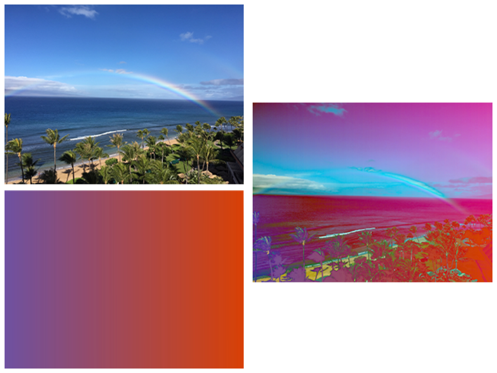

> Navigation: [Technologies](../../technologies.md) · [Core Image](../../coreimage.md) · [CIFilter](../cifilter-swift.class.md)

# differenceBlendMode()

<sub>Type Method</sub>

Subtracts color values to blend colors.

<sub>iOS, iPadOS, Mac Catalyst, macOS, tvOS, visionOS</sub>

```swift
class func differenceBlendMode() -> any CIFilter & CICompositeOperation
```

## Return Value

The modified image.

## Discussion

This method applies the difference-blend mode filter to an image. The effect calculates the brightness value for both images and subtracts the smaller value, resulting in a slightly darker image. This effect doesn’t modify images that are black.

The difference-blend mode filter uses the following properties:

- **`inputImage`** — An image with the type [CIImage](../ciimage.md).
- **`backgroundImage`** — An image with the type [CIImage](../ciimage.md).

The following code creates a filter that blends colors in the background image and input image:

```swift
func differenceBlendMode(inputImage: CIImage, backgroundImage: CIImage) -> CIImage {
    let colorBlendFilter = CIFilter.differenceBlendMode()
    colorBlendFilter.inputImage = inputImage
    colorBlendFilter.backgroundImage = backgroundImage
    return colorBlendFilter.outputImage!
}
```



<sub>The image on the top left shows a beach with multiple palm trees and a rainbow arching across the blue sky.  The image below is a gradient image displaying a gradual color shift from purple to a dark orange. The image on the right shows the output from applying a difference-blend mode filter. This displays colors from both images with the clarity and brightness from the beach rainbow image.</sub>

## See Also

### Filters

- [+ additionCompositingFilter](<additioncompositing().md>) — Blends colors from two images by addition.
- [+ colorBlendModeFilter](<colorblendmode().md>) — Blends color from two images using the luminance values from the background image and the hue and saturation values from the input image.
- [+ colorBurnBlendModeFilter](<colorburnblendmode().md>) — Blends color from two images while darkening the image.
- [+ colorDodgeBlendModeFilter](<colordodgeblendmode().md>) — Blends color from two images using dodging.
- [+ darkenBlendModeFilter](<darkenblendmode().md>) — Blends colors from two images while darkening lighter pixels.
- [+ divideBlendModeFilter](<divideblendmode().md>) — Divides color values to blend colors.
- [+ exclusionBlendModeFilter](<exclusionblendmode().md>) — Subtracts color values to blend colors with less contrast.
- [+ hardLightBlendModeFilter](<hardlightblendmode().md>) — Blends colors of two images by screening and multiplying.
- [+ hueBlendModeFilter](<hueblendmode().md>) — Blends colors of two images by computing the sum of image color values.
- [+ lightenBlendModeFilter](<lightenblendmode().md>) — Blends colors from two images by brightening colors.
- [+ linearBurnBlendModeFilter](<linearburnblendmode().md>) — Blends color from two images while increasing contrast.
- [+ linearDodgeBlendModeFilter](<lineardodgeblendmode().md>) — Blends colors of two images with dodging.
- [+ linearLightBlendModeFilter](<linearlightblendmode().md>) — A combination of linear burn and linear dodge blend modes.
- [+ luminosityBlendModeFilter](<luminosityblendmode().md>) — Blends color from two images by calculating the color, hue, and saturation.
- [+ minimumCompositingFilter](<minimumcompositing().md>) — Blends colors from two images by computing minimum values.
