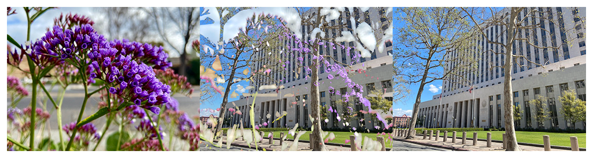

> Navigation: [Technologies](../../technologies.md) · [Core Image](../../coreimage.md) · [CIFilter](../cifilter-swift.class.md)

# disintegrateWithMaskTransition()

<sub>Type Method</sub>

Transitions between two images using a mask image.

<sub>iOS, iPadOS, Mac Catalyst, macOS, tvOS, visionOS</sub>

```swift
class func disintegrateWithMaskTransition() -> any CIFilter & CIDisintegrateWithMaskTransition
```

## Return Value

The transition image.

## Discussion

This method applies the disintegrate with mask transition filter to an image. The effect transitions from one image to another using the shapes defined by the mask image.

The disintegrate with mask transition filter uses the following properties:

- **`inputImage`** — The starting image with the type [CIImage](../ciimage.md).
- **`targetImage`** — The ending image with the type [CIImage](../ciimage.md).
- **`maskImage`** — An image with the type [CIImage](../ciimage.md).
- **`time`** — A `float` representing the parametric time of the transition from start (at time 0) to end (at time 1) as an [NSNumber](../../foundation/nsnumber.md).
- **`shadowRadius`** — A `float` representing the size of the shadow as a [NSNumber](../../foundation/nsnumber.md).
- **`shadowDensity`** — A `float` representing the strength of the shadow as a [NSNumber](../../foundation/nsnumber.md).
- **`shadowOffset`** — A [CGPoint](../../corefoundation/cgpoint.md) representing the size of the shadow from the mask image.

The following code creates a filter that produces a transition between the input and target images starting in the area’s outline in the mask image:

```swift
func disintergrate(inputImage: CIImage, targetImage: CIImage, maskImage: CIImage) -> CIImage {
    let disintergrateTransition  = CIFilter.disintegrateWithMaskTransition()
    disintergrateTransition.inputImage = inputImage
    disintergrateTransition.targetImage = targetImage
    disintergrateTransition.maskImage = maskImage
    disintergrateTransition.time = 0.5
    disintergrateTransition.shadowRadius = 8
    disintergrateTransition.shadowDensity = 0.65
    disintergrateTransition.shadowOffset = CGPoint(x: 0, y: -1)
    return disintergrateTransition.outputImage!
}
```



<sub>Three photographs. In the photo on the left, there are multiple small purple flowers photographed close up with good lighting, and the background has a slight blur. In the photograph on the right is a tall building with two trees directly in front of the building. In the center photo, a disintegrate with mask transition filter is applied, resulting in a still photograph of the moving transition. The left photograph is overlaid on the right photo while slowly transitioning to the city image, with a slow fade of the flower image to the city image with added brightness.</sub>

## See Also

### Filters

- [+ accordionFoldTransitionFilter](<accordionfoldtransition().md>) — Transitions by folding and crossfading an image to reveal the target image.
- [+ barsSwipeTransitionFilter](<barsswipetransition().md>) — Transitions between two images by removing rectangular portions of an image.
- [+ copyMachineTransitionFilter](<copymachinetransition().md>) — Simulates the effect of a copy machine scanner light to transiton between two images.
- [+ dissolveTransitionFilter](<dissolvetransition().md>) — Transitions between two images with a fade effect.
- [+ flashTransitionFilter](<flashtransition().md>) — Creates a flash of light to transition between two images.
- [+ modTransitionFilter](<modtransition().md>) — Transitions between two images by applying irregularly shaped holes.
- [+ pageCurlTransitionFilter](<pagecurltransition().md>) — Simulates the curl of a page, revealing the target image.
- [+ pageCurlWithShadowTransitionFilter](<pagecurlwithshadowtransition().md>) — Simulates the curl of a page, revealing the target image with added shadow.
- [+ rippleTransitionFilter](<rippletransition().md>) — Simulates a ripple in a pond to transiton from one image to another.
- [+ swipeTransitionFilter](<swipetransition().md>) — Gradually transitions from one image to another with a swiping motion.
