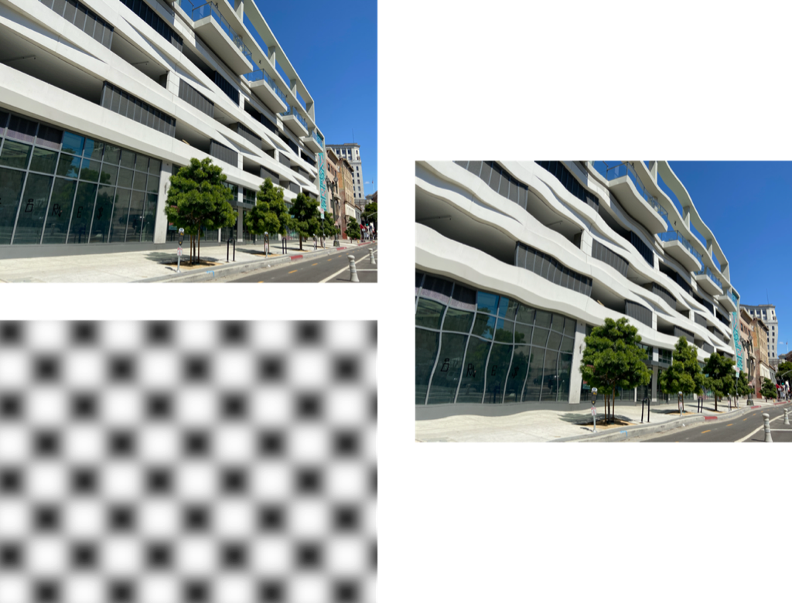

> Navigation: [Technologies](../../technologies.md) · [Core Image](../../coreimage.md) · [CIFilter](../cifilter-swift.class.md)

# displacementDistortion()

<sub>Type Method</sub>

Applies the grayscale values of the second image to the first image.

<sub>iOS, iPadOS, Mac Catalyst, macOS, tvOS, visionOS</sub>

```swift
class func displacementDistortion() -> any CIFilter & CIDisplacementDistortion
```

## Return Value

The distorted image.

## Discussion

This method applies the displacement distortion filter to an image. This effect distorts an image by applying the grayscale color values of the texture image.

The displacement distortion filter uses the following properties:

- **`inputImage`** — An image with the type [CIImage](../ciimage.md).
- **`displacementImage`** — An image with the type [CIImage](../ciimage.md).
- **`scale`** — A `float` representing the scaling the filter uses to apply the texture to the input image as an [NSNumber](../../foundation/nsnumber.md).

The following code creates a filter that applies the grayscale values of the displacement image to the input image:

```swift
func displacementDistortion(inputImage: CIImage) -> CIImage {
    // Create an interesting grayscale pattern.
    let displacementImage = CIFilter.checkerboardGenerator()
    displacementImage.color0 = CIColor.white
    displacementImage.color1 = CIColor.black
    displacementImage.width = 200
    let gaussianBlur = CIFilter.gaussianBlur()
    gaussianBlur.radius = 40
    gaussianBlur.inputImage = displacementImage.outputImage
    // Use it in the displacement filter.
    let filter = CIFilter.displacementDistortion()
    filter.displacementImage = gaussianBlur.outputImage
    filter.inputImage = inputImage
    filter.scale = 1000
    return filter.outputImage!
}
```



<sub>A group of three images: two images on the left arranged vertically and a third image on the right vertically centered. The top left image is of a modern concrete building with black tinted windows. The bottom left image is a blurred checkerboard pattern. The image on the right shows the result of applying the displacement distortion effect. It appears as if there is a ripple in the image.</sub>

## See Also

### Filters

- [+ bumpDistortionFilter](<bumpdistortion().md>) — Distorts an image with a concave or convex bump.
- [+ bumpDistortionLinearFilter](<bumpdistortionlinear().md>) — Linearly distorts an image with a concave or convex bump.
- [+ circleSplashDistortionFilter](<circlesplashdistortion().md>) — Distorts an image with radiating circles to the periphery of the image.
- [+ circularWrapFilter](<circularwrap().md>) — Distorts an image by increasing the distance of the center of the image.
- [+ drosteFilter](<droste().md>) — Stylizes an image with the Droste effect.
- [+ glassDistortionFilter](<glassdistortion().md>) — Distorts an image by applying a glass-like texture.
- [+ glassLozengeFilter](<glasslozenge().md>) — Creates a lozenge-shaped lens and distorts the image.
- [+ holeDistortionFilter](<holedistortion().md>) — Distorts an image with a circular area that pushes the image outward.
- [+ lightTunnelFilter](<lighttunnel().md>) — Distorts an image by generating a light tunnel.
- [+ ninePartStretchedFilter](<ninepartstretched().md>) — Distorts an image by stretching it between two breakpoints.
- [+ ninePartTiledFilter](<nineparttiled().md>) — Distorts an image by tiling portions of it.
- [+ pinchDistortionFilter](<pinchdistortion().md>) — Distorts an image by creating a pinch effect with stronger distortion in the center.
- [+ stretchCropFilter](<stretchcrop().md>) — Distorts an image by stretching or cropping to fit a specified size.
- [+ torusLensDistortionFilter](<toruslensdistortion().md>) — Creates a torus-shaped lens to distort the image.
- [+ twirlDistortionFilter](<twirldistortion().md>) — Distorts an image by rotating pixels around a center point.
