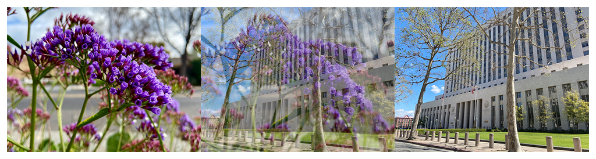

> Navigation: [Technologies](../../technologies.md) · [Core Image](../../coreimage.md) · [CIFilter](../cifilter-swift.class.md)

# dissolveTransition()

<sub>Type Method</sub>

Transitions between two images with a fade effect.

<sub>iOS, iPadOS, Mac Catalyst, macOS, tvOS, visionOS</sub>

```swift
class func dissolveTransition() -> any CIFilter & CIDissolveTransition
```

## Return Value

The transition image.

## Discussion

This method applies the disintegrate transition filter to an image. The effect transitions from one image to another by using a fade effect.

The dissolve transition filter uses the following properties:

- **`inputImage`** — The starting image with the type [CIImage](../ciimage.md).
- **`targetImage`** — The ending image with the type [CIImage](../ciimage.md).
- **`time`** — A `float` representing the parametric time of the transition from start (at time 0) to end (at time 1) as an [NSNumber](../../foundation/nsnumber.md).

The following code creates a filter that produces a fade transition from the input image and the target image:

```swift
func dissolve(inputImage: CIImage, targetImage: CIImage) -> CIImage {
    let dissolveTransition = CIFilter.dissolveTransition()
    dissolveTransition.inputImage = inputImage
    dissolveTransition.targetImage = targetImage
    dissolveTransition.time = 0.5
    return dissolveTransition.outputImage!
}
```



<sub>Three photographs. In the photo on the left, there are multiple small purple flowers photographed close up with good lighting, and the background has a slight blur. In the photograph on the right is a tall building with two trees directly in front of the building. In the center photo, a dissolve with mask transition filter is applied, resulting in a still photograph of the moving transition. The left photograph is overlaid on the right photo while slowly transitioning to the city image, with a slow fade of the flower image to the city image.</sub>

## See Also

### Filters

- [+ accordionFoldTransitionFilter](<accordionfoldtransition().md>) — Transitions by folding and crossfading an image to reveal the target image.
- [+ barsSwipeTransitionFilter](<barsswipetransition().md>) — Transitions between two images by removing rectangular portions of an image.
- [+ copyMachineTransitionFilter](<copymachinetransition().md>) — Simulates the effect of a copy machine scanner light to transiton between two images.
- [+ disintegrateWithMaskTransitionFilter](<disintegratewithmasktransition().md>) — Transitions between two images using a mask image.
- [+ flashTransitionFilter](<flashtransition().md>) — Creates a flash of light to transition between two images.
- [+ modTransitionFilter](<modtransition().md>) — Transitions between two images by applying irregularly shaped holes.
- [+ pageCurlTransitionFilter](<pagecurltransition().md>) — Simulates the curl of a page, revealing the target image.
- [+ pageCurlWithShadowTransitionFilter](<pagecurlwithshadowtransition().md>) — Simulates the curl of a page, revealing the target image with added shadow.
- [+ rippleTransitionFilter](<rippletransition().md>) — Simulates a ripple in a pond to transiton from one image to another.
- [+ swipeTransitionFilter](<swipetransition().md>) — Gradually transitions from one image to another with a swiping motion.
