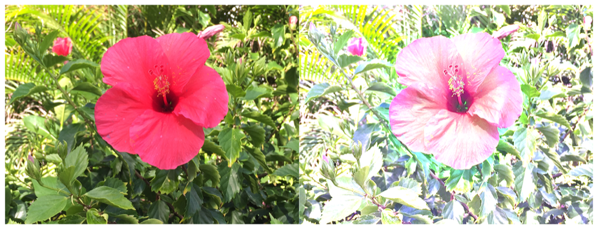

> Navigation: [Technologies](../../technologies.md) · [Core Image](../../coreimage.md) · [CIFilter](../cifilter-swift.class.md)

# documentEnhancer()

<sub>Type Method</sub>

Adjusts an image’s shadows and contrast.

<sub>iOS, iPadOS, Mac Catalyst, macOS, tvOS, visionOS</sub>

```swift
class func documentEnhancer() -> any CIFilter & CIDocumentEnhancer
```

## Return Value

The modified image.

## Discussion

This method applies the document enhancer filter to an image. The effect removes unwanted shadows while whitening the background and enhancing contrast. The filter is commonly used to enhance scanned documents.

The document enhancer filter uses the following properties:

- **`inputImage`** — An image with the type [CIImage](../ciimage.md).
- **`amount`** — A `float` representing the desired strength of the effect as an [NSNumber](../../foundation/nsnumber.md).

The following code creates a filter that adds brightness to the input image:

```swift
func documentEnhancer(inputImage: CIImage) -> CIImage {
    let documentEnhancerFilter = CIFilter.documentEnhancer()
    documentEnhancerFilter.inputImage = inputImage
    documentEnhancerFilter.amount = 4
    return documentEnhancerFilter.outputImage!
}
```



<sub>Two pictures of a pink flower surrounded by foliage. The photo on the left shows a single flower photographed close-up, in focus, with good light and no effects. In the photo on the right, a document enhancer filter is applied, resulting in a brighter image with less saturation.</sub>

## See Also

### Color Effect Filters

- [+ colorCrossPolynomialFilter](<colorcrosspolynomial().md>) — Adjusts an image’s color by applying polynomial cross-products.
- [+ colorCubeFilter](<colorcube().md>) — Adjusts an image’s pixels using a three-dimensional color table.
- [+ colorCubeWithColorSpaceFilter](<colorcubewithcolorspace().md>) — Adjusts an image’s pixels using a three-dimensional color table in specified color space.
- [+ colorCubesMixedWithMaskFilter](<colorcubesmixedwithmask().md>) — Alters an image’s pixels using a three-dimensional color tables and a mask image.
- [+ colorCurvesFilter](<colorcurves().md>) — Adjusts an image’s color curves.
- [+ colorInvertFilter](<colorinvert().md>) — Inverts an image’s colors.
- [+ colorMapFilter](<colormap().md>) — Performs a transformation of the input image colors to colors from a gradient image.
- [+ colorMonochromeFilter](<colormonochrome().md>) — Adjusts an image’s colors to shades of a single color.
- [+ colorPosterizeFilter](<colorposterize().md>) — Flattens an image’s colors.
- [+ convertLabToRGBFilter](<convertlabtorgb().md>) — Converts an image from CIELAB to RGB color space.
- [+ convertRGBtoLabFilter](<convertrgbtolab().md>) — Converts an image from RGB to CIELAB color space.
- [+ ditherFilter](<dither().md>) — Applies randomized noise to produce a processed look.
- [+ falseColorFilter](<falsecolor().md>) — Replaces an image’s colors with specified colors.
- [+ LabDeltaE](<labdeltae().md>) — Compares an image’s color values.
- [+ maskToAlphaFilter](<masktoalpha().md>) — Converts an image to a white image with an alpha component.
