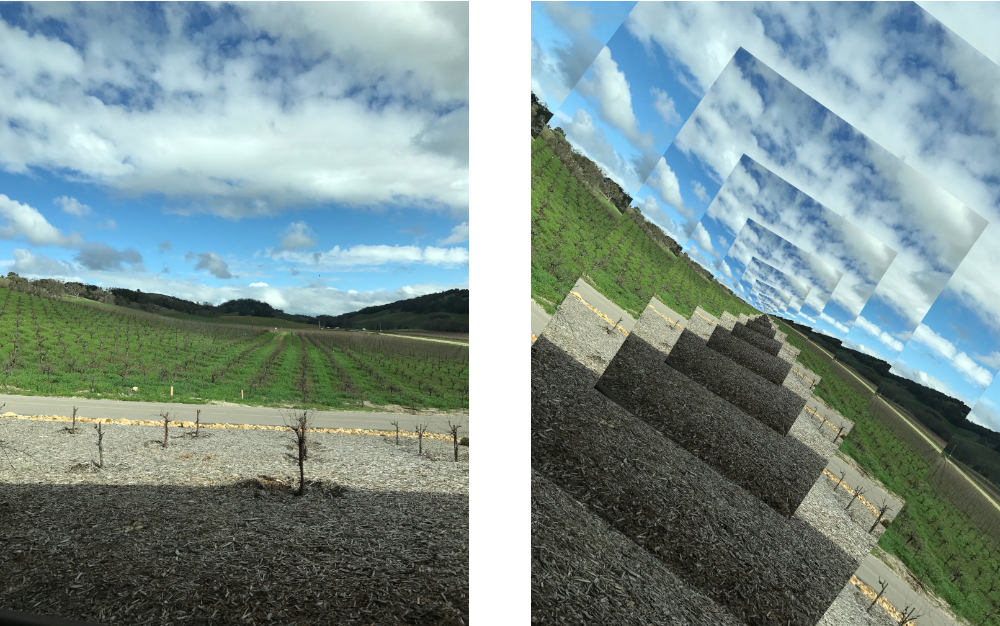

> Navigation: [Technologies](../../technologies.md) · [Core Image](../../coreimage.md) · [CIFilter](../cifilter-swift.class.md)

# droste()

<sub>Type Method</sub>

Stylizes an image with the Droste effect.

<sub>iOS, iPadOS, Mac Catalyst, macOS, tvOS, visionOS</sub>

```swift
class func droste() -> any CIFilter & CIDroste
```

## Return Value

The distorted image.

## Discussion

This method applies the Droste filter to an image. This effect creates a Droste effect that distorts the image by repeating smaller versions of the same image within itself.

The Droste filter uses the following properties:

- **`inputImage`** — An image with the type [CIImage](../ciimage.md).
- **`rotation`** — A `float` representing the angle of the rotation, in radians, as an [NSNumber](../../foundation/nsnumber.md).
- **`zoom`** — A `float` representing the zoom of the effect as an [NSNumber](../../foundation/nsnumber.md).
- **`periodicity`** — A float representing the amount of intervals as an [NSNumber](../../foundation/nsnumber.md).
- **`inputInsetPoint1`** — A [CGPoint](../../corefoundation/cgpoint.md) representing the x and y position that defines the first inset point.
- **`inputInsetPoint0`** — A [CGPoint](../../corefoundation/cgpoint.md) representing the x and y position that defines the second inset point.
- **`inputStrands`** — A float representing the amount of strands as an [NSNumber](../../foundation/nsnumber.md).

The following code creates a filter that results in the image becoming a repeated, scaled pattern:

```swift
func drosteFilter(inputImage: CIImage) -> CIImage {
    let filter = CIFilter.droste()
    filter.inputImage = inputImage
    filter.insetPoint1 = CGPoint(
        x: inputImage.extent.size.width * 0.2,
        y: inputImage.extent.size.height * 0.2
    )
    filter.insetPoint0 = CGPoint(
        x: inputImage.extent.size.width * 0.8,
        y: inputImage.extent.size.height * 0.8
    )
    filter.periodicity = 1
    filter.rotation = 0
    filter.strands = 1
    filter.zoom = 1
    return filter.outputImage!.cropped(to: inputImage.extent)
}
```



<sub>Two images arranged horizontally. The left image contains a photograph of a vineyard with a partially cloudy sky. The right image shows the result of applying a Droste filter. A portion of the image has been rotated and then repeatedly scaled.</sub>

## See Also

### Filters

- [+ bumpDistortionFilter](<bumpdistortion().md>) — Distorts an image with a concave or convex bump.
- [+ bumpDistortionLinearFilter](<bumpdistortionlinear().md>) — Linearly distorts an image with a concave or convex bump.
- [+ circleSplashDistortionFilter](<circlesplashdistortion().md>) — Distorts an image with radiating circles to the periphery of the image.
- [+ circularWrapFilter](<circularwrap().md>) — Distorts an image by increasing the distance of the center of the image.
- [+ displacementDistortionFilter](<displacementdistortion().md>) — Applies the grayscale values of the second image to the first image.
- [+ glassDistortionFilter](<glassdistortion().md>) — Distorts an image by applying a glass-like texture.
- [+ glassLozengeFilter](<glasslozenge().md>) — Creates a lozenge-shaped lens and distorts the image.
- [+ holeDistortionFilter](<holedistortion().md>) — Distorts an image with a circular area that pushes the image outward.
- [+ lightTunnelFilter](<lighttunnel().md>) — Distorts an image by generating a light tunnel.
- [+ ninePartStretchedFilter](<ninepartstretched().md>) — Distorts an image by stretching it between two breakpoints.
- [+ ninePartTiledFilter](<nineparttiled().md>) — Distorts an image by tiling portions of it.
- [+ pinchDistortionFilter](<pinchdistortion().md>) — Distorts an image by creating a pinch effect with stronger distortion in the center.
- [+ stretchCropFilter](<stretchcrop().md>) — Distorts an image by stretching or cropping to fit a specified size.
- [+ torusLensDistortionFilter](<toruslensdistortion().md>) — Creates a torus-shaped lens to distort the image.
- [+ twirlDistortionFilter](<twirldistortion().md>) — Distorts an image by rotating pixels around a center point.
