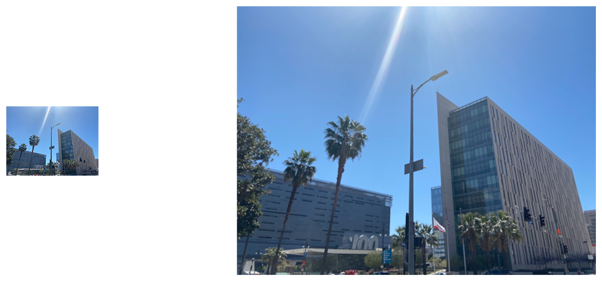

> Navigation: [Technologies](../../technologies.md) · [Core Image](../../coreimage.md) · [CIFilter](../cifilter-swift.class.md)

# edgePreserveUpsample()

<sub>Type Method</sub>

Creates a high-quality upscaled image.

<sub>iOS, iPadOS, Mac Catalyst, macOS, tvOS, visionOS</sub>

```swift
class func edgePreserveUpsample() -> any CIFilter & CIEdgePreserveUpsample
```

## Return Value

The adjusted image.

## Discussion

This method applies the edge preserve upsample filter to an image. The effect upsamples a small input image to be the size of the scale image using the luminance of the input image to preserve detail.

The edge preserve upsample filter uses the following properties:

- **`inputImage`** — An image representing the image to upscale with the type [CIImage](../ciimage.md).
- **`scaleImage`** — An image representing the reference for scaling the input image with the type [CIImage](../ciimage.md).
- **`spatialSigma`** — A float representing the influence of the input image’s spatial information on the upsampling operation as an [NSNumber](../../foundation/nsnumber.md).
- **`lumaSimga`** — A float representing influence of the input image’s luma information on the upsampling operation as an [NSNumber](../../foundation/nsnumber.md).

The following code creates a filter that upscales the smaller image to the size of the scale image:

```swift
func edgePerserveUp(inputImage: CIImage, smallImage: CIImage) -> CIImage {
    let edgePerserveUpFilter = CIFilter.edgePreserveUpsample()
    edgePerserveUpFilter.inputImage = inputImage
    edgePerserveUpFilter.smallImage = smallImage
    edgePerserveUpFilter.spatialSigma = 5
    edgePerserveUpFilter.lumaSigma = 0.15
    return edgePerserveUpFilter.outputImage!
}
```



<sub>Two photographs of two large buildings with a clear sky in the background. The buildings have small windows with a lot of horizonal and vertical details. The photo on the left has no modifications to size or color. In the photo on the right, an edge preserve upsample filter is applied, resulting in a scaled-up, larger image.</sub>

## See Also

### Filters

- [+ bicubicScaleTransformFilter](<bicubicscaletransform().md>) — Produces a high-quality scaled version of an image.
- [+ keystoneCorrectionCombinedFilter](<keystonecorrectioncombined().md>) — Adjusts the image vertically and horizontally to remove distortion.
- [+ keystoneCorrectionHorizontalFilter](<keystonecorrectionhorizontal().md>) — Horizontally adjusts an image to remove distortion.
- [+ keystoneCorrectionVerticalFilter](<keystonecorrectionvertical().md>) — Vertically adjusts an image to remove distortion.
- [+ lanczosScaleTransformFilter](<lanczosscaletransform().md>) — Creates a high-quality, scaled version of a source image.
- [+ perspectiveCorrectionFilter](<perspectivecorrection().md>) — Transforms an image’s perspective.
- [+ perspectiveRotateFilter](<perspectiverotate().md>) — Rotates an image in a 3D space.
- [+ perspectiveTransformFilter](<perspectivetransform().md>) — Alters an image’s geometry to adjust the perspective.
- [+ perspectiveTransformWithExtentFilter](<perspectivetransformwithextent().md>) — Alters an image’s geometry to adjust the perspective while applying constraints.
- [+ straightenFilter](<straighten().md>) — Rotates and crops an image.
