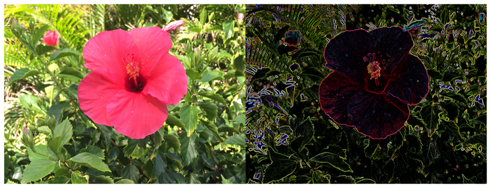

> Navigation: [Technologies](../../technologies.md) · [Core Image](../../coreimage.md) · [CIFilter](../cifilter-swift.class.md)

# edges()

<sub>Type Method</sub>

Hilghlights edges of objects found within an image.

<sub>iOS, iPadOS, Mac Catalyst, macOS, tvOS, visionOS</sub>

```swift
class func edges() -> any CIFilter & CIEdges
```

## Return Value

The modified image.

## Discussion

This method applies the edges filter to an image. The effect uses the `intensity` to compute and highlight edges of items within the image.

The edges filter uses the following property:

- **`inputImage`** — An image with the type [CIImage](../ciimage.md).
- **`intensity`** — A `float` representing the desired strength of the effect as an [NSNumber](../../foundation/nsnumber.md).

The following code creates a filter that results in a darker image with the edges of objects highlighted with the colors of the input image:

```swift
func edges(inputImage: CIImage) -> CIImage {
    let edgesFilter = CIFilter.edges()
    edgesFilter.inputImage = inputImage
    edgesFilter.intensity = 15
    return edgesFilter.outputImage!
}
```



<sub>Two pictures of a pink flower surrounded by foliage. The photo on the left shows a single flower photographed close up, in focus, with good light and no effects. In the photo on the right, the edges filter is applied, resulting in an overall darker image while brightening the edges of the flowers and leaves.</sub>

## See Also

### Filters

- [+ blendWithAlphaMaskFilter](<blendwithalphamask().md>) — Blends two images by using an alpha mask image.
- [+ blendWithBlueMaskFilter](<blendwithbluemask().md>) — Blends two images by using a blue mask image.
- [+ blendWithMaskFilter](<blendwithmask().md>) — Blends two images by using a mask image.
- [+ blendWithRedMaskFilter](<blendwithredmask().md>) — Blends two images by using a red mask image.
- [+ bloomFilter](<bloom().md>) — Adjusts an image’s colors by applying a blur effect.
- [+ cannyEdgeDetectorFilter](<cannyedgedetector().md>) — Applies the Canny edge-detection algorithm to an image.
- [+ comicEffectFilter](<comiceffect().md>) — Creates an image with a comic book effect.
- [+ coreMLModelFilter](<coremlmodel().md>) — Filters an image with a Core ML model.
- [+ crystallizeFilter](<crystallize().md>) — Creates an image made with a series of colorful polygons.
- [+ depthOfFieldFilter](<depthoffield().md>) — Simulates a depth of field effect.
- [+ edgeWorkFilter](<edgework().md>) — Produces a black-and-white image that looks similar to a woodblock print.
- [+ gaborGradientsFilter](<gaborgradients().md>) — Highlights textures in an image.
- [+ gloomFilter](<gloom().md>) — Adjusts an image’s color by applying a gloom filter.
- [+ heightFieldFromMaskFilter](<heightfieldfrommask().md>) — Creates a realistic shaded height-field image.
- [+ hexagonalPixellateFilter](<hexagonalpixellate().md>) — Creates an image made of a series of colorful hexagons.
