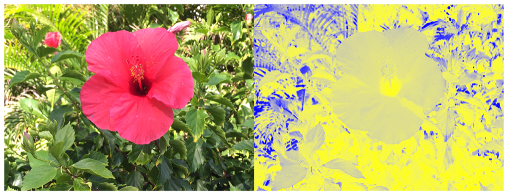

> Navigation: [Technologies](../../technologies.md) · [Core Image](../../coreimage.md) · [CIFilter](../cifilter-swift.class.md)

# falseColor()

<sub>Type Method</sub>

Replaces an image’s colors with specified colors.

<sub>iOS, iPadOS, Mac Catalyst, macOS, tvOS, visionOS</sub>

```swift
class func falseColor() -> any CIFilter & CIFalseColor
```

## Return Value

The modified image.

## Discussion

This method applies the false color filter to an image. The effect maps the luminance to a color ramp from `color0` to `color1`. People use this effect to process astronomical and other scientific data, such as ultraviolet and X-ray images.

The false color filter uses the following properties:

- **`inputImage`** — An image with the type [CIImage](../ciimage.md).
- **`color0`** — A [CIColor](../cicolor.md) representing the first color to use for the color ramp.
- **`color1`** — A [CIColor](../cicolor.md) representing the second color to use for the color ramp.

The following code creates a filter that replaces the colors of the input image resulting in blue and yellow colors:

```swift
func falseColor(inputImage: CIImage) -> CIImage {
    let falseColorFilter = CIFilter.falseColor()
    falseColorFilter.inputImage = inputImage
    falseColorFilter.color0 = CIColor(red: 1, green: 1, blue: 0)
    falseColorFilter.color1 = CIColor(red: 0, green: 0, blue: 1)
    return falseColorFilter.outputImage!
}
```



<sub>Two pictures of a pink flower surrounded by foliage. The photo on the left shows a single flower photographed close-up, in focus, with good light and no effects. In the photo on the right, a false color filter is applied, transforming the colors in the image to be blue and yellow.</sub>

## See Also

### Color Effect Filters

- [+ colorCrossPolynomialFilter](<colorcrosspolynomial().md>) — Adjusts an image’s color by applying polynomial cross-products.
- [+ colorCubeFilter](<colorcube().md>) — Adjusts an image’s pixels using a three-dimensional color table.
- [+ colorCubeWithColorSpaceFilter](<colorcubewithcolorspace().md>) — Adjusts an image’s pixels using a three-dimensional color table in specified color space.
- [+ colorCubesMixedWithMaskFilter](<colorcubesmixedwithmask().md>) — Alters an image’s pixels using a three-dimensional color tables and a mask image.
- [+ colorCurvesFilter](<colorcurves().md>) — Adjusts an image’s color curves.
- [+ colorInvertFilter](<colorinvert().md>) — Inverts an image’s colors.
- [+ colorMapFilter](<colormap().md>) — Performs a transformation of the input image colors to colors from a gradient image.
- [+ colorMonochromeFilter](<colormonochrome().md>) — Adjusts an image’s colors to shades of a single color.
- [+ colorPosterizeFilter](<colorposterize().md>) — Flattens an image’s colors.
- [+ convertLabToRGBFilter](<convertlabtorgb().md>) — Converts an image from CIELAB to RGB color space.
- [+ convertRGBtoLabFilter](<convertrgbtolab().md>) — Converts an image from RGB to CIELAB color space.
- [+ ditherFilter](<dither().md>) — Applies randomized noise to produce a processed look.
- [+ documentEnhancerFilter](<documentenhancer().md>) — Adjusts an image’s shadows and contrast.
- [+ LabDeltaE](<labdeltae().md>) — Compares an image’s color values.
- [+ maskToAlphaFilter](<masktoalpha().md>) — Converts an image to a white image with an alpha component.
