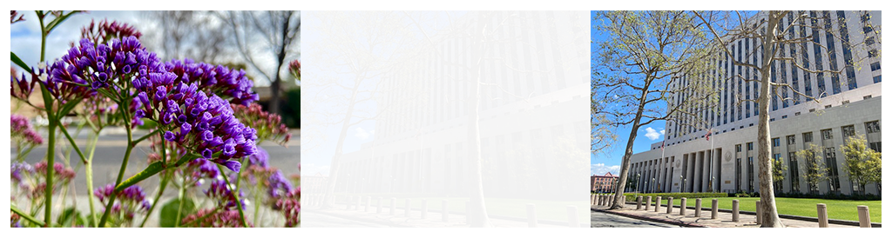

> Navigation: [Technologies](../../technologies.md) · [Core Image](../../coreimage.md) · [CIFilter](../cifilter-swift.class.md)

# flashTransition()

<sub>Type Method</sub>

Creates a flash of light to transition between two images.

<sub>iOS, iPadOS, Mac Catalyst, macOS, tvOS, visionOS</sub>

```swift
class func flashTransition() -> any CIFilter & CIFlashTransition
```

## Return Value

The transition image.

## Discussion

This method applies the flash transition filter to an image. The effect transitions from the input image to the target image by creating a flash that fills the image and fades to the target image.

The flash transition filter uses the following properties:

- **`inputImage`** — The starting image with the type [CIImage](../ciimage.md).
- **`targetImage`** — The ending image with the type [CIImage](../ciimage.md).
- **`center`** — A set of coordinates marking the center of the image as a [CGPoint](../../corefoundation/cgpoint.md).
- **`extent`** — A [CGRect](../../corefoundation/cgrect.md) representing the size of the rounded rectangle.
- **`color`** — A [CIColor](../cicolor.md) representing the color of the flash effect.
- **`time`** — A `float` representing the parametric time of the transition from start (at time 0) to end (at time 1) as an [NSNumber](../../foundation/nsnumber.md).
- **`maxStiriationRadius`** — A `float` representing the radius of the light rays emanating from the flash as a [NSNumber](../../foundation/nsnumber.md).
- **`striationStrength`** — A `float` representing the strength of the light rays emanating from the flash as a [NSNumber](../../foundation/nsnumber.md).
- **`striationContrast`** — A `float` representing the contrast that’s added to each output pixel as a [NSNumber](../../foundation/nsnumber.md).
- **`fadeThreshold`** — A `float` representing the amount of fade between the flash and the target image as a [NSNumber](../../foundation/nsnumber.md).

The following code creates a filter that transitions from the input image with a large flash of light and fades to the target image.

```swift
func flash (inputImage: CIImage, targetImage: CIImage) -> CIImage {
    let flashTransition = CIFilter.flashTransition()
    flashTransition.inputImage = inputImage
    flashTransition.targetImage = targetImage
    flashTransition.center = CGPoint(x: 253, y: 372)
    flashTransition.extent = CGRect(x: 0, y: 0, width: 300, height: 300)
    flashTransition.color = .white
    flashTransition.time = 0.5
    flashTransition.maxStriationRadius = 2.58
    flashTransition.striationStrength = 0.5
    flashTransition.striationContrast = 1.375
    flashTransition.fadeThreshold = 0.06
    return flashTransition.outputImage!
}
```



<sub>Three photographs. In the photo on the left, there are multiple small purple flowers photographed close up with good lighting, and the background has a slight blur. In the photograph on the right is a tall building with two trees directly in front of the building. In the center photograph, a flash transition filter is applied, resulting in a still photo of the moving transition. The left photograph is overlaid on the photo on the right while transitioning by creating a flash of light and slowly fading to the city image.</sub>

## See Also

### Filters

- [+ accordionFoldTransitionFilter](<accordionfoldtransition().md>) — Transitions by folding and crossfading an image to reveal the target image.
- [+ barsSwipeTransitionFilter](<barsswipetransition().md>) — Transitions between two images by removing rectangular portions of an image.
- [+ copyMachineTransitionFilter](<copymachinetransition().md>) — Simulates the effect of a copy machine scanner light to transiton between two images.
- [+ disintegrateWithMaskTransitionFilter](<disintegratewithmasktransition().md>) — Transitions between two images using a mask image.
- [+ dissolveTransitionFilter](<dissolvetransition().md>) — Transitions between two images with a fade effect.
- [+ modTransitionFilter](<modtransition().md>) — Transitions between two images by applying irregularly shaped holes.
- [+ pageCurlTransitionFilter](<pagecurltransition().md>) — Simulates the curl of a page, revealing the target image.
- [+ pageCurlWithShadowTransitionFilter](<pagecurlwithshadowtransition().md>) — Simulates the curl of a page, revealing the target image with added shadow.
- [+ rippleTransitionFilter](<rippletransition().md>) — Simulates a ripple in a pond to transiton from one image to another.
- [+ swipeTransitionFilter](<swipetransition().md>) — Gradually transitions from one image to another with a swiping motion.
