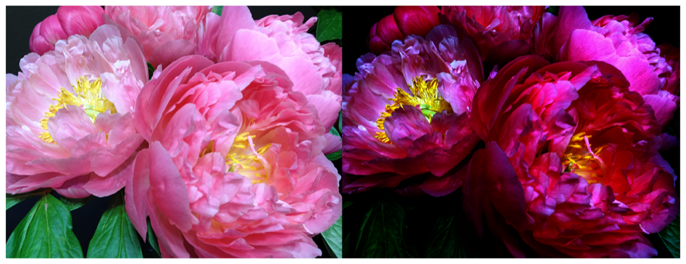

> Navigation: [Technologies](../../technologies.md) · [Core Image](../../coreimage.md) · [CIFilter](../cifilter-swift.class.md)

# gammaAdjust()

<sub>Type Method</sub>

Alters an image’s transition between black and white.

<sub>iOS, iPadOS, Mac Catalyst, macOS, tvOS, visionOS</sub>

```swift
class func gammaAdjust() -> any CIFilter & CIGammaAdjust
```

## Return Value

The modified image.

## Discussion

This method applies the gamma-adjust filter to an image. The effect adjusts the image’s mid-tone brightness. This filter is typically used to compensate for distortion caused by displays.

The gamma-adjust filter uses the following properties:

- **`inputImage`** — An image with the type [CIImage](../ciimage.md).

The following code creates a filter that adds darker colors to the input image:

```swift
func gammaAdjust(inputImage: CIImage) -> CIImage {
    let gammaAdjustFilter = CIFilter.gammaAdjust()
    gammaAdjustFilter.inputImage = inputImage
    gammaAdjustFilter.power = 4
    return gammaAdjustFilter.outputImage!
}
```



<sub>Two versions of a photograph side by side. The photo on the left shows a small bunch of flowers photographed close up, in focus, with good light and no effects. In the photo on the right, a gamma adjust filter is applied, resulting in a darker image.</sub>

## See Also

### Filters

- [+ colorAbsoluteDifferenceFilter](<colorabsolutedifference().md>) — Calculates the absolute difference between each color component in the input images.
- [+ colorClampFilter](<colorclamp().md>) — Alters the colors in an image based on color components.
- [+ colorControlsFilter](<colorcontrols().md>) — Alters the brightness, contrast, and saturation of an image’s colors.
- [+ colorMatrixFilter](<colormatrix().md>) — Alters the colors in an image based on vectors provided.
- [+ colorPolynomialFilter](<colorpolynomial().md>) — Alters an image’s colors.
- [+ colorThresholdFilter](<colorthreshold().md>) — Compares the red, green, and blue components of the input image to a threshold and sets them to 1 or 0.
- [+ colorThresholdOtsuFilter](<colorthresholdotsu().md>) — Compares the red, green, and blue components of the input image against a threshold calculated using Otsu’s algorithm.
- [+ depthToDisparityFilter](<depthtodisparity().md>) — Converts from an image containing depth data to an image containing disparity data.
- [+ disparityToDepthFilter](<disparitytodepth().md>) — Creates depth data from an image containing disparity data.
- [+ exposureAdjustFilter](<exposureadjust().md>) — Adjusts an image’s exposure.
- [+ hueAdjustFilter](<hueadjust().md>) — Modifies an image’s hue.
- [+ linearToSRGBToneCurveFilter](<lineartosrgbtonecurve().md>) — Alters an image’s color intensity.
- [+ sRGBToneCurveToLinearFilter](<srgbtonecurvetolinear().md>) — Converts the colors in an image from sRGB to linear.
- [+ temperatureAndTintFilter](<temperatureandtint().md>) — Alters an image’s temperature and tint.
- [+ toneCurveFilter](<tonecurve().md>) — Alters an image’s tone curve according to a series of data points.
