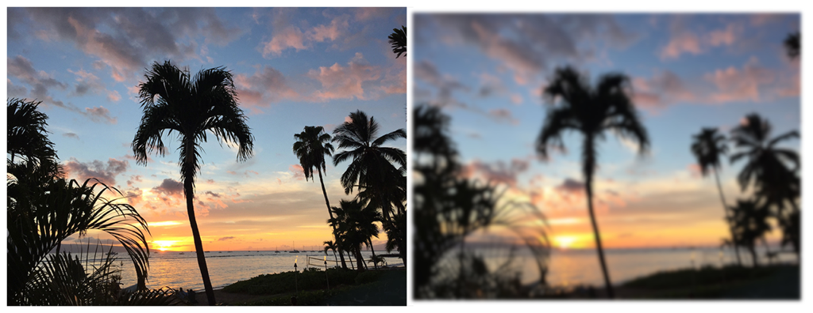

> Navigation: [Technologies](../../technologies.md) · [Core Image](../../coreimage.md) · [CIFilter](../cifilter-swift.class.md)

# gaussianBlur()

<sub>Type Method</sub>

Blurs an image with a Gaussian distribution pattern.

<sub>iOS, iPadOS, Mac Catalyst, macOS, tvOS, visionOS</sub>

```swift
class func gaussianBlur() -> any CIFilter & CIGaussianBlur
```

## Return Value

The blurred image.

## Discussion

This method applies a Gaussian blur filter to an image. The effect targets the pixels within a circle defined by a `radius` and uses Gaussian ditribution to blur the image from the center out.

The Gaussian blur filter uses the following properties:

- **`radius`** — A `float` representing the area of effect as an [NSNumber](../../foundation/nsnumber.md).
- **`inputImage`** — A [CIImage](../ciimage.md) representing the input image to apply the filter to.

The following code creates a filter that adds a heavy blur to the input image:

```swift
    func gaussianBlur(inputImage: CIImage) -> CIImage? {

        let gaussianBlurFilter = CIFilter.gaussianBlur()
        gaussianBlurFilter.inputImage = inputImage
        gaussianBlurFilter.radius = 10
        return gaussianBlurFilter.outputImage
    }
```



<sub>Two photographs of a beach at sunset with multiple palm trees. A Gaussian blur filter has been applied to the photo on the right. It is smaller than the one on the left, and has an intense blur effect that makes the entire image very hazy.</sub>

## See Also

### Filters

- [+ bokehBlurFilter](<bokehblur().md>) — Applies a bokeh effect to an image.
- [+ boxBlurFilter](<boxblur().md>) — Applies a square-shaped blur to an area of an image.
- [+ discBlurFilter](<discblur().md>) — Applies a circle-shaped blur to an area of an image.
- [+ maskedVariableBlurFilter](<maskedvariableblur().md>) — Blurs a specified portion of an image.
- [+ medianFilter](<median().md>) — Calculates the median of an image to refine detail.
- [+ morphologyGradientFilter](<morphologygradient().md>) — Detects and highlights edges of objects.
- [+ morphologyMaximumFilter](<morphologymaximum().md>) — Blurs a circular area by enlarging contrasting pixels.
- [+ morphologyMinimumFilter](<morphologyminimum().md>) — Blurs a circular area by reducing contrasting pixels.
- [+ morphologyRectangleMaximumFilter](<morphologyrectanglemaximum().md>) — Blurs a rectangular area by enlarging contrasting pixels.
- [+ morphologyRectangleMinimumFilter](<morphologyrectangleminimum().md>) — Blurs a rectangular area by reducing contrasting pixels.
- [+ motionBlurFilter](<motionblur().md>) — Creates motion blur on an image.
- [+ noiseReductionFilter](<noisereduction().md>) — Reduces noise by sharpening the edges of objects.
- [+ zoomBlurFilter](<zoomblur().md>) — Creates a zoom blur centered around a single point on the image.
