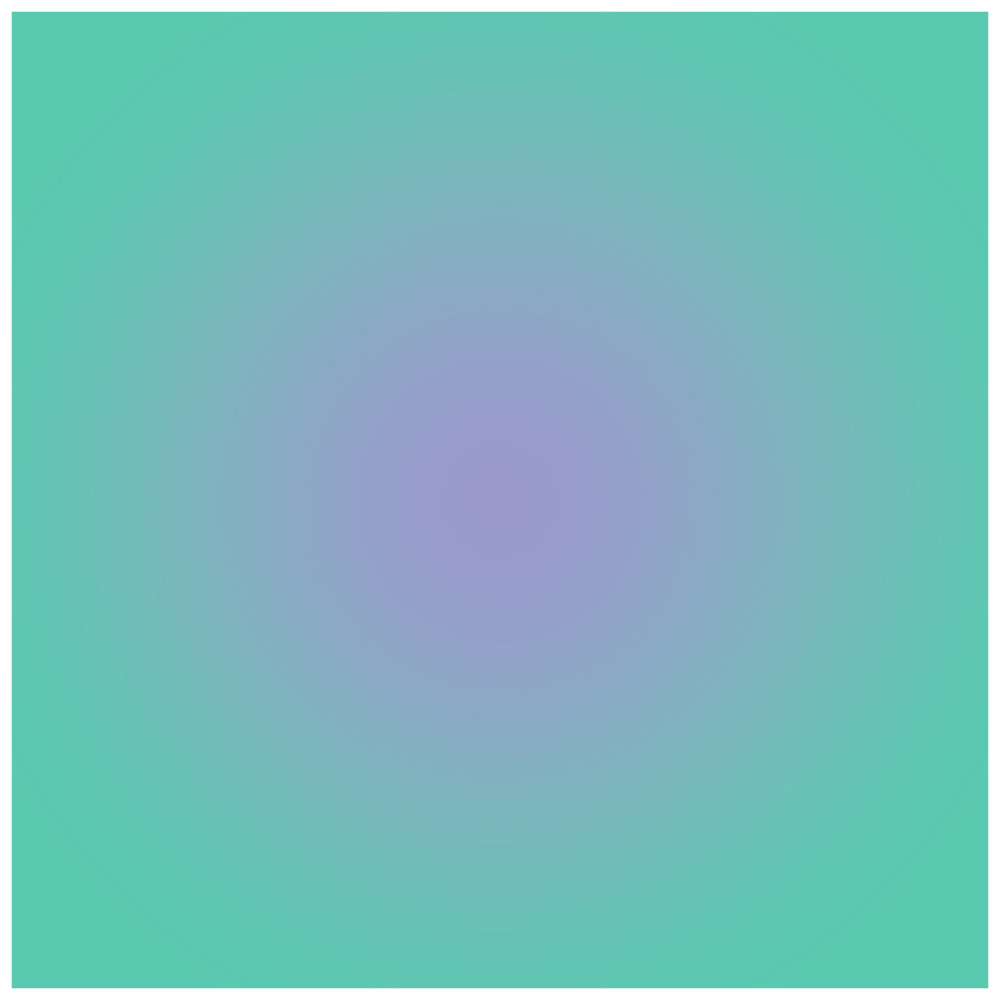

> Navigation: [Technologies](../../technologies.md) · [Core Image](../../coreimage.md) · [CIFilter](../cifilter-swift.class.md)

# gaussianGradient()

<sub>Type Method</sub>

Generates a gradient that varies from one color to another using a Gaussian distribution.

<sub>iOS, iPadOS, Mac Catalyst, macOS, tvOS, visionOS</sub>

```swift
class func gaussianGradient() -> any CIFilter & CIGaussianGradient
```

## Return Value

The generated image.

## Discussion

This method generates a Gaussian gradient image. The effect uses the Gaussian kernel to calculate the even dispersal of the first color in the center to the second color in the image’s periphery.

The Gaussian gradient filter uses the following properties:

- **`center`** — A [CGPoint](../../corefoundation/cgpoint.md) representing the center of the effect as x and y coordinates.
- **`color0`** — A [CIColor](../cicolor.md) representing the first color to use in the gradient.
- **`color1`** — A [CIColor](../cicolor.md) representing the second color to use in the gradient.
- **`radius`** — A `float` representing the radius of the Gaussian distribution as an [NSNumber](../../foundation/nsnumber.md).

The following code creates a filter that generates a gradient image:

```swift
func gaussian() -> CIImage {
    let gaussianGradient = CIFilter.gaussianGradient()
    gaussianGradient.center = CGPoint (x: 150, y: 150)
    gaussianGradient.color0 = CIColor(red: 88/255, green: 201
/255, blue: 175/255)
    gaussianGradient.color1 = CIColor(red: 153/255, green: 153/255, blue: 204/255)
    gaussianGradient.radius = 10
    return gaussianGradient.outputImage!
}
```



<sub>A photo of a Gaussian gradient that gradually changes in color from purple in the center and shifts to light blue in the periphery.</sub>

## See Also

### Filters

- [+ hueSaturationValueGradientFilter](<huesaturationvaluegradient().md>) — Generates a gradient representing a specified color space.
- [+ linearGradientFilter](<lineargradient().md>) — Generates a color gradient that varies along a linear axis between two defined endpoints.
- [+ radialGradientFilter](<radialgradient().md>) — Generates a gradient that varies radially between two circles having the same center.
- [+ smoothLinearGradientFilter](<smoothlineargradient().md>) — Generates a gradient that blends colors along a linear axis between two defined endpoints.
