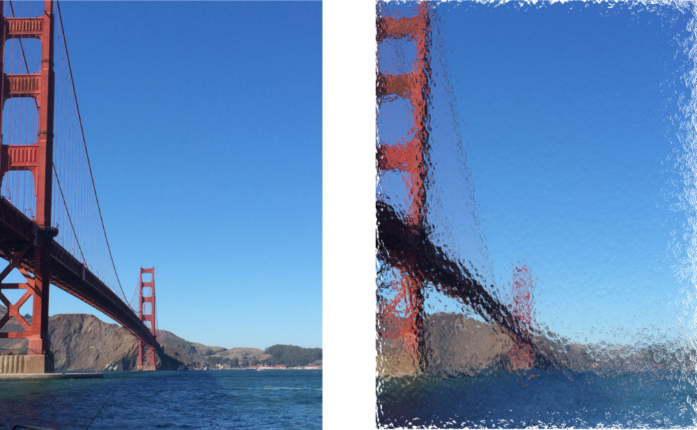

> Navigation: [Technologies](../../technologies.md) · [Core Image](../../coreimage.md) · [CIFilter](../cifilter-swift.class.md)

# glassDistortion()

<sub>Type Method</sub>

Distorts an image by applying a glass-like texture.

<sub>iOS, iPadOS, Mac Catalyst, macOS, tvOS, visionOS</sub>

```swift
class func glassDistortion() -> any CIFilter & CIGlassDistortion
```

## Return Value

The distorted image.

## Discussion

This method applies the glass distortion filter to an image. This effect distorts an image by applying a glass texture from the raised portions of the texture map image.

The glass distortion filter uses the following properties:

- **`inputImage`** — An image with the type [CIImage](../ciimage.md).
- **`texture`** — An image with the type [CIImage](../ciimage.md).
- **`scale`** — The amount of texturing to apply. Larger values increase the effect. Defaults to 200.
- **`center`** — A set of coordinates marking the center of the image as a [CGPoint](../../corefoundation/cgpoint.md).

The following code creates a filter that results in a glass-like distortion applied to the image:

```swift
func glassDistortion(inputImage: CIImage, textureImage: CIImage) -> CIImage {
    let filter = CIFilter.glassDistortion()
    filter.inputImage = inputImage
    filter.textureImage = textureImage
    filter.center = CGPoint(x: 1791, y: 1344)
    filter.scale = 500
    return filter.outputImage!
}
```



<sub>Two images arranged horizontally. The left image contains a photo of the Golden Gate Bridge with a clear sky as the backdrop. The right image shows the result of applying the glass distortion filter. It appears as though the image is behind a piece of privacy glass.</sub>

## See Also

### Filters

- [+ bumpDistortionFilter](<bumpdistortion().md>) — Distorts an image with a concave or convex bump.
- [+ bumpDistortionLinearFilter](<bumpdistortionlinear().md>) — Linearly distorts an image with a concave or convex bump.
- [+ circleSplashDistortionFilter](<circlesplashdistortion().md>) — Distorts an image with radiating circles to the periphery of the image.
- [+ circularWrapFilter](<circularwrap().md>) — Distorts an image by increasing the distance of the center of the image.
- [+ displacementDistortionFilter](<displacementdistortion().md>) — Applies the grayscale values of the second image to the first image.
- [+ drosteFilter](<droste().md>) — Stylizes an image with the Droste effect.
- [+ glassLozengeFilter](<glasslozenge().md>) — Creates a lozenge-shaped lens and distorts the image.
- [+ holeDistortionFilter](<holedistortion().md>) — Distorts an image with a circular area that pushes the image outward.
- [+ lightTunnelFilter](<lighttunnel().md>) — Distorts an image by generating a light tunnel.
- [+ ninePartStretchedFilter](<ninepartstretched().md>) — Distorts an image by stretching it between two breakpoints.
- [+ ninePartTiledFilter](<nineparttiled().md>) — Distorts an image by tiling portions of it.
- [+ pinchDistortionFilter](<pinchdistortion().md>) — Distorts an image by creating a pinch effect with stronger distortion in the center.
- [+ stretchCropFilter](<stretchcrop().md>) — Distorts an image by stretching or cropping to fit a specified size.
- [+ torusLensDistortionFilter](<toruslensdistortion().md>) — Creates a torus-shaped lens to distort the image.
- [+ twirlDistortionFilter](<twirldistortion().md>) — Distorts an image by rotating pixels around a center point.
