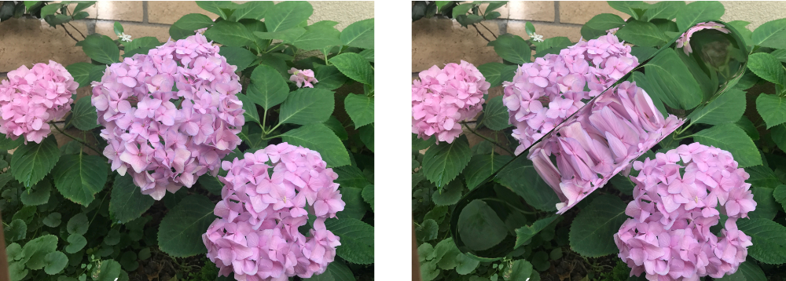

> Navigation: [Technologies](../../technologies.md) · [Core Image](../../coreimage.md) · [CIFilter](../cifilter-swift.class.md)

# glassLozenge()

<sub>Type Method</sub>

Creates a lozenge-shaped lens and distorts the image.

<sub>iOS, iPadOS, Mac Catalyst, macOS, tvOS, visionOS</sub>

```swift
class func glassLozenge() -> any CIFilter & CIGlassLozenge
```

## Return Value

The distorted image.

## Discussion

This method applies the glass lozenge filter to an image. This effect distorts an image by creating a lozenge shape placed over the input image.

The absolute threshold filter uses the following properties:

- **`inputImage`** — An image with the type [CIImage](../ciimage.md).
- **`radius`** — A `float` representing the radius of the lozenge distortion as an [NSNumber](../../foundation/nsnumber.md).
- **`refraction`** — A `float` representing the refraction of the glass as an [NSNumber](../../foundation/nsnumber.md).
- **`inputPoint1`** — A [CGPoint](../../corefoundation/cgpoint.md) representing the x and y positions that define the center of the circle at the first end of the lozenge.
- **`inputPoint2`** — A [CGPoint](../../corefoundation/cgpoint.md) representing the x and y positions that define the center of the circle at the second end of the lozenge.

The following code creates a filter that results in a large glass lozenge distorting the image:

```swift
func glassLozenge(inputImage: CIImage) -> CIImage {
    let filter = CIFilter.glassLozenge()
    filter.inputImage = inputImage
    filter.refraction = 1.7
    filter.point0 = CGPoint(x: 150, y: 1050)
    filter.point1 = CGPoint(x: 3050, y: 150)
    return filter.outputImage!
}
```



<sub>Two images next to each other. The left image contains a photograph of three hydrangea flowers with leaves in the background. In the right image, the glass lozenge filter has been applied. It appears as if the glass pill shape has been placed on top of the image.</sub>

## See Also

### Filters

- [+ bumpDistortionFilter](<bumpdistortion().md>) — Distorts an image with a concave or convex bump.
- [+ bumpDistortionLinearFilter](<bumpdistortionlinear().md>) — Linearly distorts an image with a concave or convex bump.
- [+ circleSplashDistortionFilter](<circlesplashdistortion().md>) — Distorts an image with radiating circles to the periphery of the image.
- [+ circularWrapFilter](<circularwrap().md>) — Distorts an image by increasing the distance of the center of the image.
- [+ displacementDistortionFilter](<displacementdistortion().md>) — Applies the grayscale values of the second image to the first image.
- [+ drosteFilter](<droste().md>) — Stylizes an image with the Droste effect.
- [+ glassDistortionFilter](<glassdistortion().md>) — Distorts an image by applying a glass-like texture.
- [+ holeDistortionFilter](<holedistortion().md>) — Distorts an image with a circular area that pushes the image outward.
- [+ lightTunnelFilter](<lighttunnel().md>) — Distorts an image by generating a light tunnel.
- [+ ninePartStretchedFilter](<ninepartstretched().md>) — Distorts an image by stretching it between two breakpoints.
- [+ ninePartTiledFilter](<nineparttiled().md>) — Distorts an image by tiling portions of it.
- [+ pinchDistortionFilter](<pinchdistortion().md>) — Distorts an image by creating a pinch effect with stronger distortion in the center.
- [+ stretchCropFilter](<stretchcrop().md>) — Distorts an image by stretching or cropping to fit a specified size.
- [+ torusLensDistortionFilter](<toruslensdistortion().md>) — Creates a torus-shaped lens to distort the image.
- [+ twirlDistortionFilter](<twirldistortion().md>) — Distorts an image by rotating pixels around a center point.
