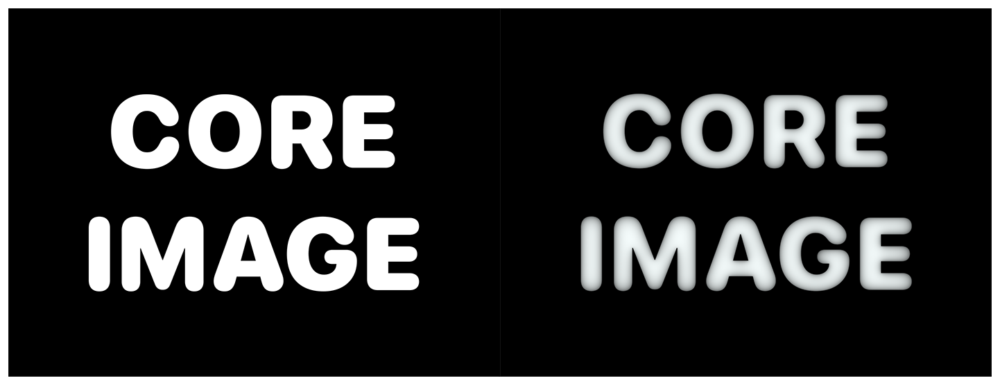

> Navigation: [Technologies](../../technologies.md) · [Core Image](../../coreimage.md) · [CIFilter](../cifilter-swift.class.md)

# heightFieldFromMask()

<sub>Type Method</sub>

Creates a realistic shaded height-field image.

<sub>iOS, iPadOS, Mac Catalyst, macOS, tvOS, visionOS</sub>

```swift
class func heightFieldFromMask() -> any CIFilter & CIHeightFieldFromMask
```

## Return Value

The modified image.

## Discussion

This method applies the height-field from the mask filter to an image. The effect targets the white in the input image and creates realistic shading.

The height field from mask filter uses the following properties:

- **`inputImage`** — An image with the type [CIImage](../ciimage.md).
- **`radius`** — A `float` representing the area of effect as an [NSNumber](../../foundation/nsnumber.md).

The following code creates a filter that results in the text having a shading effect:

```swift
func heightFieldFromMask(inputImage: CIImage) -> CIImage {
    let heightFieldFromMaskFilter = CIFilter.heightFieldFromMask()
    heightFieldFromMaskFilter.inputImage = inputImage
    heightFieldFromMaskFilter.radius = 3
    return heightFieldFromMaskFilter.outputImage!
}
```



<sub>Two photographs of the text Core Image. The photo on the left has no modifications with white text and a black background. In the photo on the right, a height field from mask filter is applied, resulting in the text having some shading and appearing gray and less sharp.</sub>

## See Also

### Filters

- [+ blendWithAlphaMaskFilter](<blendwithalphamask().md>) — Blends two images by using an alpha mask image.
- [+ blendWithBlueMaskFilter](<blendwithbluemask().md>) — Blends two images by using a blue mask image.
- [+ blendWithMaskFilter](<blendwithmask().md>) — Blends two images by using a mask image.
- [+ blendWithRedMaskFilter](<blendwithredmask().md>) — Blends two images by using a red mask image.
- [+ bloomFilter](<bloom().md>) — Adjusts an image’s colors by applying a blur effect.
- [+ cannyEdgeDetectorFilter](<cannyedgedetector().md>) — Applies the Canny edge-detection algorithm to an image.
- [+ comicEffectFilter](<comiceffect().md>) — Creates an image with a comic book effect.
- [+ coreMLModelFilter](<coremlmodel().md>) — Filters an image with a Core ML model.
- [+ crystallizeFilter](<crystallize().md>) — Creates an image made with a series of colorful polygons.
- [+ depthOfFieldFilter](<depthoffield().md>) — Simulates a depth of field effect.
- [+ edgesFilter](<edges().md>) — Hilghlights edges of objects found within an image.
- [+ edgeWorkFilter](<edgework().md>) — Produces a black-and-white image that looks similar to a woodblock print.
- [+ gaborGradientsFilter](<gaborgradients().md>) — Highlights textures in an image.
- [+ gloomFilter](<gloom().md>) — Adjusts an image’s color by applying a gloom filter.
- [+ hexagonalPixellateFilter](<hexagonalpixellate().md>) — Creates an image made of a series of colorful hexagons.
