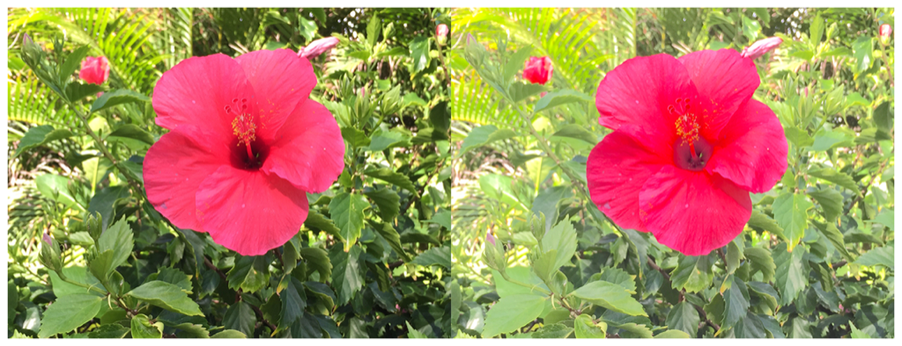

> Navigation: [Technologies](../../technologies.md) · [Core Image](../../coreimage.md) · [CIFilter](../cifilter-swift.class.md)

# highlightShadowAdjust()

<sub>Type Method</sub>

Adjusts the highlights of colors to reduce shadows.

<sub>iOS, iPadOS, Mac Catalyst, macOS, tvOS, visionOS</sub>

```swift
class func highlightShadowAdjust() -> any CIFilter & CIHighlightShadowAdjust
```

## Return Value

The modified image.

## Discussion

This method applies the highlight-shadow adjust filter to an image. The effect adjusts shadows, while preserving spatial detail in the image.

The highlight-shadow adjust filter uses the following properties:

- **`inputImage`** — An image with the type [CIImage](../ciimage.md).
- **`shadowAmount`** — A `float` representing the amount of generated shadow as an [NSNumber](../../foundation/nsnumber.md).
- **`radius`** — A `float` representing the radius of the shadow as an [NSNumber](../../foundation/nsnumber.md).
- **`highlightAmount`** — A `float` representing the strength of the shadow as an [NSNumber](../../foundation/nsnumber.md).

The following code creates a filter that results in a brighter image with reduced shadows:

```swift
func highlightShadowAdjust(inputImage: CIImage) -> CIImage {
    let highlightShadowAdjustFilter = CIFilter.highlightShadowAdjust()
    highlightShadowAdjustFilter.inputImage = inputImage
    highlightShadowAdjustFilter.shadowAmount = 1
    return highlightShadowAdjustFilter.outputImage!
}
```



<sub>Two pictures of a pink flower surrounded by foliage. The photo on the left shows a single flower photographed close up, in focus, with good light and no effects. In the photo on the right, the highlight shadow adjust filter is applied, resulting in a brighter image with a darker color on the pink flower.</sub>

## See Also

### Filters

- [+ blendWithAlphaMaskFilter](<blendwithalphamask().md>) — Blends two images by using an alpha mask image.
- [+ blendWithBlueMaskFilter](<blendwithbluemask().md>) — Blends two images by using a blue mask image.
- [+ blendWithMaskFilter](<blendwithmask().md>) — Blends two images by using a mask image.
- [+ blendWithRedMaskFilter](<blendwithredmask().md>) — Blends two images by using a red mask image.
- [+ bloomFilter](<bloom().md>) — Adjusts an image’s colors by applying a blur effect.
- [+ cannyEdgeDetectorFilter](<cannyedgedetector().md>) — Applies the Canny edge-detection algorithm to an image.
- [+ comicEffectFilter](<comiceffect().md>) — Creates an image with a comic book effect.
- [+ coreMLModelFilter](<coremlmodel().md>) — Filters an image with a Core ML model.
- [+ crystallizeFilter](<crystallize().md>) — Creates an image made with a series of colorful polygons.
- [+ depthOfFieldFilter](<depthoffield().md>) — Simulates a depth of field effect.
- [+ edgesFilter](<edges().md>) — Hilghlights edges of objects found within an image.
- [+ edgeWorkFilter](<edgework().md>) — Produces a black-and-white image that looks similar to a woodblock print.
- [+ gaborGradientsFilter](<gaborgradients().md>) — Highlights textures in an image.
- [+ gloomFilter](<gloom().md>) — Adjusts an image’s color by applying a gloom filter.
- [+ heightFieldFromMaskFilter](<heightfieldfrommask().md>) — Creates a realistic shaded height-field image.
