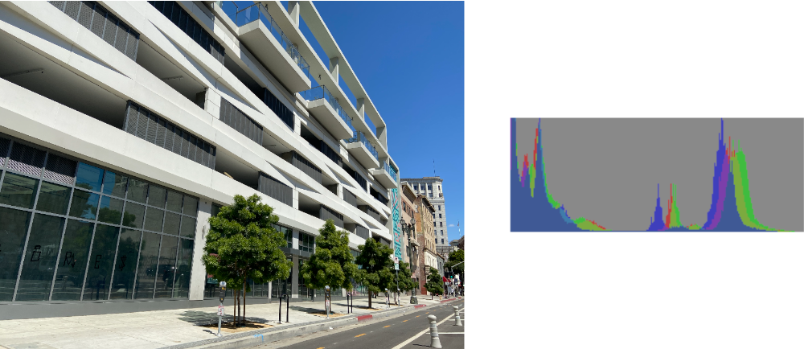

> Navigation: [Technologies](../../technologies.md) · [Core Image](../../coreimage.md) · [CIFilter](../cifilter-swift.class.md)

# histogramDisplay()

<sub>Type Method</sub>

Generates a histogram map from the image.

<sub>iOS, iPadOS, Mac Catalyst, macOS, tvOS, visionOS</sub>

```swift
class func histogramDisplay() -> any CIFilter & CIHistogramDisplay
```

## Return Value

The generated image.

## Discussion

This method applies the histogram display filter to the result of the output from the [+ areaHistogramFilter](<areahistogram().md>) filter. This effect shows a graphical representation of the tonal distribution of colors in the image.

The histogram display filter uses the following properties:

- **`inputImage`** — An image with the type [CIImage](../ciimage.md). Typically this is the output from the area histogram filter.
- **`height`** — A `float` representing the height of the generated histogram image as an [NSNumber](../../foundation/nsnumber.md).
- **`lowLimit`** — A `float` representing the fraction of the left portion of the histogram image to make darker as an [NSNumber](../../foundation/nsnumber.md).
- **`hightLimit`** — A `float` representing the fraction of the right portion of the histogram to make lighter as an [NSNumber](../../foundation/nsnumber.md).

The following code creates a filter that results in a histogram diagram generated from the input image:

```swift
func areaHistogram(inputImage: CIImage) -> CIImage {
    let filter = CIFilter.areaHistogram()
    filter.inputImage = inputImage
    filter.count = 256
    filter.scale = 50
    filter.extent = CGRect(
        x: inputImage.extent.width/2-250,
        y: inputImage.extent.height/2-250,
        width: 500,
        height: 500)
    return filter.outputImage!
}

func histogramDisplay(inputImage: CIImage) -> CIImage {
    let filter = CIFilter.histogramDisplay()
    filter.inputImage = areaHistogram(inputImage: inputImage)
    filter.highLimit = 1
    filter.height = 100
    filter.lowLimit = 0
    return filter.outputImage!
}
```



<sub>Two images side by side horizontally. The left image is a modern building with white concrete and tinted glass windows with a clear sky in the background. The right image is the result of applying the histogram display filter to the output of the area histogram filter. There are three overlaid charts representing the histograms for the red, green, and blue components.</sub>

## See Also

### Filters

- [+ areaAverageFilter](<areaaverage().md>) — Returns a 1 x 1 pixel image that contains the average color for the region of interest.
- [+ areaHistogramFilter](<areahistogram().md>) — Returns a histogram of a specified area of the image.
- [+ areaLogarithmicHistogramFilter](<arealogarithmichistogram().md>) — Returns a logarithmic histogram of a specified area of the image.
- [+ areaMaximumFilter](<areamaximum().md>) — Calculates the maximum color components of a specified area of the image.
- [+ areaMaximumAlphaFilter](<areamaximumalpha().md>) — Finds the pixel with the highest alpha value.
- [+ areaMinimumFilter](<areaminimum().md>) — Calculates the minimum color component values for a specified area of the image.
- [+ areaMinimumAlphaFilter](<areaminimumalpha().md>) — Calculates the pixel within a specified area that has the smallest alpha value.
- [+ areaMinMaxFilter](<areaminmax().md>) — Calculates minimum and maximum color components for a specified area of the image.
- [+ areaMinMaxRedFilter](<areaminmaxred().md>) — Calculates the minimum and maximum red component value.
- [+ columnAverageFilter](<columnaverage().md>) — Calculates the average color for a specified column of an image.
- [+ KMeansFilter](<kmeans().md>) — Applies the k-means algorithm to find the most common colors in an image.
- [+ rowAverageFilter](<rowaverage().md>) — Calculates the average color for the specified row of pixels in an image.
