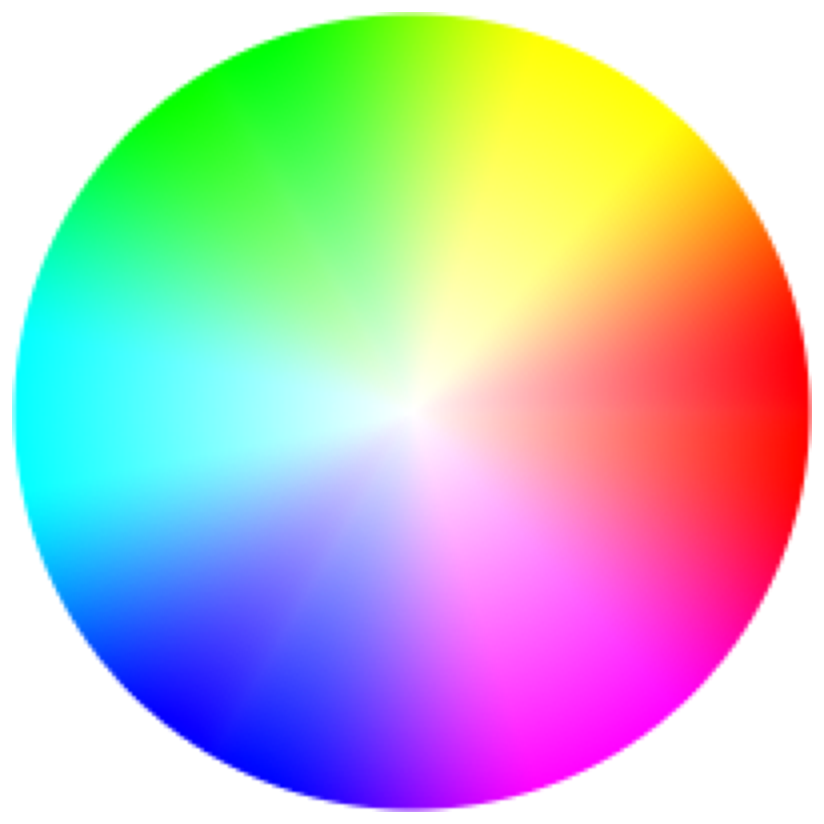

> Navigation: [Technologies](../../technologies.md) · [Core Image](../../coreimage.md) · [CIFilter](../cifilter-swift.class.md)

# hueSaturationValueGradient()

<sub>Type Method</sub>

Generates a gradient representing a specified color space.

<sub>iOS, iPadOS, Mac Catalyst, macOS, tvOS, visionOS</sub>

```swift
class func hueSaturationValueGradient() -> any CIFilter & CIHueSaturationValueGradient
```

## Return Value

The generated image.

## Discussion

This method generates a hue-saturation-value gradient image. The filter creates a color wheel that shows the hues and saturations for a specified [CGColorSpace](../../coregraphics/cgcolorspace.md).

The hue-saturation-value gradient uses the following properties:

- **`colorSpace`** — A [CGColorSpace](../../coregraphics/cgcolorspace.md) representing the color space for the generated color wheel.
- **`dither`** — A `boolean` value specifying whether the distort the generated output.
- **`radius`** — A `float` representing the distance from the center of the effect as an [NSNumber](../../foundation/nsnumber.md).
- **`softness`** — A `float` representing the softness of the generated color wheel as an [NSNumber](../../foundation/nsnumber.md).
- **`value`** — A `float` representing the lightness of the hue-saturation gradient as an [NSNumber](../../foundation/nsnumber.md).

The following code creates a filter that generates a color-space image:

```swift
func hueSaturationValue() -> CIImage {
    let hueSaturationValueGradient = CIFilter.hueSaturationValueGradient()
    hueSaturationValueGradient.colorSpace = CGColorSpaceCreateDeviceRGB()
    hueSaturationValueGradient.dither = 1
    hueSaturationValueGradient.radius = 100
    hueSaturationValueGradient.softness = 2
    hueSaturationValueGradient.value = 1
    return hueSaturationValueGradient.outputImage!
}
```



## See Also

### Filters

- [+ gaussianGradientFilter](<gaussiangradient().md>) — Generates a gradient that varies from one color to another using a Gaussian distribution.
- [+ linearGradientFilter](<lineargradient().md>) — Generates a color gradient that varies along a linear axis between two defined endpoints.
- [+ radialGradientFilter](<radialgradient().md>) — Generates a gradient that varies radially between two circles having the same center.
- [+ smoothLinearGradientFilter](<smoothlineargradient().md>) — Generates a gradient that blends colors along a linear axis between two defined endpoints.
