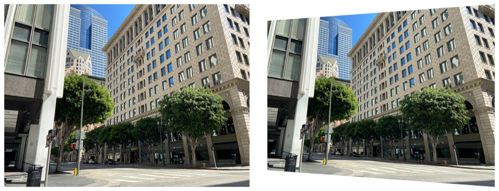

> Navigation: [Technologies](../../technologies.md) · [Core Image](../../coreimage.md) · [CIFilter](../cifilter-swift.class.md)

# keystoneCorrectionCombined()

<sub>Type Method</sub>

Adjusts the image vertically and horizontally to remove distortion.

<sub>iOS, iPadOS, Mac Catalyst, macOS, tvOS, visionOS</sub>

```swift
class func keystoneCorrectionCombined() -> any CIFilter & CIKeystoneCorrectionCombined
```

## Return Value

The adjusted image.

## Discussion

This method applies the keystone correction combined filter to an image. The effect applies a combined set of horizontal and vertical guides to adjust the shape of the input image. This effect is commonly used when cropping an image to correct distortion. In the figure below, both vertical and horizontal adjustments are made, resulting in a trapezoid-shaped image.

The keystone correction filter uses the following properties:

- **`inputImage`** — An image with the type [CIImage](../ciimage.md).
- **`topLeft`** — A [CGPoint](../../corefoundation/cgpoint.md) in the input image mapped to the top-left corner of the output image.
- **`topRight`** — A [CGPoint](../../corefoundation/cgpoint.md) in the input image mapped to the top-right corner of the output image.
- **`bottomLeft`** — A [CGPoint](../../corefoundation/cgpoint.md) in the input image mapped to the bottom-left corner of the output image.
- **`bottomRight`** — A [CGPoint](../../corefoundation/cgpoint.md) in the input image mapped to the bottom-right corner of the output image.
- **`focalLength`** — A `float` representing the simulated focal length as an [NSNumber](../../foundation/nsnumber.md).

The following code creates a filter that distorts the image:

```swift
func keystoneCorrectionCombined(inputImage: CIImage) -> CIImage {
    let keystoneCorrect = CIFilter.keystoneCorrectionCombined()
    keystoneCorrect.inputImage = inputImage
    keystoneCorrect.topLeft = CGPoint(x: 0, y: 2448)
    keystoneCorrect.topRight = CGPoint(x: 3164, y: 2248)
    keystoneCorrect.bottomLeft = CGPoint(x: 0, y: 0)
    keystoneCorrect.bottomRight = CGPoint(x: 3164, y: 150)
    keystoneCorrect.focalLength = 35
    return keystoneCorrect.outputImage!
}
```



<sub>Two photographs of a large building on the corner of an intersection. The building has small windows and is made of a brick structure. The photo on the left has no modifications to size or color. In the photo on the right, a keystone correction combined filter is applied, distorting the rectangular image to become a trapezoid.</sub>

## See Also

### Filters

- [+ bicubicScaleTransformFilter](<bicubicscaletransform().md>) — Produces a high-quality scaled version of an image.
- [+ edgePreserveUpsampleFilter](<edgepreserveupsample().md>) — Creates a high-quality upscaled image.
- [+ keystoneCorrectionHorizontalFilter](<keystonecorrectionhorizontal().md>) — Horizontally adjusts an image to remove distortion.
- [+ keystoneCorrectionVerticalFilter](<keystonecorrectionvertical().md>) — Vertically adjusts an image to remove distortion.
- [+ lanczosScaleTransformFilter](<lanczosscaletransform().md>) — Creates a high-quality, scaled version of a source image.
- [+ perspectiveCorrectionFilter](<perspectivecorrection().md>) — Transforms an image’s perspective.
- [+ perspectiveRotateFilter](<perspectiverotate().md>) — Rotates an image in a 3D space.
- [+ perspectiveTransformFilter](<perspectivetransform().md>) — Alters an image’s geometry to adjust the perspective.
- [+ perspectiveTransformWithExtentFilter](<perspectivetransformwithextent().md>) — Alters an image’s geometry to adjust the perspective while applying constraints.
- [+ straightenFilter](<straighten().md>) — Rotates and crops an image.
