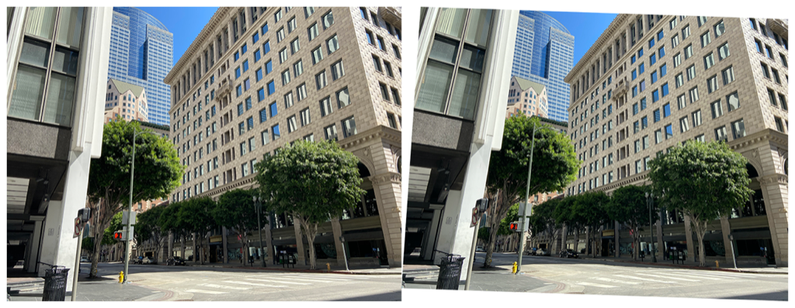

> Navigation: [Technologies](../../technologies.md) · [Core Image](../../coreimage.md) · [CIFilter](../cifilter-swift.class.md)

# keystoneCorrectionVertical()

<sub>Type Method</sub>

Vertically adjusts an image to remove distortion.

<sub>iOS, iPadOS, Mac Catalyst, macOS, tvOS, visionOS</sub>

```swift
class func keystoneCorrectionVertical() -> any CIFilter & CIKeystoneCorrectionVertical
```

## Return Value

The adjusted image.

## Discussion

This method applies the keystone correction vertical. The effect performs vertical adjustment of the image to shape the image to be rectangular. This effect is commonly used with multimedia projectors to correct the distortion caused by the projector being lower or higher than the projected screen.

The keystone vertical filter uses the following properties:

- **`inputImage`** — An image with the type [CIImage](../ciimage.md).
- **`topLeft`** — A [CGPoint](../../corefoundation/cgpoint.md) in the input image mapped to the top-left corner of the output image.
- **`topRight`** — A [CGPoint](../../corefoundation/cgpoint.md) in the input image mapped to the top-right corner of the output image.
- **`bottomLeft`** — A [CGPoint](../../corefoundation/cgpoint.md) in the input image mapped to the bottom-left corner of the output image.
- **`bottomRight`** — A [CGPoint](../../corefoundation/cgpoint.md) in the input image mapped to the bottom-right corner of the output image.
- **`focalLength`** — A `float` representing the simulated focal length as an [NSNumber](../../foundation/nsnumber.md).

The following code creates a filter that distorts the image:

```swift
func keystoneCorrectionVertical(inputImage: CIImage) -> CIImage {
    let keystoneCorrect = CIFilter.keystoneCorrectionVertical()
    keystoneCorrect.inputImage = inputImage
    keystoneCorrect.topLeft = CGPoint(x: 0, y: 3024)
    keystoneCorrect.topRight = CGPoint(x: 4032, y: 3024)
    keystoneCorrect.bottomLeft = CGPoint(x: 200, y: 0)
    keystoneCorrect.bottomRight = CGPoint(x: 4032, y: 0)
    keystoneCorrect.focalLength = 18
    return keystoneCorrect.outputImage!
}
```



<sub>Two photographs of a large building on the corner of an intersection. The building has small windows and is made of a brick structure. The photo on the left has no modifications to size or color. In the photo on the right, a keystone correction vertical filter is applied, distorting the rectangular image to appear slanted with the bottom-left corner of the photo raised.</sub>

## See Also

### Filters

- [+ bicubicScaleTransformFilter](<bicubicscaletransform().md>) — Produces a high-quality scaled version of an image.
- [+ edgePreserveUpsampleFilter](<edgepreserveupsample().md>) — Creates a high-quality upscaled image.
- [+ keystoneCorrectionCombinedFilter](<keystonecorrectioncombined().md>) — Adjusts the image vertically and horizontally to remove distortion.
- [+ keystoneCorrectionHorizontalFilter](<keystonecorrectionhorizontal().md>) — Horizontally adjusts an image to remove distortion.
- [+ lanczosScaleTransformFilter](<lanczosscaletransform().md>) — Creates a high-quality, scaled version of a source image.
- [+ perspectiveCorrectionFilter](<perspectivecorrection().md>) — Transforms an image’s perspective.
- [+ perspectiveRotateFilter](<perspectiverotate().md>) — Rotates an image in a 3D space.
- [+ perspectiveTransformFilter](<perspectivetransform().md>) — Alters an image’s geometry to adjust the perspective.
- [+ perspectiveTransformWithExtentFilter](<perspectivetransformwithextent().md>) — Alters an image’s geometry to adjust the perspective while applying constraints.
- [+ straightenFilter](<straighten().md>) — Rotates and crops an image.
