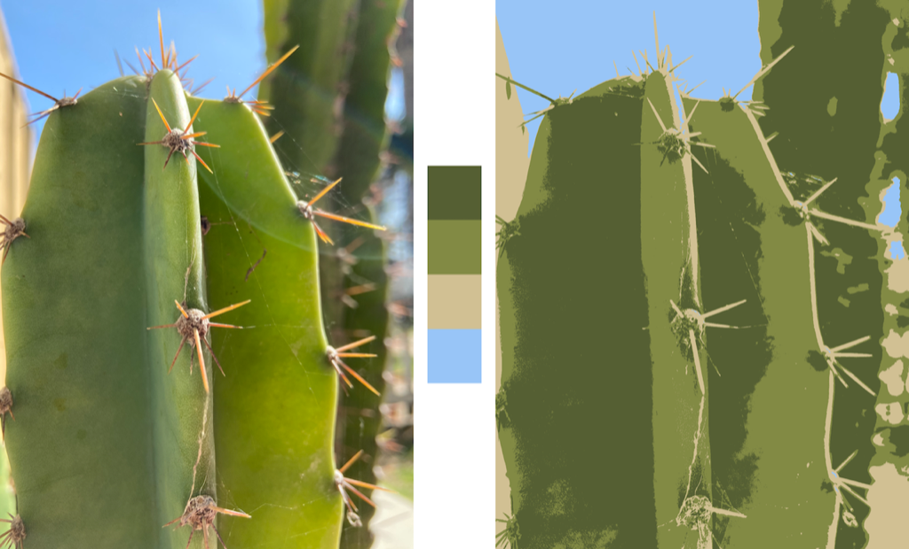

> Navigation: [Technologies](../../technologies.md) · [Core Image](../../coreimage.md) · [CIFilter](../cifilter-swift.class.md)

# kMeans()

<sub>Type Method</sub>

Applies the k-means algorithm to find the most common colors in an image.

<sub>iOS, iPadOS, Mac Catalyst, macOS, tvOS, visionOS</sub>

```swift
class func kMeans() -> any CIFilter & CIKMeans
```

## Return Value

A one-dimensional [CIImage](../ciimage.md) containing the colors.

## Discussion

This filter uses the k-means clustering algorithm to find the most common colors in an input image. The result is a [CIImage](../ciimage.md) with `count` x 1 dimensions. Each `RGBA` pixel in the result image represents the center of a k-means cluster. The `RGB` components contain the color and the alpha component represents the weight of the color. You typically use the [+ KMeansFilter](<kmeans().md>) filter in conjunction with the [+ palettizeFilter](<palettize().md>) filter to produce an image with a reduced number of colors.

- **`inputImage`** — A [CIImage](../ciimage.md) to process.
- **`extent`** — A [CGRect](../../corefoundation/cgrect.md) specifying the area of the image to analyze.
- **`means`** — An optional [CIImage](../ciimage.md) containing a set of colors to use as seeds for the k-means clustering.
- **`count`** — The number of k-means color clusters that should be created. Maximum is `128`, and default is `8`.
- **`passes`** — The number of k-means passes that should run. Maximum is `20`, and default is `5`.
- **`perceptual`** — Whether the k-means color palette should use a perceptual color space.

> [!tip] Tip
> The colors in the result of the [+ KMeansFilter](<kmeans().md>) filter have an alpha component that indicates the weight of the color. You should set this value one using [- imageBySettingAlphaOneInExtent:](<../ciimage/settingalphaone(in_).md>) before using the palette.

The following code example uses the [+ KMeansFilter](<kmeans().md>) filter followed by the [+ palettizeFilter](<palettize().md>) filter to reduce the colors in the image to four:

```swift
func kMeans(inputImage: CIImage) -> CIImage {
    let filter = CIFilter.kMeans()
    filter.inputImage = inputImage
    filter.extent = inputImage.extent
    filter.count = 4
    filter.passes = 5
    return filter.outputImage!
}

func palettize(inputImage: CIImage, paletteImage: CIImage) -> CIImage {
    let palettize = CIFilter.palettize()
    palettize.inputImage = inputImage
    palettize.paletteImage = paletteImage
    return palettize.outputImage!
}

let palette = kMeans(inputImage: image)
let palettized = palettize(inputImage: image, palette.settingAlphaOne(in: palette.extent))
```



<sub>Three images arranged horizontally. The image on the left is a closeup photograph of a cactus. The center image consists of squares arranged vertically showing the four main colors from the left image. The image on the right shows the image with the reduced colors.</sub>

## See Also

### Filters

- [+ areaAverageFilter](<areaaverage().md>) — Returns a 1 x 1 pixel image that contains the average color for the region of interest.
- [+ areaHistogramFilter](<areahistogram().md>) — Returns a histogram of a specified area of the image.
- [+ areaLogarithmicHistogramFilter](<arealogarithmichistogram().md>) — Returns a logarithmic histogram of a specified area of the image.
- [+ areaMaximumFilter](<areamaximum().md>) — Calculates the maximum color components of a specified area of the image.
- [+ areaMaximumAlphaFilter](<areamaximumalpha().md>) — Finds the pixel with the highest alpha value.
- [+ areaMinimumFilter](<areaminimum().md>) — Calculates the minimum color component values for a specified area of the image.
- [+ areaMinimumAlphaFilter](<areaminimumalpha().md>) — Calculates the pixel within a specified area that has the smallest alpha value.
- [+ areaMinMaxFilter](<areaminmax().md>) — Calculates minimum and maximum color components for a specified area of the image.
- [+ areaMinMaxRedFilter](<areaminmaxred().md>) — Calculates the minimum and maximum red component value.
- [+ columnAverageFilter](<columnaverage().md>) — Calculates the average color for a specified column of an image.
- [+ histogramDisplayFilter](<histogramdisplay().md>) — Generates a histogram map from the image.
- [+ rowAverageFilter](<rowaverage().md>) — Calculates the average color for the specified row of pixels in an image.
