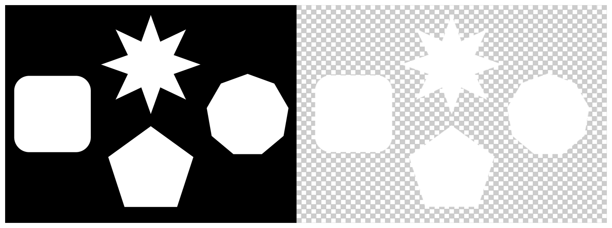

> Navigation: [Technologies](../../technologies.md) · [Core Image](../../coreimage.md) · [CIFilter](../cifilter-swift.class.md)

# labDeltaE()

<sub>Type Method</sub>

Compares an image’s color values.

<sub>iOS, iPadOS, Mac Catalyst, macOS, tvOS, visionOS</sub>

```swift
class func labDeltaE() -> any CIFilter & CILabDeltaE
```

## Return Value

The modified image.

## Discussion

This method applies the Lab ΔE filter to an image. The effect creates an image based on the visual color differences between the two input images. The resulting image contains ΔE 1994 values between 0.0 and 100.0.

The Lab ΔE filter uses the following properties:

- **`inputImage`** — An image with the type [CIImage](../ciimage.md).
- **`image2`** — An image with the type [CIImage](../ciimage.md) the system uses for comparison.

The following code creates a filter that removes the background from the input image:

```swift
func labDeltaE(inputImage: CIImage, inputImage2: CIImage) -> CIImage {
    let labDeltaEFilter = CIFilter.labDeltaE()
    labDeltaEFilter.inputImage = inputImage
    labDeltaEFilter.image2 = inputImage2
    return labDeltaEFilter.outputImage!
}
```



<sub>Two photographs of a star, pentagon, nonagon, and a rounded corner square arranged in the center of the image on a black background. In the photo on the right, a Lab ΔE filter is applied, so the image no longer has a black background, and all of the white shapes are now on a transparent layer.</sub>

## See Also

### Color Effect Filters

- [+ colorCrossPolynomialFilter](<colorcrosspolynomial().md>) — Adjusts an image’s color by applying polynomial cross-products.
- [+ colorCubeFilter](<colorcube().md>) — Adjusts an image’s pixels using a three-dimensional color table.
- [+ colorCubeWithColorSpaceFilter](<colorcubewithcolorspace().md>) — Adjusts an image’s pixels using a three-dimensional color table in specified color space.
- [+ colorCubesMixedWithMaskFilter](<colorcubesmixedwithmask().md>) — Alters an image’s pixels using a three-dimensional color tables and a mask image.
- [+ colorCurvesFilter](<colorcurves().md>) — Adjusts an image’s color curves.
- [+ colorInvertFilter](<colorinvert().md>) — Inverts an image’s colors.
- [+ colorMapFilter](<colormap().md>) — Performs a transformation of the input image colors to colors from a gradient image.
- [+ colorMonochromeFilter](<colormonochrome().md>) — Adjusts an image’s colors to shades of a single color.
- [+ colorPosterizeFilter](<colorposterize().md>) — Flattens an image’s colors.
- [+ convertLabToRGBFilter](<convertlabtorgb().md>) — Converts an image from CIELAB to RGB color space.
- [+ convertRGBtoLabFilter](<convertrgbtolab().md>) — Converts an image from RGB to CIELAB color space.
- [+ ditherFilter](<dither().md>) — Applies randomized noise to produce a processed look.
- [+ documentEnhancerFilter](<documentenhancer().md>) — Adjusts an image’s shadows and contrast.
- [+ falseColorFilter](<falsecolor().md>) — Replaces an image’s colors with specified colors.
- [+ maskToAlphaFilter](<masktoalpha().md>) — Converts an image to a white image with an alpha component.
