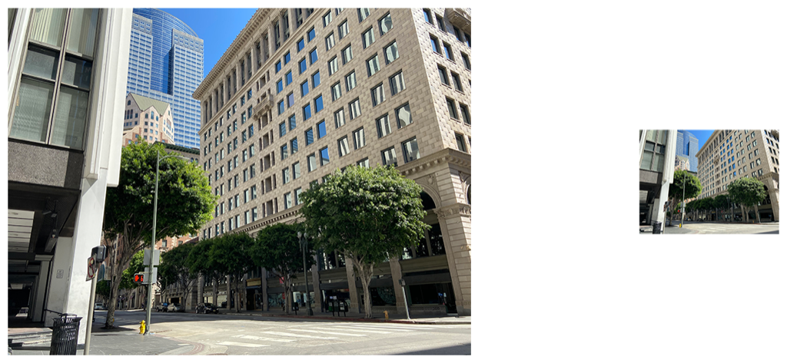

> Navigation: [Technologies](../../technologies.md) · [Core Image](../../coreimage.md) · [CIFilter](../cifilter-swift.class.md)

# lanczosScaleTransform()

<sub>Type Method</sub>

Creates a high-quality, scaled version of a source image.

<sub>iOS, iPadOS, Mac Catalyst, macOS, tvOS, visionOS</sub>

```swift
class func lanczosScaleTransform() -> any CIFilter & CILanczosScaleTransform
```

## Return Value

The adjusted image.

## Discussion

This method applies the Lanczos scale transform filter to an image. The effect creates the output image by scaling the input image based on the scale and aspect ratio properties provided.

The Lanczos scale filter uses the following properties:

- **`inputImage`** — An image with the type [CIImage](../ciimage.md).
- **`scale`** — A `float` representing the scaling factor used on the image as an [NSNumber](../../foundation/nsnumber.md). Values less than `1.0` scale down the images. Values greater than `1.0` scale up the image.
- **`aspectRatio`** — A `float` representing the additional horizontal scaling factor used on the image as an [NSNumber](../../foundation/nsnumber.md).

The following code creates a filter that results in a smaller scaled image with high quality:

```swift
func lanczosScale(inputImage: CIImage) -> CIImage {    
    let lanczosScaleFilter = CIFilter.lanczosScaleTransform()
    lanczosScaleFilter.inputImage = inputImage
    lanczosScaleFilter.scale =  0.3
    lanczosScaleFilter.aspectRatio = 1
    return lanczosScaleFilter.outputImage!
}
```



<sub>Two photographs of a large building on the corner of an intersection. The building has small windows and is made of a brick structure. The photo on the left has no modifications to size or color. In the photo on the right, a Lanczos scale transform filter is applied, resulting in a scaled-down or smaller image.</sub>

## See Also

### Filters

- [+ bicubicScaleTransformFilter](<bicubicscaletransform().md>) — Produces a high-quality scaled version of an image.
- [+ edgePreserveUpsampleFilter](<edgepreserveupsample().md>) — Creates a high-quality upscaled image.
- [+ keystoneCorrectionCombinedFilter](<keystonecorrectioncombined().md>) — Adjusts the image vertically and horizontally to remove distortion.
- [+ keystoneCorrectionHorizontalFilter](<keystonecorrectionhorizontal().md>) — Horizontally adjusts an image to remove distortion.
- [+ keystoneCorrectionVerticalFilter](<keystonecorrectionvertical().md>) — Vertically adjusts an image to remove distortion.
- [+ perspectiveCorrectionFilter](<perspectivecorrection().md>) — Transforms an image’s perspective.
- [+ perspectiveRotateFilter](<perspectiverotate().md>) — Rotates an image in a 3D space.
- [+ perspectiveTransformFilter](<perspectivetransform().md>) — Alters an image’s geometry to adjust the perspective.
- [+ perspectiveTransformWithExtentFilter](<perspectivetransformwithextent().md>) — Alters an image’s geometry to adjust the perspective while applying constraints.
- [+ straightenFilter](<straighten().md>) — Rotates and crops an image.
